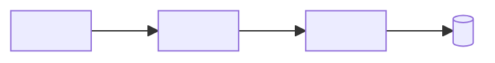
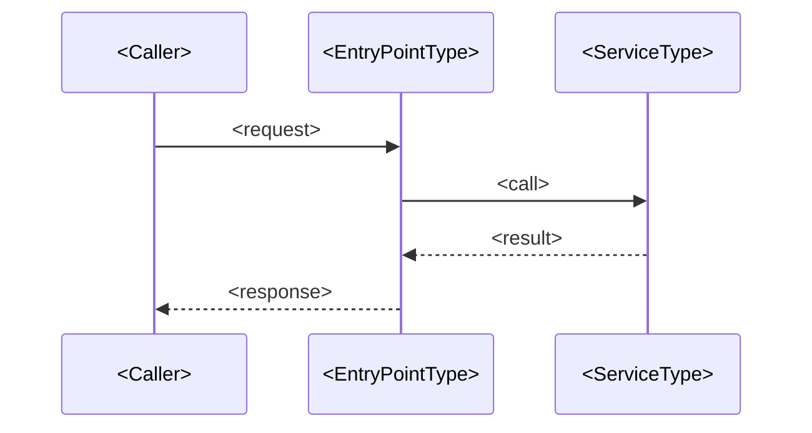

# <Area> architecture

<!--
Copy this file to docs/architecture/<area>.md, replace every <placeholder>, delete the comments,
and add a row for the area in docs/architecture/README.md. Keep the "Source:" and "Last verified:" lines.
-->

<One paragraph: what this area does, which process hosts it, and who calls it.>

## Components

Source: `src/<Project>/<Folder>/`

<Two to five sentences: responsibility of each node, using the real type names.>

## Main flow

Source: `src/<Project>/<File>.cs`

<What happens at each step, including failure paths worth knowing.>

## Lifecycle

<!-- Delete this section when the area has no long-lived state. -->

Source: `src/<Project>/<File>.cs`

## Configuration and contracts

<Environment variables, annotations, options types, serializer contexts or wire formats that other components depend on.>

## Related pages

- [How SlimFaas Works](../how-it-works.md)
- <other docs/*.md pages>

Last verified: <YYYY-MM-DD> against <short SHA>
