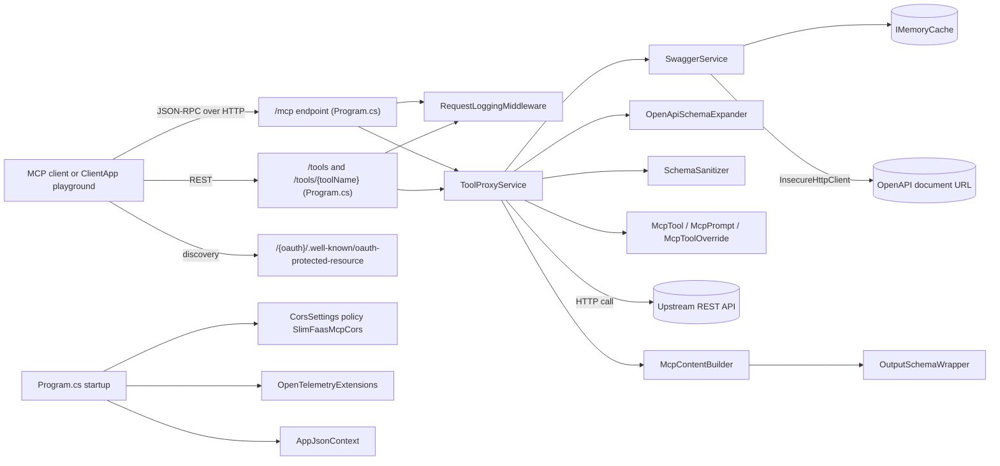
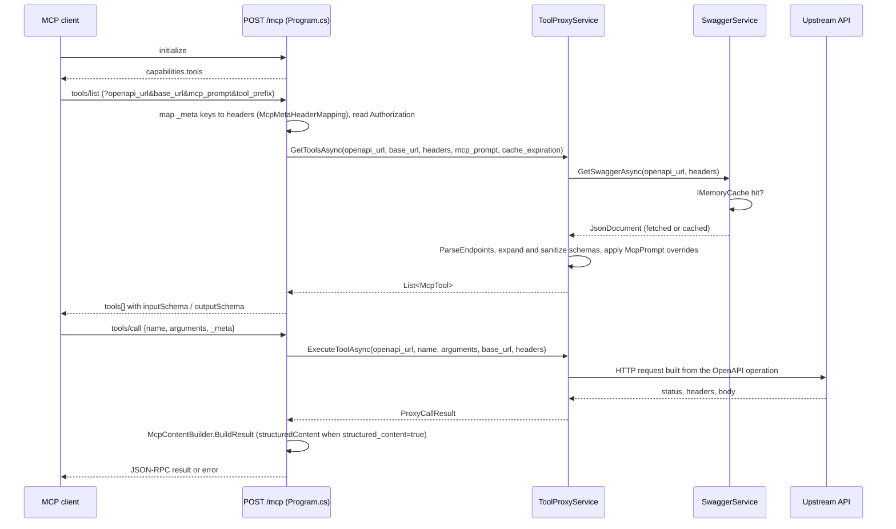

# SlimFaasMcp architecture

SlimFaasMcp is a standalone, AOT-compiled ASP.NET Core service (`src/SlimFaasMcp/`) that turns any OpenAPI description into a Model Context Protocol (MCP) server. An MCP client (an IDE, an agent framework, the bundled playground UI) posts JSON-RPC requests to `/mcp`; SlimFaasMcp downloads and caches the OpenAPI document named in the query string, exposes each operation as an MCP tool, and proxies `tools/call` invocations to the real API. It has no dependency on the SlimFaas runtime or SlimData; the website deliberately has no `/mcp` page, so this page is the reference for its internals.

## Components

Source: `src/SlimFaasMcp/Program.cs`, `src/SlimFaasMcp/Services/`, `src/SlimFaasMcp/Models/`, `src/SlimFaasMcp/Middleware/RequestLoggingMiddleware.cs`, `src/SlimFaasMcp/Extensions/OpenTelemetryExtensions.cs`, `src/SlimFaasMcp/AppJsonContext.cs`

`Program.cs` wires the minimal API: `POST /mcp` implements the JSON-RPC methods `initialize`, `tools/list` and `tools/call`; `GET /tools` and `POST /tools/{toolName}` expose the same capabilities as plain REST for the playground; `GET /{oauth?}/.well-known/oauth-protected-resource` serves `OAuthProtectedResourceMetadata` decoded from the `oauth` query parameter; `GET /health` and, when OpenTelemetry is enabled, `GET /metrics` complete the surface. `RequestLoggingMiddleware` logs every request, and the CORS policy `SlimFaasMcpCors` is built from `CorsSettings` (appsettings section `Cors` and the `CORS_*` environment variables).

`SwaggerService` fetches the OpenAPI document through the `InsecureHttpClient` (certificate validation relaxed for internal endpoints), caches the parsed `JsonDocument` in `IMemoryCache` for the duration given by `cache_expiration`, and turns paths into `Endpoint` and `Parameter` models. `ToolProxyService` builds the `McpTool` list from those endpoints (`GetToolsAsync`), applying `McpPrompt` overrides and `tool_prefix`, expanding `$ref` schemas with `OpenApiSchemaExpander`, and making them MCP-safe with `SchemaSanitizer.SanitizeForMcp` and `McpTool.GenerateInputSchema`. `ExecuteToolAsync` maps tool arguments back to path, query, header and body parameters, calls the upstream API, and returns a `ProxyCallResult` that `McpContentBuilder.BuildResult` renders as MCP `content` (and `structuredContent` through `OutputSchemaWrapper` when `structured_content=true`). All JSON goes through the source-generated `AppJsonContext`, which keeps the service AOT-compatible.

## Main flow: `tools/list` then `tools/call`

Source: `src/SlimFaasMcp/Program.cs`, `src/SlimFaasMcp/Services/ToolProxyService.cs`, `src/SlimFaasMcp/Services/SwaggerService.cs`, `src/SlimFaasMcp/Services/McpContentBuilder.cs`

When the `oauth` query parameter is present and the request carries no `Authorization` header (neither as an HTTP header nor through the `_meta` mapping), `/mcp` answers `401` with a `WWW-Authenticate: Bearer resource_metadata="…/.well-known/oauth-protected-resource"` challenge so the client can start the OAuth flow described by `OAuthProtectedResourceMetadata`. Upstream errors are not thrown: `ProxyCallResult` carries the status code and body, and `McpContentBuilder` reports them to the client as tool results.

## Configuration and contracts

- Query parameters on `/mcp` and `/tools`: `openapi_url` (required), `base_url`, `mcp_prompt` (base64 JSON `McpPrompt` with `McpToolOverride` entries), `oauth` (base64 `OAuthProtectedResourceMetadata`), `tool_prefix`, `cache_expiration`, `structured_content`.
- Configuration: `Cors` section or `CORS_ORIGINS`, `CORS_METHODS`, `CORS_HEADERS`, `CORS_EXPOSE`, `CORS_CREDENTIALS`, `CORS_MAXAGEMINUTES`; `McpMetaHeaderMapping` (JSON-RPC `_meta` key → HTTP header, `Authorization` values are prefixed with `Bearer` when needed); OpenTelemetry settings read by `OpenTelemetryExtensions`.
- Serialization: every request and response type must be registered in `AppJsonContext` (`src/SlimFaasMcp/AppJsonContext.cs`); reflection-based serialization breaks the AOT publish.
- UI: `src/SlimFaasMcp/ClientApp/` is a React playground built with `npm ci && npm run build` before the .NET build; it only uses the public endpoints above and follows the BEM rule.

## Related pages

- [How SlimFaas Works](../how-it-works.md)
- [Data files](../data-files.md) for agentic workflows that combine SlimFaas functions with MCP tools

Last verified: 2026-09-11 against 59e421ce
