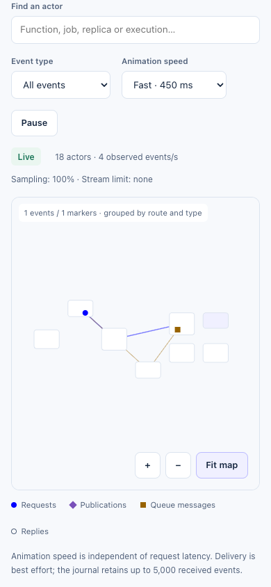

# Dashboard validation — issue #338

This report records the checks for the canvas traffic map and metadata inventory. The browser workload is synthetic; it does not measure Kubernetes scheduling capacity or end-to-end HTTP throughput.

## Reference workstation

- Apple M4 Pro, 48 GiB RAM, macOS 26.5.2 (25F84), ARM64.
- Node 24.20.0, .NET SDK 10.0.300, Chromium 153.0.8010.12, headless at 1920 × 1080.
- The production Vite build is served over loopback. All 10,000 job executions and 10,000 replicas are recreated in a full status snapshot every second, with 100 activity events every 100 ms.

## Browser load

The five-minute run measured actual canvas background draws while continuously panning and zooming, with the map at instance detail. It also searched for and selected the final job execution and final replica, checked pause/resume, and verified a 390 × 844 mobile viewport and reduced-motion preference.

| Measure | Result |
|---|---:|
| Duration | 300.09 s |
| Canvas draw rate | 59.92 frames/s |
| 95th percentile frame gap | 18.1 ms |
| JavaScript heap after GC, start / end | 19.0 / 20.9 MB |
| Browser errors | 0 |
| Event journal capacity | 5,000 |
| Animated marker capacity | 200 |

The heap observations are consistent with bounded retention over this run, not a guarantee for every workload. The Node tests separately verify every instance identity and reserved group boundary, and feed 300,000 unique events plus duplicates through the bounded history.

Storybook's development runtime retained substantially more memory in the same full-snapshot scenario (approximately 49 → 863 MB after GC in five minutes). Clearing browser user-timing entries did not release it. Use the production harness below for memory/performance acceptance; Storybook remains the interactive visual fixture. No production code clears browser instrumentation or disables developer tools.

### Reproduce the production measurement

Build and start the synthetic SSE server:

```bash
cd src/SlimFaas/ClientApp
npm ci
npm test
npm run build
node scripts/serve-load.mts
```

In another terminal, use an independently installed Playwright Core and a local Chromium executable. This harness adds no dashboard dependency or lockfile change:

```bash
npm install --prefix /tmp/slimfaas-browser --no-save --ignore-scripts playwright-core
cd src/SlimFaas/ClientApp
PLAYWRIGHT_ROOT=/tmp/slimfaas-browser \
CHROMIUM_EXECUTABLE=/absolute/path/to/chromium \
node scripts/measure-load.mjs
```

The default duration is 300 seconds. `DASHBOARD_LOAD_RESULTS` selects the output directory (default: the system temporary directory's `slimfaas-dashboard-load`). `DASHBOARD_LOAD_URL`, `DASHBOARD_LOAD_PORT` and `DASHBOARD_LOAD_SECONDS` allow local overrides. The harness fails below 30 actual draws/s, on browser errors, or when post-GC heap growth exceeds 30 MB.

For interactive scenarios, run `npm run storybook` and open **Dashboard / Live**. Traffic contains the dense workload; Data Files covers persistent, expiring and unknown-size entries.

## Integration validation

The complete .NET suite passed 1,214 tests (SlimFaas 950, SlimData 176, MCP 79, Kafka 9). Dashboard and documentation tests each passed 8 tests; dashboard, Storybook and documentation builds succeeded. Run these checks with Node 24 on PATH:

```bash
dotnet test
dotnet publish src/SlimFaas/SlimFaas.csproj -c Release -r osx-arm64
(cd src/SlimFaas/ClientApp && npm test && npm run build && npm run build-storybook)
(cd src/SlimFaasSite && pnpm install --frozen-lockfile && pnpm lint && pnpm test && pnpm build)
```

Use the native RID of the build host. The dashboard MSBuild target refreshes the web content items after Vite changes its hashed filenames, including on an incremental build.

## SlimData comparison with inventory open

The baseline is `ffff804f` (current main when the branch was created). Both variants use native AOT, three nodes, the same adaptive batch defaults and `EnableFront=true`. The candidate additionally holds one metadata stream open throughout warmup, load and cooldown. Each variant ran three alternating repetitions: 2 s warmup, 5 s measured writes, concurrency 12, 4 KiB payloads, then 1 s cooldown.

| Variant | Write rates across runs (ops/s) | Median ops/s | Median p95 (ms) | Median peak node RSS (MiB) | Errors |
|---|---|---:|---:|---:|---:|
| Main baseline | 76.72, 52.31, 53.12 | 53.12 | 244.32 | 138.83 | 0 |
| Candidate + inventory | 51.97, 124.21, 52.32 | 52.32 | 237.45 | 138.48 | 0 |

Median throughput changed by −1.5%; median p95 improved by 2.8%. These short screening runs have high throughput variance and do not establish statistical equivalence. All writes succeeded. Each observer received nine frames, never more than 100 entries per frame, with 312–320 keys in the shared inventory. No stream disconnected during measured load.

Reproduce each variant with its own publication directory; alternate the baseline and candidate to reduce ordering bias:

```bash
MEMORY_LAB_ENABLE_FRONT=true MEMORY_LAB_DATA_STREAM=0 \
MEMORY_LAB_PUBLISH_DIR=/absolute/path/to/baseline-publish \
MEMORY_LAB_SKIP_PUBLISH=1 WARMUP_SECONDS=2 COOLDOWN_SECONDS=1 \
.bin/memory-lab.sh aot slimdata-set 5 12

MEMORY_LAB_ENABLE_FRONT=true MEMORY_LAB_DATA_STREAM=1 \
MEMORY_LAB_PUBLISH_DIR=/absolute/path/to/candidate-publish \
MEMORY_LAB_SKIP_PUBLISH=1 WARMUP_SECONDS=2 COOLDOWN_SECONDS=1 \
.bin/memory-lab.sh aot slimdata-set 5 12
```

## Native demo and browser behavior

The `osx-arm64` AOT executable validated the native demo manifest and ran its three-node chain with an ephemeral test overlay. `/status-functions` and `/function/fibonacci1/hello/local` returned 200. A temporary Python job sent synchronous and asynchronous requests through its signed local gateway; the collected events retained the execution identity and associated `fibonacci1` target/queue.

The live API checks created set keys and files, observed a short TTL expire, changed a persistent key's TTL, checked exact sizes (2,500,000; 98,297; 128 bytes), and paged 105 prefix-matching keys as 100 + 5. The browser checks covered dialog keyboard navigation and focus restoration, wake failure feedback, restricted metadata without an automatic retry loop, copying a key, retaining stale rows after stream EOF, reconnecting, and mobile overflow. The screenshots use synthetic data in that native demo.

Kubernetes IP attribution is covered by endpoint/helper tests; no live Kubernetes cluster was used. AOT dependency warnings from MemoryPack and System.Configuration are also present on the baseline. The full test suite initially encountered an existing adaptive-batcher timing timeout under concurrent builds; its isolated rerun and the complete subsequent run passed.

## Address privacy follow-up

The browser workload above was repeated with full-length opaque address tokens after the privacy change. Fifteen new backend cases cover IPv4, mapped IPv6, IPv6 scope IDs, loopback callers, unchanged workload names and the actual SSE wire output. Initial/periodic state, history, individual activity and batches expose matching tokens; a second subscriber receives consistent tokens. Raw deployment caches and access-controlled inter-node activity retain their internal addresses.

The native AOT demo and browser follow-up passed Fibonacci, signed job sync/async calls through a successfully completed job, identifier search, replica selection and mobile layout. All 55 captured browser SSE frames omitted literal loopback addresses, the old `Ip` property and the `ip_` prefix; there were no browser errors. Existing Node topology tests also cover opaque-token correlation and stable selection identities after token rotation. Dashboard, Storybook, documentation and native AOT builds passed again. The public replica field is `Identity` (replacing `Ip`) and tokens use the generic `id_` prefix. SSE tests explicitly reject the old `Ip` JSON property; consumers must migrate to `Identity` and treat it as opaque.

After renaming the wire field to `Identity`, a further 60-second production smoke run with the same 20,000-instance workload passed at 59.86 draws/s (p95 gap 17.6 ms), with post-GC heap 19.0 → 20.6 MB and no browser errors. Native publication, the complete .NET suite, dashboard/Storybook/site builds and browser integration checks were rerun for the renamed contract.

## Reactive Traffic follow-up

The follow-up fixes the first ignored activity batch, server-clock-based animation expiry and missing WebSocket dispatch events. Native integration also exposed an existing routing error: peer activity was queried on the first advertised port, which is the Raft port in local mode. Peer reads now select an application port, with tests for both native and Kubernetes port ordering. Default peer interval and initial delay are 500 ms, explicit overrides are preserved, and at most four peer reads run concurrently. Overview and Data request state-only streams and do not activate peer activity polling.

The complete .NET suite passed **1,232 tests** (SlimFaas 968, SlimData 176, MCP 79, Kafka 9), and the dashboard passed **20 Node tests**. Regressions cover first/delayed receipts, duplicates, identical timestamps, peer restart with a backward clock, history-free bootstrap, concurrent reads, disconnect cleanup, selection/filter changes, buffered arrivals during pause, reconnect sessions, function power states and bounded marker aggregation. The WebSocket tests cover successful streaming, abort, send failure and publication fanout while preserving job identity. The client wire protocol and public `Identity` contract are unchanged.

Dashboard and Storybook production builds passed with Node 24. Documentation lint, eight tests and the static export passed: 21 pages, 1,306 local links/assets and 324 search entries. Native AOT publication remains compatible; generated Storybook output is excluded from the runtime's content items. No dependencies or lockfile versions changed.

The `osx-arm64` AOT demo ran on three isolated nodes. Twelve synchronous HTTP requests and three publications to four ready HTTP subscribers produced **93 events: 93 received, no duplicates** on a stream pinned to one node. A signed local job completed four rounds of synchronous requests, queued requests and publications; its **84 events** retained the execution identity and fanout targets. Two native WebSocket clients on another node served four synchronous requests and a publication to both clients: **21 emitted, 21 received, no duplicates**. Refeeding these exact receipts through the playback model represented all 21 as six aggregate markers, with none omitted.

The production dashboard browser observed the remote WebSocket function despite its absence from the local inventory, searched its identity, selected both the function and an observed replica, retained global traffic during selection, and displayed active markers. Captured public frames omitted literal loopback addresses and the old `Ip` property. Storybook browser checks cover the isolated first event, deliberately old server timestamps, publications, an empty observed queue, all three persisted speeds, explicit isolation, pause/resume, reduced motion, keyboard canvas controls and a 390 px mobile viewport. See **Dashboard / Live / Reactive Traffic** for the interactive fixture.




### Peer polling cost and idle shutdown

Both measurements use the same corrected native binary, three otherwise idle nodes, information-level node logging, one browser-equivalent observer, three seconds of warmup and twenty seconds per view. The baseline explicitly overrides the interval to 2,000 ms; the candidate uses the 500 ms default. Nodes are restarted between variants. CPU and peak RSS are summed across the three runtime processes; the local controller and this Python observer are excluded.

| Interval | View | Successful peer reads | Failed reads | Node CPU (s) | Peak node RSS (MiB) |
|---|---|---:|---:|---:|---:|
| 2,000 ms | Traffic | 20 | 0 | 2.952 | 326.9 |
| 2,000 ms | Overview | 0 | 0 | 2.841 | 362.1 |
| 500 ms | Traffic | 80 | 0 | 2.562 | 330.9 |
| 500 ms | Overview | 0 | 0 | 2.109 | 366.7 |

Polling performs four times as many successful peer reads at the new default and stops without Traffic subscribers. These short single runs demonstrate polling frequency and shutdown, not a statistically significant CPU improvement or a throughput benchmark. RSS includes normal process growth between sequential views. No activity was generated during these cost measurements.

With a native local demo running, reproduce from the repository root (substitute its HTTP ports if using an overlay):

```bash
python3 .bin/status-stream-benchmark.py \
  --nodes http://127.0.0.1:30021 http://127.0.0.1:30022 http://127.0.0.1:30023 \
  --interval-label 500
```

For the comparison, restart the same demo with `SlimFaas__StatusStream__PeerSyncIntervalMilliseconds=2000` and change the label to `2000`. The label is descriptive and does not configure the server. The harness fails if any peer read returns a non-success response.

Eight benchmark unit tests cover metric deltas, failed reads, stream parsing and its 5,000-event bound, readiness errors, cleanup and CLI validation. They run in the dashboard check and emit a Sonar generic coverage report in the analysis job. Python's standard-library `trace` records executed lines (including the reader threads); compiled line tables provide the executable-line denominator. The local result is **88/89 lines (98.9%)**, with no additional dependency. Only the test runner itself is excluded from coverage; the measured benchmark remains included and the quality gate is unchanged.

```bash
python3 .bin/test-status-stream-benchmark.py --coverage /tmp/status-stream-coverage.xml
```

### Five-minute reactive map workload

The production harness above was rerun on the same reference workstation with the new Fast animation, global traffic during selection, grouped markers, icons and status badges. The workload again contained **10,000 job executions + 10,000 replicas, 1,000 events/s, and a full new state every second**.

| Measure | Result |
|---|---:|
| Duration | 300.08 s |
| Canvas draw rate while panning/zooming | 59.86 frames/s |
| 95th percentile frame gap | 17.5 ms |
| JavaScript heap after GC, start / end | 20.1 / 21.9 MB |
| Browser errors | 0 |
| Journal / marker capacities | 5,000 / 200 |

Search and selection of the final job execution and replica, a stable paused journal, live resumption, reduced motion and mobile overflow checks passed. The Node tests verify non-overlapping reserved groups and all 20,000 identities, independently of viewport culling. These results describe this synthetic rendering workload; they do not measure function latency or lossless production telemetry.

## Exact deliveries, leader and instance logs

The delivery/log follow-up passed **1,276 .NET tests** (SlimFaas 1,012; SlimData 176; MCP 79; Kafka 9) and **31 dashboard Node tests**, with dashboard/Storybook builds and an `osx-arm64` AOT publication. New regression cases cover paired async attempts in either order or separate batches, retries, filters/Pause, actual destinations, SSE role normalization, missing peer queue inventories, log permissions and source ownership, global quotas, shared readers, cancellation, Unicode, byte/line limits, Docker framing and native file lifecycle. Existing AOT dependency warnings remain unchanged; no dependencies or lockfiles changed. The existing SlimData adaptive-cooldown timing test timed out once during a repeated solution run; its isolated retry and the subsequent full suite passed.

The Linux CI caught a file-tail regression: a filesystem without birth time can change the reported creation timestamp on append. Rotation detection now compares the path with current open-handle timestamps, tolerates concurrent writes, and drains a final append before completion. The existing append test and an additional same-file timestamp-change regression cover this without relaxing assertions. See [the .NET creation-time semantics](https://learn.microsoft.com/en-us/dotnet/api/system.io.filesysteminfo.creationtime).

### Native and browser integration

An ephemeral overlay ran the current AOT runtime on HTTP ports 31020–31023 and Raft ports 3362–3364, independently of the normal tutorial ports. It kept three Fibonacci replicas ready and disabled scheduled jobs only in the test overlay. The checked-in demo schedules and Planet Saver behavior are unchanged.

- Twelve synchronous requests and three publications across three nodes produced **75 events, all 75 received without duplicates** on a pinned observer. A retained signed local job completed HTTP, async and publication calls with its execution identity intact.
- Eighteen individually identified synchronous requests were distributed **6 / 6 / 6**. Every dispatch destination matched the managed process whose actual log contained that request marker.
- Two native WebSocket clients handled **four sync requests, four async requests and a publication to both clients**. All **37 events** were received without duplicates. Each async attempt had a correlated dispatch with the actual connection identity. Both transports' eight paired technical events replayed as exactly **four Queue → replica deliveries**, in either arrival order. A remote queue remains drawable with an unknown-length label while its inventory is absent locally.
- All three nodes agreed on the leader. Stopping that test process elected another node, updated all three views, and terminated its old log session. Browser checks also assert that the canvas renders the Leader label, covering normalization between the SSE payload and topology.
- Log discovery/read succeeded for functions, a retained completed job and SlimFaas nodes. Source identifiers were portable across all three nodes. The completed job stream ended explicitly; a quiet node stayed Live with its supervisor startup line. An explicit `SlimFaas__ExposeLogs=false` override returned **403 Disabled** from both endpoints despite `cluster.exposeLogs: true`.
- Browser checks covered on-demand opening, switching instance, closing Logs, text/exclusion/case filters, 10,000 retained rows with at most 30 DOM rows, paused scrolling/Follow latest, keyboard tabs, mobile and reduced motion. A failed stream made one initial request plus **three automatic retries**; manual reconnect worked and closing the tab cancelled the pending retry. Public Traffic frames contained neither literal loopback addresses nor the former `Ip` property.

The native WebSocket async test attached clients to the leader. An additional attempt with clients attached only to a follower confirmed an existing runtime limitation: the queue worker runs on the leader and does not dispatch those follower-only connections. Cross-node WebSocket queue ownership is outside this display/log change; synchronous follower calls and publications were exercised successfully. Kubernetes/Docker ownership, container selection, permissions and stream decoding use real client adapters with HTTP fixtures; **no live Kubernetes cluster or Docker daemon was used**.

Interactive fixtures: **Dashboard / Live / Reactive Traffic** (queue pairs and Change leader) and **Instance Log Stream** (10,000 lines plus live output).


[Leader capture](images/dashboard/traffic-leader.png) · [Mobile logs](images/dashboard/instance-logs-mobile.png)

### Reader cost and shutdown

Three otherwise idle native nodes, six ready function processes, information-level node logging, one function log source, three seconds warmup and twenty seconds per phase. Node CPU is summed across the three runtimes; supervisor CPU is measured separately. File handles count the supervisor's writer plus any reader for that source.

| View | Node CPU (s) | Supervisor CPU (s) | Peer activity reads | Source file handles |
|---|---:|---:|---:|---:|
| Closed, before | 2.469 | 0.560 | 0 | 1 |
| Logs open | 2.435 | 0.560 | 0 | 2 |
| Closed, after | 2.449 | 0.520 | 0 | 1 |

The open viewer received 3,922 retained/live lines. Closing it returned the source to its sole writer handle. Unit tests independently check cancellation after the last subscriber, shared readers and slow-consumer bounds. These short single runs establish on-demand operation and cleanup; their small CPU differences are not statistically significant.

### Async throughput screening

Three alternating baseline/candidate runs used the previous `af6554bb` AOT publication and this follow-up, twelve concurrent clients, two seconds warmup, five seconds measured load and one second cooldown. The memory-lab harness used isolated HTTP/Raft/function ports. No Traffic or log viewer was open for this dispatch-path comparison.

| Variant | Requests/s, runs 1 / 2 / 3 | Median requests/s | Failures |
|---|---|---:|---:|
| Before | 977.09 / 996.45 / 985.82 | 985.82 | 0 |
| After | 958.30 / 983.60 / 987.61 | 983.60 | 0 |

The median difference was **−0.23%**. This is a short screening result for queue acceptance, not a claim about end-to-end delivery capacity. Reproduce with the matching publications and `.bin/memory-lab.sh aot async 5 12`, `WARMUP_SECONDS=2`, `COOLDOWN_SECONDS=1`, `MEMORY_LAB_SKIP_PUBLISH=1` and `MEMORY_LAB_PUBLISH_DIR` pointing at each publication.

### Five-minute workload with exact replica destinations

The production harness was rerun on the reference workstation with all **20,000 instances**, **1,000 events/s** and full inventory replacement each second. Continuous keyboard panning and zooming produced:

| Measure | Result |
|---|---:|
| Duration | 300.09 s |
| Actual canvas draw rate | 59.92 frames/s |
| 95th percentile frame gap | 17.4 ms |
| Post-GC JavaScript heap, start / end | 19.6 / 21.9 MB |
| Browser errors | 0 |
| Journal / animation / log-row DOM limits | 5,000 / 200 / 30 |

The last replica and job execution remained searchable and selectable. Pause/resume, reduced motion and a 390 px mobile viewport passed. Non-overlap and all instance identities are covered by Node tests; logs have separate 10,000-line / 8 MiB text retention tests. The five-minute map measurement had no log panel open; log-reader cost and viewer behavior are measured separately above. Use the production load commands at the start of this report to reproduce.

## Shared selection drawer

The Traffic selection now uses Overview's modal right-hand drawer. Follow-up validation passed **1,276 .NET tests**, **32 dashboard Node tests**, **8 documentation tests**, and dashboard/Storybook/site builds. The new Node case covers viewport-dependent log virtualization at heights from 120 to 2,160 px, partial rows, empty results and shortened buffers. Rendered rows are bounded by visible rows plus 11 overscan rows; the earlier fixed 30-row observations above describe the former 360 px viewer.

The production browser regression starts its own loopback SSE fixture and checks Overview function/job drawers, Escape from a populated search field, modal focus, canvas selection, focus restoration after a removed actor, preserved camera/isolation, mobile width, reduced motion, resized virtualization, log filters and Follow latest. It now verifies automatic log opening alongside Details for function replicas, job executions and the SlimFaas leader; no discovery for groups; compact disabled/denied/unavailable states; one active source; cancellation on close/source changes and during discovery; no previous-instance text; removal even while Traffic is paused; and cancellation of scheduled reconnects. It finishes with zero active log streams and no browser errors; opening and closing drawers never reconnects Traffic.

```bash
cd src/SlimFaas/ClientApp
npm test
npm run build
PLAYWRIGHT_ROOT=/tmp/slimfaas-browser \
CHROMIUM_EXECUTABLE=/absolute/path/to/chromium \
node scripts/check-drawer.mjs
```

Use the external Playwright installation described above. `DASHBOARD_DRAWER_RESULTS` selects the screenshot/JSON directory; the default is `slimfaas-dashboard-drawer` under the system temporary directory. The browser harness does not add a dashboard dependency. Interactive drawer fixtures are under **Dashboard / Traffic selection**: Group details, Details and live logs (10,000 lines), Unavailable, Disabled and Highlighted search. The highlighted-search story opens the drawer and types its search automatically.

The native three-node demo returned status and Fibonacci successfully. Browser checks opened actual replica logs, filtered newly emitted request markers, switched replicas, closed the stream with Escape and verified the 390 px mobile drawer. The refreshed screenshots above show this native run.

The updated production load harness passed a **15.01-second screening** with 20,000 instances and 1,000 events/s: **59.82 draws/s**, p95 gap **17.7 ms**, post-GC heap **19.7 → 21.4 MB**, zero browser errors. This short UI follow-up does not replace the prior five-minute measurements. Backend log adapters, permissions and retention limits were not changed.


### Combined details, automatic logs and search highlights

The combined drawer follow-up passed **1,276 .NET tests**, **33 dashboard Node tests**, **8 documentation tests**, dashboard/Storybook/site builds, and all five drawer Storybook scenarios in Chromium. No backend contracts, configuration defaults, dependencies or retention limits changed.

The production browser regression exercises a 10,000-line stream, source/container changes, automatic opening for all three instance kinds, cancelled discovery and reconnects, and compact disabled/access-denied/unavailable states with no unauthorized stream request or retry loop. It ends with **zero active streams and zero browser errors**. Search checks now cover yellow backgrounds on matching text only, including hover, new matching output, empty queries, case sensitivity, exclusions, literal punctuation, Unicode and escaped markup. The rest of the row keeps its usual background. Desktop resizing and the 390 px mobile drawer retain bounded virtualization; the footer stays below the viewport even when controls need more vertical space. An explicit browser assertion limits the viewer height to the window height, preventing virtual spacer rows from inflating the drawer to the full 10,000-line height.

The native three-node demo returned **HTTP 200** for status on the entrypoint and each node, and for Fibonacci. Browser checks confirmed that opening the drawer directly streams actual replica output beside its details, newly emitted request markers are filtered and highlighted, selecting another replica opens a fresh stream, and Escape closes the viewer. The desktop and mobile instance-log screenshots show this combined view. The prior five-minute traffic measurements above were not repeated for this presentation change.


Windows CI exposed a temporary-directory lock after the process-tree test had already verified termination. Async process fixtures now retry only the final directory removal within the existing bounded wait; process-exit assertions are unchanged. The Sonar workflow preserves the coverage/test command's exit code so a successful scanner cannot mask failed tests. The raw Windows results are checked separately from the scanner badge during delivery.


### Highlight searched text only

The search follow-up passed **35 dashboard Node tests**, **1,276 .NET tests**, all five drawer Storybook browser scenarios, and the production drawer regression. Highlights use escaped React text inside inline `mark` elements only on virtualized rows. Tests cover multiple and adjacent occurrences, case-sensitive matching, unchanged surrounding text, Unicode lowercase expansions and literal markup. Browser checks confirm that new matches appear, numbers/timestamps and other text remain unhighlighted, and selecting/copying the rendered text exactly reproduces the original line.

The native three-node demo returned status and Fibonacci successfully and streamed actual replica logs with highlighted request markers. Desktop and mobile screenshots show text matches, with the mobile log viewport scrolled horizontally to expose long message text. Stream lifecycle, filtering, Follow latest and viewport bounds remain covered by the existing regression. Backend contracts, dependencies and storage limits are unchanged.

Windows CI also exposed two unrelated fixture races: PowerShell can still hold a newly created PID file open, and delayed cancellation timers can run after the job worker's delay under load. The process fixture now waits for a readable PID within its existing startup deadline. The worker test explicitly cancels an infinite configured delay, verifying cancellation without depending on timer ordering. Runtime behavior and process-termination assertions remain unchanged.


## Scaling diagnostics and playground validation

Build the dashboard, then run its production browser regression with Node 24 and an external Playwright Core installation:

```bash
(cd src/SlimFaas/ClientApp && npm test && npm run build)
(cd src/SlimFaas/ClientApp && PLAYWRIGHT_ROOT=/tmp/slimfaas-scaling-browser CHROMIUM_EXECUTABLE=/absolute/path/to/chromium node scripts/check-scaling.mjs)
```

`SCALING_BROWSER_RESULTS` selects the screenshots and JSON output directory. The harness verifies preview inputs (including an explicit zero), a new leader session, function changes, reconnect state, keyboard focus, 390 px layout, stream disposal and absence of a Traffic subscription. It uses the production bundle and introduces no repository dependency.

For the real native runtime, start the external-metrics demo with the exporter at zero, then run:

```bash
python3 .bin/test-scaling-dashboard.py --viewers 6 --seconds 20
python3 .bin/test-external-metrics-demo.py
```

The first script opens viewers across all three node HTTP ports and sends read-only simulations through each node. It checks that the worker stays at zero while every preview requests eight replicas. Pass `--pids` with comma-separated node process IDs to include RSS samples in `artifacts/scaling-dashboard-smoke.json`. These are short observations, not a comparative leak or performance benchmark. The second script drives the actual exporter through wake-up, failure retention and return to zero.

Use `--nodes` for alternative HTTP ports in the viewer script. The exporter smoke supports `--slimfaas` and `--node-http-port-base`; both can run against native manifest overlays without interrupting another local cluster.

The implementation passed **1,337 .NET tests**, **40 dashboard tests**, the documentation site build and a native `osx-arm64` AOT publication. The native three-node run served 126 frames to six viewers with no stream errors; previews requested eight replicas while the real worker stayed at zero. The exporter smoke then verified real `0 → 8 → 0` scaling and retained eight replicas during an exporter failure. The standard native demo also returned function status and `Hello local!` successfully.

The mixed memory-lab smoke completed 3,740 operations without failures over ten seconds at concurrency four. Both memory observations are short smoke checks, without a comparative baseline. Native screenshots show the [desktop view](images/dashboard/scaling-desktop.png) and [390 px mobile view](images/dashboard/scaling-mobile.png); the production browser regression also verifies stream lifecycle and keyboard focus.


## Ordered traffic end-to-end tests (issue #352)

Playwright runs the production dashboard served by three real native SlimFaas nodes and real Fibonacci processes. Tests use a temporary manifest and state directory, with no scheduled jobs or unrelated functions. They send each POST exactly once and poll only readiness or observations.

The cold-start test holds Fibonacci startup behind a test-owned HTTP gate until both the receiving node's browser and a peer browser have drawn the wait on SlimFaas. It then verifies all four physical hops, their order, and the different reply color. The publication test checks one incoming diamond followed by exactly one delivery to each of two ready replicas. Canvas drawing calls and real SSE frames are observed without replacing the renderer or mocking responses.

Three additional scenarios observe both the receiving node and a peer. The recursive
POST uses `{"input":12}`, verifies result 144 and 287 invocations, and checks that only
one request and one response involve External. Internal requests and their replies
retain the known caller pod. Canvas counters are observed too, so aggregation cannot
hide extra external responses. The two asynchronous cases verify exactly one return
from the executing replica to its queue. The callback case uses the real Fibonacci
`/computeWithCallback` endpoint and holds its outgoing callback in a test HTTP proxy;
no reply may be drawn before the test releases it. Square queue markers and outlined
responses are checked at their actual canvas positions.

```bash
# Run only the follow-up scenarios after publishing the runtime and Fibonacci.
(cd src/SlimFaas/ClientApp && npm run test:e2e -- --grep 'recursive|async')
```

Use Node 24 and .NET 10. Build the runtime for the host RID (`osx-arm64` below; CI uses `linux-x64`):

```bash
(cd src/SlimFaas/ClientApp && npm ci --ignore-scripts && ./node_modules/.bin/playwright install chromium)
dotnet publish src/SlimFaas/SlimFaas.csproj -c Release -r osx-arm64 -o artifacts/traffic-e2e/runtime
dotnet publish samples/Fibonacci/Fibonacci.csproj -c Release -o artifacts/traffic-e2e/fibonacci
(cd src/SlimFaas/ClientApp && npm run test:e2e)
```

`SLIMFAAS_E2E_RUNTIME` overrides the native executable. `SLIMFAAS_E2E_PORT_BASE` defaults to 38020: the entrypoint uses that port, HTTP nodes use +1 through +3, Raft uses +100 through +102, and function processes use +200 through +299. Use an unused range when running beside another local cluster.

The dashboard workflow runs this suite on pull requests. Reports, screenshots, canvas/SSE observations and runtime logs are saved under `artifacts/traffic-e2e/`; Playwright traces are retained on failure. The fixture stops the native supervisor and its child processes after each test. Backend correlation tests and dashboard model tests additionally cover batch order, duplicate delivery records, concurrent calls, delayed inventories, missing parents, cancellation, pause and reconnection.

Local validation used macOS ARM64, Node 24.21.0 and Chromium 153.0.8010.12. Both native Playwright scenarios passed, along with 50 dashboard model tests, the full .NET suite and dashboard/Storybook/documentation builds. A 30-second production-canvas smoke with 10,000 replicas, 10,000 job executions and 1,000 events/s measured 59.95 draws/s, a 17.6 ms p95 frame gap and zero browser errors; post-GC heap changed from 20.1 to 26.4 MB. This short run validates bounded-load behavior, not a long-duration memory guarantee.

The recursive and asynchronous follow-up passed all five native Playwright scenarios,
54 dashboard tests and 1,465 .NET tests. Both viewers verified the exact external
request/response count and the single logical queue return. Dashboard, Storybook
and native AOT builds passed. Kubernetes caller attribution is covered by tests
using known pod addresses; no live Kubernetes cluster was used for this follow-up.

The documentation build checked 21 pages and 1,376 local links/assets. The native
local demo passed manifest validation, `/status-functions` and
`/function/fibonacci1/hello/local`. A five-second AOT async memory-lab smoke with
12 concurrent callers and the dashboard enabled completed 4,292 requests with no
failures (858 requests/s, p95 18.9 ms). This is a short functional load check, not
a comparative performance claim.
