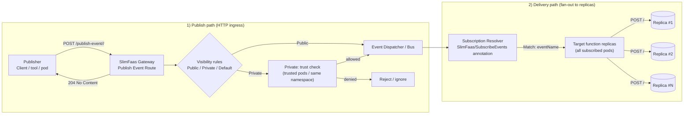

# Events in SlimFaas

SlimFaas supports a basic “publish/subscribe” model for broadcasting events to ready replicas of subscribed functions.
This can be used to trigger internal actions or notify your functions of certain events.

---

## 1. Subscribe to Events

To allow a function to **receive** events, add the annotation `SlimFaas/SubscribeEvents` to the function's deployment:

```yaml
metadata:
  annotations:
    SlimFaas/SubscribeEvents: "Public:my-event1,Private:my-event2,my-event3"
```

- **Public events** can be sent from any source.
- **Private event**s can only be sent by trusted pods or within the same namespace.
- If you omit `Public:` or `Private:`, it defaults to `SlimFaas/DefaultVisibility`.

---

## 2. Publishing an Event
   Use the following HTTP route to publish an event:

- **Endpoint**: `POST http://<slimfaas>/publish-event/<eventName>/<path>`

- **Body** (any JSON payload):
```json
{
  "data": "my-event-data"
}
```
- **Response**: `204 (No Content)`

---

## 3. Delivery behavior

HTTP publication does not wake sleeping replicas or queue events durably. Wake subscribers and wait for readiness before publishing. A configured subscriber with no ready replicas can still lead to a `204` response, while no allowed subscription returns `404`. Per-target failures are logged, so `204` is not an acknowledgment from every replica.

Connected WebSocket subscribers receive events through their registered clients. Use [async function calls](functions.md#2-asynchronous-functions) when work needs a durable queue, and the [Guided Tour](guided-tour.md#5-publish-an-event) to observe fan-out in the UI.

## 4. Example
```bash
curl -X POST -H "Content-Type: application/json" \
     -d '{"input":10}' \
     http://localhost:30021/publish-event/fibo-public/fibonacci

```
In the supplied demo, ready replicas subscribed to `fibo-public` receive a POST at `/fibonacci`. Use port `30020` instead in native local mode.



