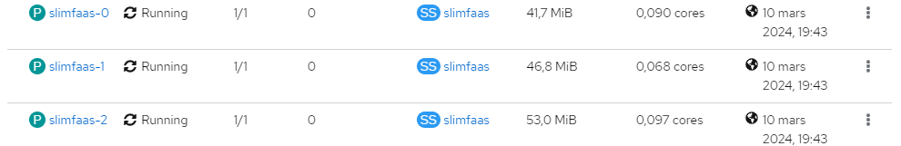



# SlimFaas: The Slimmest, Simplest & Autoscaling-First Function-as-a-Service

SlimFaas is a lightweight, plug-and-play Function-as-a-Service (FaaS) platform for Kubernetes (and Docker-Compose / Podman-Compose).
It’s designed to be **fast**, **simple**, and **extremely slim** — with a very opinionated, **autoscaling-first** design:
- `0 → N` wake-up from HTTP history & schedules,
- `0 → N` wake-up from **Kafka lag** via the companion **SlimFaas Kafka** service,
- `N → M` scaling powered by PromQL,
- internal metrics store, debug endpoints, and scale-to-zero out of the box.
- built-in **User Interface** at the SlimFaas root address to see functions, jobs, queues, and real-time messages.
- temporary **Data Sets** endpoints (Redis-like KV) to store small blobs/JSON with **TTL (milliseconds)** and atomic counters — perfect for cache & agentic state.
- temporary **Data Files** endpoints to ingest and stage files (from tiny to very large) with TTL-friendly storage — perfect for caching & agentic workflows.

> **Looking for MCP integration?**
> Check out **[SlimFaas MCP](https://slimfaas.dev/mcp)** — the companion runtime that converts *any* OpenAPI definition into MCP-ready tools on the fly.

---

## Why Use SlimFaas?

### 🚀 Autoscaling that actually understands your traffic

SlimFaas puts autoscaling at the center of the design:

- **Scale-to-zero & cold-start control**
    - Scale down to `0` after inactivity with configurable timeouts.
    - Wake up from `0 → N` based on real HTTP history and/or time-based schedules.
    - Wake up from `0 → N` based on **Kafka topic activity**: SlimFaas Kafka watches consumer group lag and calls the wake-up API whenever there are pending messages or recent consumption.
    - Control initial capacity via `ReplicasAtStart` to avoid thundering herds.

- **Two-phase scaling model**
    - **`0 → N`**: driven by HTTP history, schedules, dependencies **and Kafka lag (via SlimFaas Kafka)** to bring functions online only when needed.
    - **`N → M`**: driven by Prometheus metrics and a built-in PromQL mini-evaluator.
    - The metrics-based autoscaler only runs once at least one pod exists — no “metrics from the void”.

- **PromQL-driven autoscaler (no external HPA required)**
    - Write PromQL-style triggers like:
        - `sum(rate(http_server_requests_seconds_count{...}[1m]))`
        - `max_over_time(slimfaas_function_queue_ready_items{function="my-func"}[30s])`
        - `histogram_quantile(0.95, sum by (le) (rate(http_server_requests_seconds_bucket{...}[1m])))`
    - Targets can be interpreted as **“per pod”** (`AverageValue`) or **global** (`Value`).
    - Scale-up/scale-down policies and stabilization windows inspired by HPA/KEDA.

- **Integrated metrics scraper (no Prometheus mandatory in the hot path)**
    - SlimFaas scrapes **only** the HTTP metrics endpoints of pods with Prometheus annotations.
    - It stores **only the metrics you actually request** in your triggers or debug queries.
    - A single SlimFaas node is responsible for scraping and writing to the shared store; all nodes read from it.

- **Debug-friendly autoscaling**
    - `POST /debug/promql/eval` – evaluate any PromQL expression against the internal store.
    - `GET /debug/store` – see what metrics SlimFaas is scraping and how much data it keeps.
    - Designed so you can reason about “what SlimFaas sees” when it makes scaling decisions.

- **FinOps-friendly by design**
    - 30-minute metrics retention window for predictable memory usage.
    - Native scale-to-zero + schedules to keep non-critical workloads cold outside of business hours.
    - Super slim runtime so your control plane does not become the new bottleneck.

### 🧵 Synchronous and Asynchronous Functions

- Simple HTTP endpoints for both **sync** and **async** calls.
- Async mode:
    - Limit parallelism per function.
    - Configure retries and backoff strategies.
    - Drive scaling decisions based on queue metrics.

### ⏱ Jobs

- Run one-off, batch, and scheduled (cron) jobs via HTTP.
- Control:
    - concurrency,
    - visibility (public/private),
    - and lifecycles.

### 🔐 Private/Public Functions and Jobs

- Expose only what you need:
    - Internal functions stay private and are accessible only from within the cluster or trusted pods.
    - Public functions can be routed via Ingress / API Gateways.

### 📣 Publish/Subscribe Internal Events

- Synchronously broadcast events to **every replica** of selected functions.
- No external event bus required — perfect for simple fan-out, cache invalidation, or configuration refresh scenarios.

### 🧺 Data Sets & 📁 Data Files (ephemeral state + real-time ingestion)

SlimFaas includes two complementary data APIs:

- **Data Sets** (`/data/sets`): a Redis-like, cluster-consistent **KV store** for small payloads (cache, JSON state, flags, checkpoints) with optional **TTL in milliseconds**, atomic counter commands, and a **1 MiB** payload limit.
- **Data Files** (`/data/files`): stream-first endpoints to ingest, store, and serve temporary files — from tiny payloads to *very large* binaries — ideal for **agentic workflows** and **real-time ingestion** (upload once, get an `id`, then let tools/functions consume it when they’re ready).

### 🧠 “Mind Changer” (Status & Wake-up API)

- A built-in REST API to:
    - inspect the current state of your functions,
    - wake them up on demand,
    - integrate health/usage information into your own dashboards.

### 🔌 Plug and Play

- Deploy SlimFaas as a standard pod/StatefulSet with minimal configuration.
- Onboard existing workloads by **adding annotations** to your Deployments:
    - let SlimFaas manage their replicas and autoscaling,
    - keep your existing containers and tooling.

### ⚡ Slim & Fast

- Written in .NET with a focus on:
    - low CPU and memory footprint,
    - AOT-friendly code paths,
    - minimal dependencies.

---

## Ready to Get Started?

Dive into the documentation:

- [Get Started](get-started.md) – Deploy SlimFaas on Kubernetes or Docker Compose.
- [Local Mode](native-local-mode.md) – Run functions, Jobs, development processes, and a supervised SlimFaas cluster directly on your machine.
- Scaling
    - [Autoscaling](autoscaling.md) – Configure `0 → N` / `N → M` autoscaling, PromQL triggers, metrics scraping, and debug endpoints.
    - [Kafka Connector](kafka.md) – Use Kafka topic lag to wake functions and keep workers alive while messages are flowing.
    - [Planet Saver](planet-saver.md) – Start and monitor replicas from a JavaScript frontend.
- Functions & Workloads
    - [Functions](functions.md) – Call functions synchronously or asynchronously.
    - [User Interface](user-interface.md) – Monitor functions, queues, jobs, and real-time messages.
    - [Clients](clients.md) – Integrate SlimFaas with .NET and Python applications.
    - [Events](events.md) – Use internal publish/subscribe events.
    - [Jobs](jobs.md) – Define, schedule, and run one-off jobs.
    - [OpenTelemetry](opentelemetry.md) – Enable distributed tracing, metrics, and logs.
    - [Benchmarks](benchmarking.md) – Measure sync overhead, async delivery latency, and native-local scaling speed.
- Data & Files
    - [Data Files](data-files.md) – Ingest, store, and serve temporary binary artifacts.
    - [Data Sets](data-sets.md) – Store replicated, Redis-like key-value payloads with optional TTL.
- [How It Works](how-it-works.md) – Understand SlimFaas architecture and request flows.
- [MCP](mcp.md) – Convert OpenAPI definitions into MCP-ready tools.

### Technical references

- [Local three-node orchestrator](local-orchestrator.md)
- [Memory profiling](memory-profiling.md)
- [Unified SlimData mutation batching](slimdata-unified-batching.md)
- [SlimData batch modes](slimdata-batch-modes.md)
- [Environment-variable breaking changes](BREAKING_CHANGES_ENVIRONMENT_VARIABLES.md)

We hope SlimFaas helps you **simplify autoscaling**, **reduce costs**, and **keep your serverless workloads slim**.

---

### Community & Governance

- **CNCF Project**
  SlimFaas is proud to be part of the [Cloud Native Computing Foundation (CNCF) landscape](https://landscape.cncf.io).

  

- **Community Meeting**
  Join us through our [Community Meeting Calendar](https://calendar.google.com/calendar/embed?src=be1dd72d18650490580a7d5d96a45a6eebe0fc4c9fe8adce630754cbb6121cca%40group.calendar.google.com&ctz=Europe%2FParis)
    - [ICS file](https://calendar.google.com/calendar/ical/be1dd72d18650490580a7d5d96a45a6eebe0fc4c9fe8adce630754cbb6121cca%40group.calendar.google.com/public/basic.ics)

- **Slack Channel**
  Join our channel on the [CNCF Slack](https://cloud-native.slack.com/archives/C08CRC77VDE) to connect with other SlimFaas users.

- **Code of Conduct**
  SlimFaas follows the [CNCF Code of Conduct](https://github.com/cncf/foundation/blob/main/code-of-conduct.md).

Enjoy SlimFaas!

---

## Adopters

List of organizations using this project in production or at stages of testing.

---

Add your logo via a pull request:

- Logo must be in PNG format, 100 px wide and 100 px high.
- Add your logo to the `docs/adopters_logo` folder.
