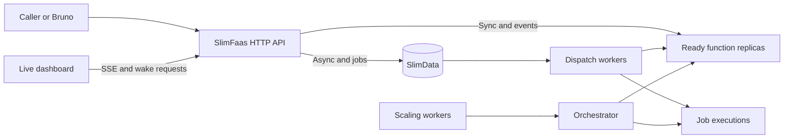
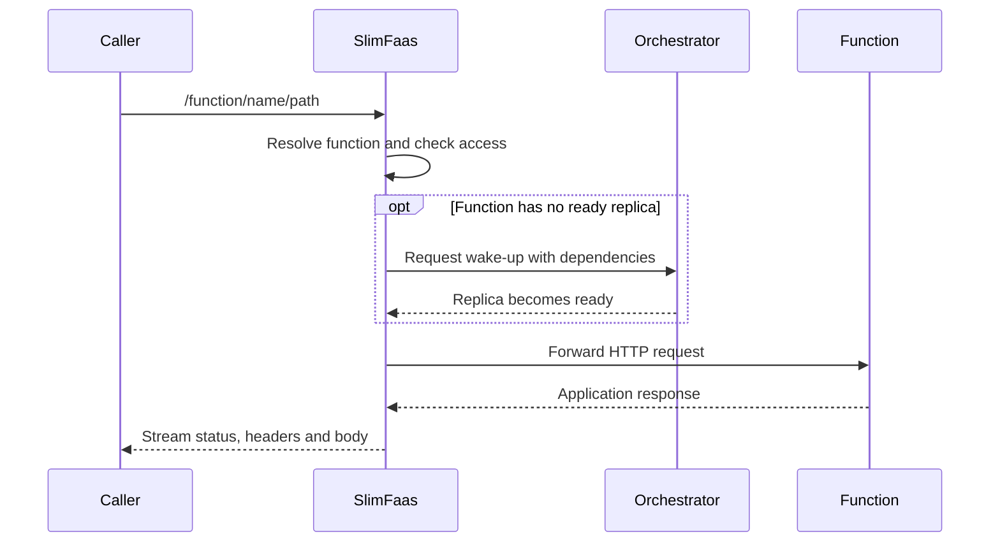
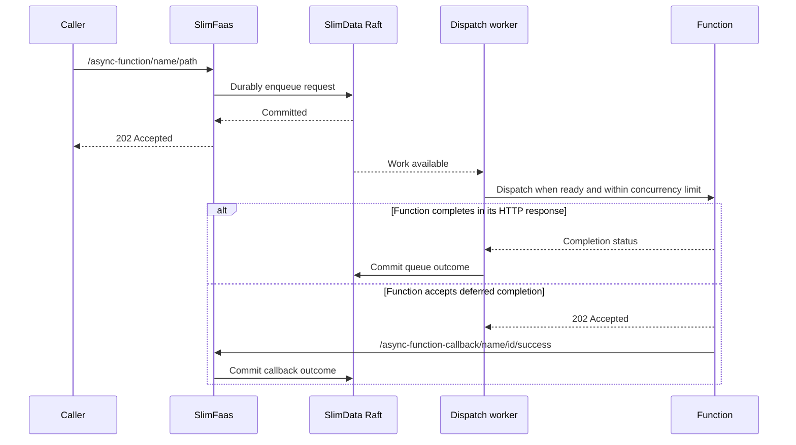
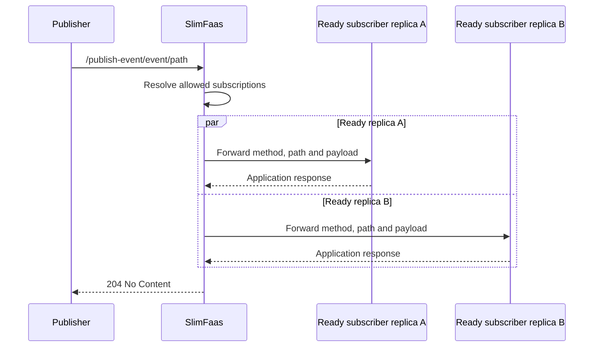
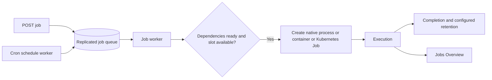
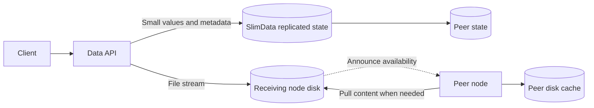

# How SlimFaas Works

SlimFaas sits between callers and their applications. It routes HTTP requests, wakes idle workloads, queues asynchronous work, dispatches jobs and coordinates state through SlimData.

Start with the [Guided Tour](guided-tour.md) to see these flows in the dashboard. This page explains what happens behind each step; the [API Reference](api-reference.md) lists the actual routes.

## The system at a glance



### One API, three orchestrators

| Mode | Workload lifecycle | Cluster in the introductory demo |
|---|---|---|
| Kubernetes | Deployments, StatefulSets, annotated workloads and Jobs | Three persistent SlimFaas/Raft nodes |
| Docker | Containers discovered through labels and managed using the Docker API | One SlimFaas node |
| Native local | Commands, health checks and jobs managed by a loopback supervisor | Three real SlimFaas/Raft processes behind one entrypoint |

Native local mode is for development. It shares the host network and does not enforce container CPU, memory or security isolation. Its process orchestrator is distinct from the simulated `Local` orchestrator used by test and memory tools. See [Native Local Mode](native-local-mode.md).

### Components and responsibilities

Each SlimFaas node serves requests and observes the cluster. `ReplicasSynchronizationWorker` refreshes workload topology. The leader's scaling and dispatch decisions use readiness, dependencies, activity history, concurrency limits and queue state.

`SlimWorker` dispatches queued HTTP work. WebSocket workers deliver requests to registered clients. Job workers create executions through the orchestrator, while schedule workers enqueue due jobs. `HistorySynchronizationWorker` shares recent activity history used by scaling.

SlimData holds replicated queue state, configuration and small values. `ClusterMembershipAnnounceWorker` announces a member to a leader; `SlimDataMembershipReconciliationWorker` reconciles membership with the orchestrator topology. Node readiness includes Raft recovery and protocol compatibility.

### Event-driven Kubernetes synchronization (watch-as-signal)

On Kubernetes, the synchronization workers are driven by **watch streams** instead of fixed-cadence polling: watch events on pods, deployments, statefulsets, jobs and cronjobs only signal *that* something changed, and the existing LIST-based synchronization then runs unchanged — the synchronized state is identical to polling, just triggered by events, with a periodic resync as a safety net (see the configuration reference in [Get started on Kubernetes](get-started-kubernetes.md)).

**How the watch is Native AOT compatible.** SlimFaas references `KubernetesClient.Aot`, the trimming/AOT variant of the official client. That package replaces the reflection-based deserialization of LIST/GET calls with source-generated `System.Text.Json` contexts, but it does **not** ship `Watcher<T>`/`WatchAsync`: the standard client's watch machinery deserializes every event into typed models (`V1Pod`, `V1Deployment`, ...) through reflection, which is incompatible with trimming and Native AOT. SlimFaas works around this by never needing that machinery:

- **Transport — raw HTTP, only the client's plumbing.** `KubernetesWatcherWorker` builds its own `HttpRequestMessage` (`GET {BaseUri}.../pods?watch=true&allowWatchBookmarks=true...`) and borrows only three pieces of the client, none of which serialize anything: `client.BaseUri` (API server URL), `client.Credentials.ProcessHttpRequestAsync` (ServiceAccount Bearer token with its rotation, or mTLS) and `client.HttpClient` (the configured TLS pipeline). This is the same hand-rolled pattern `ScaleAsync` already used, so the path was AOT-proven before the watcher existed. The response is read with `ResponseHeadersRead` and `StreamReader.ReadLineAsync` — a Kubernetes watch stream is line-delimited JSON.
- **Parsing — three scalar fields, zero reflection.** The watch-as-signal design never materializes the Kubernetes object carried by an event. `WatchEventLineParser` extracts only the event `type` (`ADDED`/`MODIFIED`/`DELETED` pulse a version counter, `BOOKMARK`, `ERROR`), `object.metadata.resourceVersion` (stream continuity across the 60 s server-side rotations) and `object.code` (410 Gone detection inside ERROR events). It uses `Utf8JsonReader` — a forward-only BCL `ref struct` with no reflection and no dynamic code generation, AOT/trim-safe by construction — with UTF-8 literal property comparisons (`ValueTextEquals("type"u8)`); everything else in the line (the full spec/status) is skipped without ever being interpreted, and a malformed line yields `Unknown` instead of throwing.
- **State — the typed path stays on the supported client.** The actual cluster state is still obtained by the existing LIST calls (`ListNamespacedPodAsync`, ...), which go through the AOT client's typed APIs and their source-generated serialization. The type-rich work therefore remains entirely on the path `KubernetesClient.Aot` already supports; the watch only decides *when* those LISTs run.

This split is validated by the CI, which publishes Native AOT builds for linux x64/arm64, win-x64 and osx x64/arm64 — reflective code on the watch path would be broken or flagged by the trimmer.

## Synchronous calls



A synchronous call waits for a usable replica and the application's response, subject to configured timeouts. Visibility failures are represented as `404`. A wake endpoint only requests activity and returns `204`; it is not a readiness wait. Streaming responses do not require buffering the whole response in memory.

## Asynchronous calls and callbacks



`202` acknowledges durable enqueueing, not execution or a stored function result. Handlers can be retried after failure or incomplete delivery; make side effects idempotent. Retry delays, HTTP timeouts and retryable statuses are configured per function. See [Functions](functions.md).

Committed mutations signal workers immediately; periodic polling remains a recovery fallback. Dispatch uses a lightweight queue snapshot of counts, running IDs and reservations rather than copying every payload. Completion mailboxes group durable callbacks, release response resources promptly and perform offloaded-body cleanup separately. Results completed after leadership loss are discarded locally so the current leader controls callback and retry decisions.

## Events



HTTP events fan out to ready replicas, including multiple replicas of the same function. They do not durably queue for sleeping functions or wake them. The handler logs per-target failures; `204` does not guarantee every subscriber succeeded. With no allowed configured subscriber, it returns `404`. Connected WebSocket subscribers receive events through their transport. See [Events](events.md).

## Jobs and schedules



A job configuration describes the executable/image, arguments, environment, resources, dependencies, concurrency and retention. A request adds an execution and returns its ID. Dynamic schedules create executions when due; Kubernetes CronJobs can also provide annotated job configuration. Deleting a schedule stops future submissions, while deleting an execution targets that individual job. See [Jobs](jobs.md).

## Scaling and access

Inactivity can reduce replicas to the configured minimum, including zero. New calls and wake-up requests refresh activity. Dependency checks coordinate dependent workloads. PromQL triggers handle scale-out from running replicas, with limits, stabilization windows and policies. Read [Autoscaling](autoscaling.md) before tuning these independently of request timeouts.

Function visibility, path overrides and event subscription visibility are separate decisions. Trusted workload addresses and forwarded addresses participate in caller classification. Set up your ingress accordingly. Native local mode's shared loopback network cannot demonstrate pod isolation. Data sets/files have their own visibility setting; the [API Reference](api-reference.md) documents the current hashset behavior separately.

### Queue metrics and function isolation

The autoscaler evaluates application metrics within the function's own deployment.
SlimFaas emits the three built-in queue gauges from its own metrics endpoint, so
those series are additionally selected from the `slimfaas` source when their
`function` label matches the function being scaled. Other functions' queue values
and unrelated SlimFaas metrics remain excluded from scoped evaluations.

The [guided scale-out exercise](guided-tour.md#scale-from-n-to-m-with-an-async-backlog)
uses that queue signal to show one ready replica becoming several, followed by
queue drain and scale-down.

## Data storage and replication



Small sets, counters and queue mutations are applied through SlimData's replicated log. Counter operations execute atomically as commands. The HTTP hashset facade stores one raw value field.

File content is disk-backed; metadata is cluster-consistent. A receiving node announces availability and another node can pull content when serving a download. File bytes are not copied through Raft as ordinary large values. TTL and deletion govern temporary artifact availability. See [Data Sets](data-sets.md) and [Data Files](data-files.md).

### Consensus and persistence

SlimData uses Raft through DotNext. Nodes retain applied state in memory and persist commands in a write-ahead log. A healthy quorum is needed for replicated writes; local snapshots of status and metadata do not by themselves establish that every peer is caught up.

### SlimData recovery

DotNext 6.4.1 chooses the synchronization path internally. SlimFaas supplies
`warmupRounds` (100 by default): a restarted member first attempts WAL
backtracking and can fall back to DotNext snapshot recovery when the gap is
larger than the configured search window. There is no public API in this
version to force a snapshot for a particular follower.

The SlimData diagnostics metrics expose the locally measurable recovery state:
`slimdata_raft_local_apply_lag` (local WAL entries pending application, not
leader/follower replication lag), `slimdata_raft_wal_generation_rate`,
`slimdata_raft_catch_up_rate`, `slimdata_raft_catch_up_cannot_converge`,
`slimdata_raft_recovery_mode{mode="wal|restoring|unknown"}`, and
`slimdata_raft_recovery_duration_seconds`. The convergence gauge is an
early-warning signal, not a membership failure: it is set when the observed
local apply rate is below the observed WAL generation rate. If an alternate
audit-trail implementation does not expose an applied index, lag and recovery
metrics remain zero because that state cannot be measured safely.


### SlimData WAL and snapshots

DotNext supports two WAL memory-management strategies. SlimFaas selects the strategy with `SlimData:WalMemoryManagement`:

- `SharedMemory` is the default. It writes directly to memory-mapped WAL files so the operating system can reclaim or flush mapped pages under memory pressure.
- `PrivateMemory` uses private temporary buffers and favors write throughput, at the cost of higher RAM consumption.

SlimData creates a streaming snapshot when either **32 MiB of successfully applied WAL entries** or **500 successfully applied entries** have accumulated, whichever occurs first. A snapshot compacts the preceding Raft log window; the byte and entry counters restart after the snapshot request or a snapshot restore.

```json
{
  "SlimData": {
    "WalMemoryManagement": "SharedMemory",
    "SnapshotIntervalEntries": 500,
    "SnapshotIntervalBytes": 33554432
  }
}
```

The equivalent environment variables are:

```bash
SlimData__WalMemoryManagement=SharedMemory
SlimData__SnapshotIntervalEntries=500
SlimData__SnapshotIntervalBytes=33554432
```

`WalMemoryManagement` accepts only `PrivateMemory` and `SharedMemory`, case-insensitively. Snapshot intervals must be strictly positive. Invalid values stop startup with a configuration error. Changing the memory strategy does not change the WAL format and does not require a data migration.

The current byte window and the cause of the latest snapshot request are exposed as `slimdata_wal_bytes_since_snapshot` and `slimdata_snapshot_last_trigger{cause="bytes|entries|incompatible"}`.

### Snapshot layout and reserved pod IPs

When the dispatch worker dequeues an asynchronous request, it reserves a pod IP for it within the per-pod concurrency limit (`NumberParallelRequestPerPod`) and SlimData stores that IP on the queue try. On every dispatch cycle the worker reads the running tries and their reserved IPs from the queue state and keeps those pod slots occupied before reserving pods for the next messages.

SlimData snapshots persist the reserved IP of every queue try so that this accounting survives a snapshot restore (node restart, follower catch-up, snapshot installed by the leader). The snapshot **body** keeps the historical layout unchanged; the reserved IPs travel in a **trailer** written after the body. A node running a release without the trailer reads the body and ignores what follows.

Compatibility rules between releases:

- **Rolling upgrade**: a snapshot written by the current release restores on an older node with empty reserved IPs. Nothing else is lost.
- **Older snapshot**: a snapshot written by a release without the trailer (0.84.4 and earlier) restores on the current release with empty reserved IPs. Requests that were running when the snapshot was taken no longer count against their pod until they complete, time out or are retried, so a pod may temporarily receive more concurrent requests than its limit.
- **Downgrade**: an older release drops the reserved IPs on its first restore, with the same transient effect. The body is unchanged in both directions, so no data migration is needed.
- **Corruption**: a trailer that is truncated, carries an unknown magic or version, describes a different number of tries than the body, or is followed by extra data is rejected and the restore fails. A truncated new-format snapshot is never read as an older one, so reserved IPs are never dropped silently.

---


## CPU-aware rate limiting

SlimFaas includes built-in **load shedding**, enabled by default, to protect your cluster during traffic spikes by automatically rejecting requests when CPU usage reaches configurable thresholds.

### Key Features

- **Hysteresis support**: Prevents rapid toggling between limited and normal states with separate high/low thresholds.
- **Port-specific**: Applies to all SlimFaas ports **except** the SlimData internal port (used for cluster coordination).
- **Path exclusions**: Configurable list of paths to exclude (e.g., health checks, metrics endpoints).
- **Native AOT compatible**: Minimal performance overhead.

### How It Works

1. **Monitoring**: A background service continuously samples process CPU usage at a configurable interval, normalized by the number of processors available to the .NET runtime.
2. **Activation**: A sample at or above `CpuHighThreshold` (80% by default) activates rejection of non-exempt requests with `429 Too Many Requests`.
3. **Deactivation**: A sample at or below `CpuLowThreshold` (60% by default) clears the limitation. Samples between the thresholds preserve the previous state.
4. **Exemptions**: The SlimData port (used for internal cluster communication) is always exempt from rate limiting.

Both transitions happen during CPU sampling, even when no requests arrive or only health probes are called. For example, samples of 85%, 50%, then 70% leave requests allowed after the 50% sample without restarting the pod. Previously, the middleware evaluated transitions only on non-exempt requests and could miss that recovery between calls.

### Configuration

Add the following to your `appsettings.json`:

```json
{
  "SlimFaas": {
    "RateLimiting": {
      "Enabled": true,
      "CpuHighThreshold": 80.0,
      "CpuLowThreshold": 60.0,
      "SampleIntervalMs": 1000,
      "RetryAfterSeconds": 5,
      "ExcludedPaths": [
        "/health",
        "/ready",
        "/metrics",
        "/SlimData"
      ]
    }
  }
}
```

**Parameters:**

- `Enabled` (bool): Enable or disable CPU rate limiting.
- `CpuHighThreshold` (double, 0-100): CPU percentage that triggers rate limiting.
- `CpuLowThreshold` (double, 0-100): CPU percentage that stops rate limiting (must be < CpuHighThreshold).
- `SampleIntervalMs` (int, ≥100): How often to sample CPU usage (milliseconds).
- `RetryAfterSeconds` (int?, optional): Value for the `Retry-After` header in 429 responses.
- `ExcludedPaths` (string[]): List of paths that bypass rate limiting (e.g., health checks).

**Validation:**

- `CpuLowThreshold < CpuHighThreshold`
- Both thresholds must be between 0 and 100
- `SampleIntervalMs` must be ≥ 100

### Port Exemption

The CPU rate limiting middleware automatically exempts the **SlimData port** (configured via `publicEndPoint` in your SlimData configuration). This ensures that:

- Internal cluster coordination is never throttled
- Raft consensus and state synchronization continue uninterrupted
- Only external/public traffic on other ports is subject to rate limiting

This design keeps your control plane healthy even under extreme load.

### Diagnose healthy probes with blocked function calls

`/health`, `/ready`, `/metrics` and `/SlimData` (including its subroutes) are excluded by default. A pod can therefore return `200` on its probes while rejecting `/function/...` and `/status-functions` with `429` and `Retry-After: 5`. A browser's error handling or wake-up overlay can make this appear to be a stalled application. An HTTP timeout without a response is a different symptom and does not, by itself, identify CPU limiting as the cause.

When monitoring is enabled, each pod exposes two gauges on `/metrics` after the first CPU sample, without additional labels:

| Metric | Meaning |
| --- | --- |
| `slimfaas_cpu_usage_percent` | Latest CPU percentage used by the limiter. |
| `slimfaas_cpu_rate_limiting_active` | `1` while limiting, otherwise `0`. |

`SlimFaas.RateLimiting.CpuMonitoringWorker` logs `CPU rate limiting activated` at Warning level and `CPU rate limiting deactivated` at Information level once per transition. `High CPU usage detected` remains a Warning for each sample at or above the high threshold. These gauges are absent when CPU monitoring is disabled.

Before restarting a pod, capture the failing request's status, response body and timing in the browser's Network panel and directly against each SlimFaas pod. For example, set your namespace and forward the first pod's public HTTP port (5000 by default):

```bash
SLIMFAAS_NAMESPACE=default
kubectl -n "$SLIMFAAS_NAMESPACE" port-forward pod/slimfaas-0 15000:5000
```

In another terminal, set a read-only function path for your environment:

```bash
SLIMFAAS_FUNCTION_PATH=/function/fibonacci1/hello/local
for path in /health /ready /status-functions "$SLIMFAAS_FUNCTION_PATH"; do
  curl --include --max-time 10 --write-out '\nHTTP %{http_code} in %{time_total}s\n' \
    "http://127.0.0.1:15000$path"
done
curl --silent --max-time 10 http://127.0.0.1:15000/metrics | rg '^slimfaas_cpu_'
```

Repeat for the other pods and retain their logs, including the interval before the failure. Compare direct responses with those through the ingress. If requests expire without `429`, investigate routing, downstream connections and deployment synchronization rather than assuming the limiter caused the incident.

For a controlled development comparison, set `SlimFaas__RateLimiting__Enabled=false` in the SlimFaas deployment configuration and replay the same workload for a comparable duration. This temporarily removes CPU load shedding. A successful request immediately after the rollout is insufficient evidence: restarting alone also resets process state. Restore the setting after the comparison; the normal recovery path requires no restart.

---


## Observe the system

The dashboard consumes `/status-functions-stream`: periodic `state` snapshots and live `activity`/`activity_batch` events. Animations are not a replay or an audit log. Peer nodes synchronize recent activity through an internal endpoint. See [User Interface](user-interface.md) for sampling, batching and stream limits.

SlimFaas is compiled to native code with .NET AOT. Source-generated JSON and MemoryPack contracts keep serialization compatible with trimming. For reproducible measurements use [Benchmarks](benchmarking.md); for traces and exports use [OpenTelemetry](opentelemetry.md). Advanced development references cover [local cluster experiments](local-orchestrator.md) and [memory workloads](memory-profiling.md).

### Dashboard metadata projection

The optional `/status-data-stream` endpoint builds a metadata-only projection from locally applied SlimData state. A per-node lazy cache shares that projection across viewers at the existing state interval; no scan runs without requests. File lengths come from stored MemoryPack metadata, with no document reads or cluster file pulls. Only a bounded page is serialized to each viewer using the generated JSON context. Status and metadata streams share `MaxSseClients`. The data visibility policy applies unless `SlimFaas:ExposeDataMetadata` explicitly enables metadata access while the front is enabled. See [the dashboard contract](user-interface.md#data-inventory).

### On-demand instance log readers

The optional `SlimFaas:ExposeLogs` capability exposes managed function, job and SlimFaas-node output through `/status-log-sources` and `/status-logs-stream`. It requires the front to be enabled and defaults to false. A source reference contains resource identity rather than a network address or log path; each open revalidates managed ownership and instance generation. Kubernetes validates controller ownership, Docker resolves a known container, and native nodes use the supervisor's existing authenticated control channel.

Per-node readers are shared only while viewed (four sources maximum) and use bounded line/byte buffers independent of client speed. The last disconnect cancels the upstream read. They reserve the same SSE client quota as Traffic/Data while leaving peer activity synchronization inactive. Native file tails, Docker stdout/stderr demultiplexing and Kubernetes follow requests use bounded streaming parsers, with generated JSON contracts for AOT. No SlimData payload or storage migration is required. See [instance logs](user-interface.md#instance-logs).


### Autoscaling signal providers

Autoscaling obtains observations through the internal `IScalerProvider` contract.
`PrometheusScalerProvider` owns PromQL compilation/evaluation and source-health checks;
it reuses the existing scraper, compiled evaluator and metrics store. Providers return a
state, numeric value and activity flag and have no Kubernetes replica-writing dependency.
`AutoScaler` owns threshold formulas, aggregation and stabilization/policies;
`ReplicasService` combines this with HTTP activity, schedules and dependency readiness.
Providers are registered explicitly through DI, compatible with native AOT.

External series use reserved internal identities containing namespace, function, source
and a URL fingerprint, within the existing MemoryPack snapshot shape. Historical local
identities and queue-gauge scope are unchanged. External evaluation filters series before
PromQL runs and requires selected series to be present in the latest successful scrape.
Health is process-local and is reset on leadership changes; persisted samples alone cannot
activate an external signal. Only the leader collects, using the existing bounded HTTP worker.

See [external sources and migration](autoscaling.md#external-metrics-and-opt-in-wake-up).


## Scaling diagnostics and simulation

`MetricsScalingCalculator` calculates trigger recommendations, bounds, policies and stabilization from explicit observations and read-only histories. `ScalingDecisionCalculator` combines that result with the captured HTTP/schedule, dependency and infrastructure context. `AutoScaler` and `ReplicasService` retain the production history/telemetry writes and orchestrator calls. Real cycles publish diagnostic decisions before application and record accepted or failed requests afterward.

The dashboard reads a separate bounded in-memory diagnostic journal. The journal has no role in making scaling decisions and is reset across leadership changes. Simulations use request-local metric and health copies plus copied autoscaler histories; compilation caches for edited queries are also request-local. They share the calculators without invoking production writes or the side effects of the existing PromQL debug endpoint.

Followers resolve the leader from configured Raft membership and reuse the configured application-port resolution for HTTP relays. State frames are briefly cached per function and leader, with a maximum of eight cache entries per node. Internal endpoints require the front, allowed ports and a direct connection from a recognized SlimFaas member IP; browser-supplied upstream addresses are not accepted. See [the UI guide](user-interface.md#scaling-diagnostics-and-playground).
