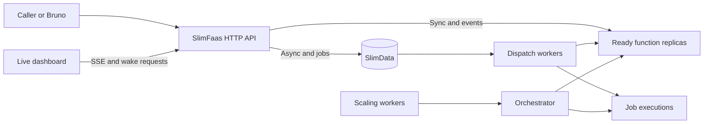
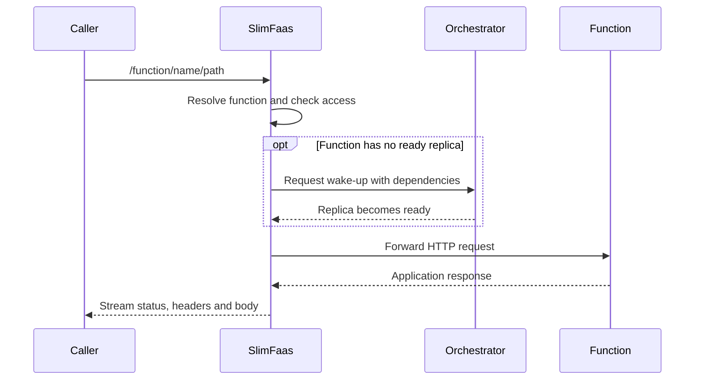
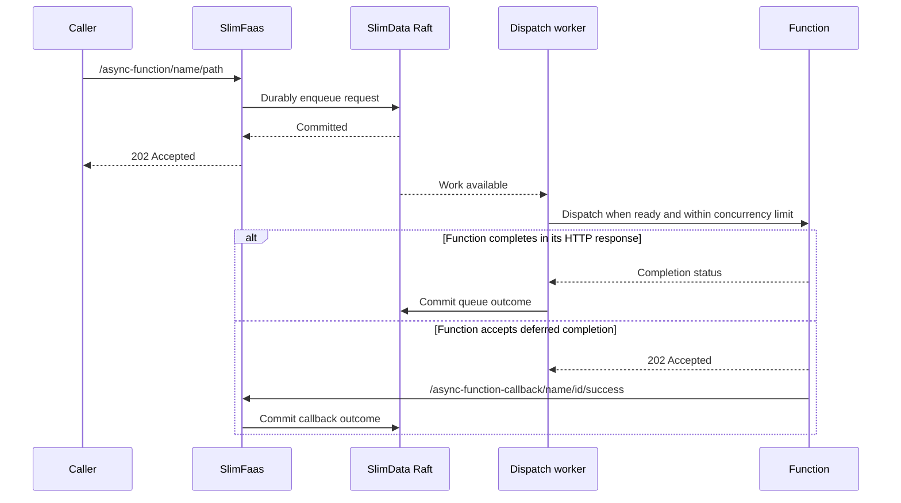
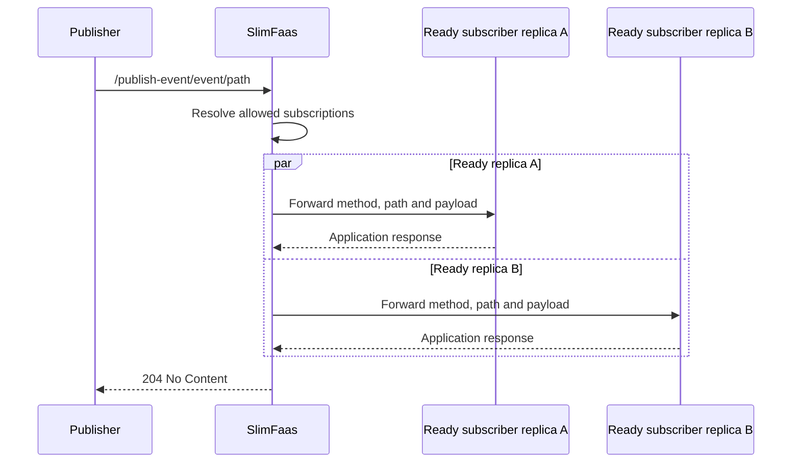
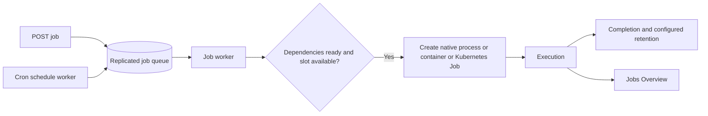
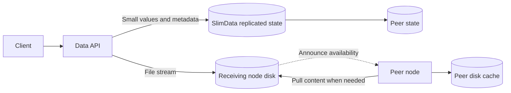

# How SlimFaas Works

SlimFaas sits between callers and their applications. It routes HTTP requests, wakes idle workloads, queues asynchronous work, dispatches jobs and coordinates state through SlimData.

Start with the [Guided Tour](guided-tour.md) to see these flows in the dashboard. This page explains what happens behind each step; the [API Reference](api-reference.md) lists the actual routes.

## The system at a glance



### One API, three orchestrators

| Mode | Workload lifecycle | Cluster in the introductory demo |
|---|---|---|
| Kubernetes | Deployments, StatefulSets, annotated workloads and Jobs | Three persistent SlimFaas/Raft nodes |
| Docker | Containers discovered through labels and managed using the Docker API | One SlimFaas node |
| Native local | Commands, health checks and jobs managed by a loopback supervisor | Three real SlimFaas/Raft processes behind one entrypoint |

Native local mode is for development. It shares the host network and does not enforce container CPU, memory or security isolation. Its process orchestrator is distinct from the simulated `Local` orchestrator used by test and memory tools. See [Native Local Mode](native-local-mode.md).

### Components and responsibilities

Each SlimFaas node serves requests and observes the cluster. `ReplicasSynchronizationWorker` refreshes workload topology. The leader's scaling and dispatch decisions use readiness, dependencies, activity history, concurrency limits and queue state.

`SlimWorker` dispatches queued HTTP work. WebSocket workers deliver requests to registered clients. Job workers create executions through the orchestrator, while schedule workers enqueue due jobs. `HistorySynchronizationWorker` shares recent activity history used by scaling.

SlimData holds replicated queue state, configuration and small values. `ClusterMembershipAnnounceWorker` announces a member to a leader; `SlimDataMembershipReconciliationWorker` reconciles membership with the orchestrator topology. Node readiness includes Raft recovery and protocol compatibility.

## Synchronous calls



A synchronous call waits for a usable replica and the application's response, subject to configured timeouts. Visibility failures are represented as `404`. A wake endpoint only requests activity and returns `204`; it is not a readiness wait. Streaming responses do not require buffering the whole response in memory.

## Asynchronous calls and callbacks



`202` acknowledges durable enqueueing, not execution or a stored function result. Handlers can be retried after failure or incomplete delivery; make side effects idempotent. Retry delays, HTTP timeouts and retryable statuses are configured per function. See [Functions](functions.md).

Committed mutations signal workers immediately; periodic polling remains a recovery fallback. Dispatch uses a lightweight queue snapshot of counts, running IDs and reservations rather than copying every payload. Completion mailboxes group durable callbacks, release response resources promptly and perform offloaded-body cleanup separately. Results completed after leadership loss are discarded locally so the current leader controls callback and retry decisions.

## Events



HTTP events fan out to ready replicas, including multiple replicas of the same function. They do not durably queue for sleeping functions or wake them. The handler logs per-target failures; `204` does not guarantee every subscriber succeeded. With no allowed configured subscriber, it returns `404`. Connected WebSocket subscribers receive events through their transport. See [Events](events.md).

## Jobs and schedules



A job configuration describes the executable/image, arguments, environment, resources, dependencies, concurrency and retention. A request adds an execution and returns its ID. Dynamic schedules create executions when due; Kubernetes CronJobs can also provide annotated job configuration. Deleting a schedule stops future submissions, while deleting an execution targets that individual job. See [Jobs](jobs.md).

## Scaling and access

Inactivity can reduce replicas to the configured minimum, including zero. New calls and wake-up requests refresh activity. Dependency checks coordinate dependent workloads. PromQL triggers handle scale-out from running replicas, with limits, stabilization windows and policies. Read [Autoscaling](autoscaling.md) before tuning these independently of request timeouts.

Function visibility, path overrides and event subscription visibility are separate decisions. Trusted workload addresses and forwarded addresses participate in caller classification. Set up your ingress accordingly. Native local mode's shared loopback network cannot demonstrate pod isolation. Data sets/files have their own visibility setting; the [API Reference](api-reference.md) documents the current hashset behavior separately.

## Data storage and replication



Small sets, counters and queue mutations are applied through SlimData's replicated log. Counter operations execute atomically as commands. The HTTP hashset facade stores one raw value field.

File content is disk-backed; metadata is cluster-consistent. A receiving node announces availability and another node can pull content when serving a download. File bytes are not copied through Raft as ordinary large values. TTL and deletion govern temporary artifact availability. See [Data Sets](data-sets.md) and [Data Files](data-files.md).

### Consensus and persistence

SlimData uses Raft through DotNext. Nodes retain applied state in memory and persist commands in a write-ahead log. A healthy quorum is needed for replicated writes; local snapshots of status and metadata do not by themselves establish that every peer is caught up.

### SlimData recovery

DotNext 6.4.1 chooses the synchronization path internally. SlimFaas supplies
`warmupRounds` (100 by default): a restarted member first attempts WAL
backtracking and can fall back to DotNext snapshot recovery when the gap is
larger than the configured search window. There is no public API in this
version to force a snapshot for a particular follower.

The SlimData diagnostics metrics expose the locally measurable recovery state:
`slimdata_raft_local_apply_lag` (local WAL entries pending application, not
leader/follower replication lag), `slimdata_raft_wal_generation_rate`,
`slimdata_raft_catch_up_rate`, `slimdata_raft_catch_up_cannot_converge`,
`slimdata_raft_recovery_mode{mode="wal|restoring|unknown"}`, and
`slimdata_raft_recovery_duration_seconds`. The convergence gauge is an
early-warning signal, not a membership failure: it is set when the observed
local apply rate is below the observed WAL generation rate. If an alternate
audit-trail implementation does not expose an applied index, lag and recovery
metrics remain zero because that state cannot be measured safely.


### SlimData WAL and snapshots

DotNext supports two WAL memory-management strategies. SlimFaas selects the strategy with `SlimData:WalMemoryManagement`:

- `SharedMemory` is the default. It writes directly to memory-mapped WAL files so the operating system can reclaim or flush mapped pages under memory pressure.
- `PrivateMemory` uses private temporary buffers and favors write throughput, at the cost of higher RAM consumption.

SlimData creates a streaming snapshot when either **32 MiB of successfully applied WAL entries** or **500 successfully applied entries** have accumulated, whichever occurs first. A snapshot compacts the preceding Raft log window; the byte and entry counters restart after the snapshot request or a snapshot restore.

```json
{
  "SlimData": {
    "WalMemoryManagement": "SharedMemory",
    "SnapshotIntervalEntries": 500,
    "SnapshotIntervalBytes": 33554432
  }
}
```

The equivalent environment variables are:

```bash
SlimData__WalMemoryManagement=SharedMemory
SlimData__SnapshotIntervalEntries=500
SlimData__SnapshotIntervalBytes=33554432
```

`WalMemoryManagement` accepts only `PrivateMemory` and `SharedMemory`, case-insensitively. Snapshot intervals must be strictly positive. Invalid values stop startup with a configuration error. Changing the memory strategy does not change the WAL format and does not require a data migration.

The current byte window and the cause of the latest snapshot request are exposed as `slimdata_wal_bytes_since_snapshot` and `slimdata_snapshot_last_trigger{cause="bytes|entries|incompatible"}`.

---


## CPU-aware rate limiting

SlimFaas includes built-in **load shedding** to protect your cluster during traffic spikes by automatically rejecting requests when CPU usage exceeds configurable thresholds.

### Key Features

- **Hysteresis support**: Prevents rapid toggling between limited and normal states with separate high/low thresholds.
- **Port-specific**: Applies to all SlimFaas ports **except** the SlimData internal port (used for cluster coordination).
- **Path exclusions**: Configurable list of paths to exclude (e.g., health checks, metrics endpoints).
- **Native AOT compatible**: Minimal performance overhead.

### How It Works

1. **Monitoring**: A background service continuously samples CPU usage at a configurable interval.
2. **Activation**: When CPU exceeds the `CpuHighThreshold`, the middleware starts rejecting requests with `429 Too Many Requests`.
3. **Deactivation**: When CPU drops below the `CpuLowThreshold`, normal processing resumes.
4. **Exemptions**: The SlimData port (used for internal cluster communication) is always exempt from rate limiting.

### Configuration

Add the following to your `appsettings.json`:

```json
{
  "SlimFaas": {
    "RateLimiting": {
      "Enabled": true,
      "CpuHighThreshold": 80.0,
      "CpuLowThreshold": 60.0,
      "SampleIntervalMs": 1000,
      "RetryAfterSeconds": 30,
      "ExcludedPaths": [
        "/health",
        "/ready",
        "/metrics"
      ]
    }
  }
}
```

**Parameters:**

- `Enabled` (bool): Enable or disable CPU rate limiting.
- `CpuHighThreshold` (double, 0-100): CPU percentage that triggers rate limiting.
- `CpuLowThreshold` (double, 0-100): CPU percentage that stops rate limiting (must be < CpuHighThreshold).
- `SampleIntervalMs` (int, ≥100): How often to sample CPU usage (milliseconds).
- `RetryAfterSeconds` (int?, optional): Value for the `Retry-After` header in 429 responses.
- `ExcludedPaths` (string[]): List of paths that bypass rate limiting (e.g., health checks).

**Validation:**

- `CpuLowThreshold < CpuHighThreshold`
- Both thresholds must be between 0 and 100
- `SampleIntervalMs` must be ≥ 100

### Port Exemption

The CPU rate limiting middleware automatically exempts the **SlimData port** (configured via `publicEndPoint` in your SlimData configuration). This ensures that:

- Internal cluster coordination is never throttled
- Raft consensus and state synchronization continue uninterrupted
- Only external/public traffic on other ports is subject to rate limiting

This design keeps your control plane healthy even under extreme load.

---


## Observe the system

The dashboard consumes `/status-functions-stream`: periodic `state` snapshots and live `activity`/`activity_batch` events. Animations are not a replay or an audit log. Peer nodes synchronize recent activity through an internal endpoint. See [User Interface](user-interface.md) for sampling, batching and stream limits.

SlimFaas is compiled to native code with .NET AOT. Source-generated JSON and MemoryPack contracts keep serialization compatible with trimming. For reproducible measurements use [Benchmarks](benchmarking.md); for traces and exports use [OpenTelemetry](opentelemetry.md). Advanced development references cover [local cluster experiments](local-orchestrator.md) and [memory workloads](memory-profiling.md).
