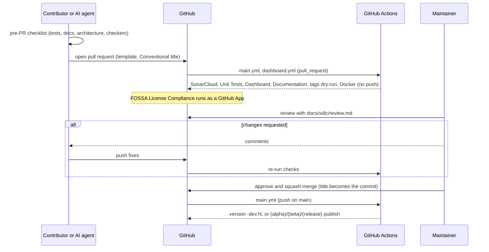
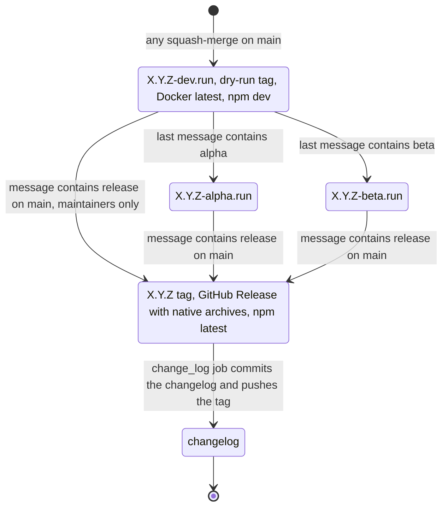

# SlimFaas development lifecycle

This is the software development lifecycle (SDLC) of the SlimFaas repository. It is written once, tool-neutral, and followed by human contributors, GitHub Copilot and Claude Code alike. Each stage below links to a workflow document in this folder; the assistants expose the same documents as slash commands.

This folder is intentionally not published on [slimfaas.dev](https://slimfaas.dev): it is developer documentation and stays on GitHub.

## Principles

1. **One source of truth.** [`AGENTS.md`](../../AGENTS.md) holds the project rules (AOT constraints, BEM, license policy, build and test commands, documentation duties). Everything here builds on it and never contradicts it. Claude Code loads it through `CLAUDE.md`; GitHub Copilot loads it natively and through `.github/copilot-instructions.md`.
2. **Same lifecycle for everyone.** An AI agent acting for a contributor has the rights and duties of that contributor: it plans, implements, tests, documents and opens pull requests; it never merges to `main`.
3. **Every stage has an artefact and an exit criterion.** An issue with phases, a branch with a first green build, a pull request with the template filled in, a review verdict, a tag.
4. **Code, tests, documentation and architecture diagrams ship together.** A pull request that changes behaviour without its documentation, or components without their Mermaid diagrams, is not done (see [`docs/architecture/README.md`](../architecture/README.md)).
5. **Process changes go through issues.** Anything that changes how people work (release model, ownership, required checks) is discussed in an issue before a pull request, for example [#363](https://github.com/SlimPlanet/SlimFaas/issues/363) (release management) and [#364](https://github.com/SlimPlanet/SlimFaas/issues/364) (code ownership).

## Roles

| Role | Defined in | In this lifecycle |
|---|---|---|
| Contributor | `GOVERNANCE.md` §2.1 | Plans, implements, opens pull requests; may publish `(alpha)` / `(beta)` pre-releases from a branch. |
| AI agent (Copilot, Claude Code, others) | this document | Acts for a contributor or maintainer with the same duties; follows `AGENTS.md`, the path-scoped rules and these workflows; never merges. |
| Maintainer | `GOVERNANCE.md` §2.2 | Reviews and squash-merges; the only role that publishes a stable version with `(release)` on `main`. |
| Technical Steering Committee | `GOVERNANCE.md` §2.3 | Decides process, architecture and licensing changes raised in issues. |

## Lifecycle

```mermaid
flowchart LR
    Issue["Issue and plan<br/>(Implementation plan form)"] --> Start["Start work<br/>worktree claude/&lt;slug&gt; or copilot/*"]
    Start --> Implement["Implement<br/>rules, tests, docs, architecture pages"]
    Implement --> Checklist["Pre-PR checklist<br/>gates 1-11"]
    Checklist -->|all gates pass| PR["Pull request<br/>template, Conventional title"]
    Checklist -->|a gate fails| Implement
    PR --> Review["Review<br/>reviewer checklist"]
    Review -->|changes requested| Implement
    Review -->|approved| Merge["Squash-merge to main"]
    Merge --> Tags["CI tags job<br/>-dev / (alpha) / (beta) / (release)"]
    Tags --> Publish["Publish<br/>Docker, native archives, npm, site"]
    Publish -->|release only| Changelog["Changelog commit and tag"]
```



Source: `docs/sdlc/*.md`, `.github/workflows/main.yml`

## Stages

| Stage | Entry | Activities | Exit | Artefact | Document | Claude Code | GitHub Copilot |
|---|---|---|---|---|---|---|---|
| Plan | A change spans several PRs or projects | Read `AGENTS.md` and the architecture pages, split into phases, name impacted docs | Issue created with phases | Issue (Implementation plan form) | [`plan-issue.md`](plan-issue.md) | `/plan-issue` | `/plan-issue` |
| Start work | Issue or clear task | Worktree and branch, first build, tests of the touched area | Green baseline on the branch | Branch `claude/<slug>`, `copilot/*` or fork | [`start-work.md`](start-work.md) | `/start-work` | `/start-work` |
| Implement | Baseline green | Code with the path-scoped rules, tests, docs, architecture diagrams | Local tests pass | Commits with Conventional messages | `AGENTS.md`, `.claude/rules/`, `.github/instructions/` | rules load by path | instructions apply by path |
| Document architecture | A mapped code area changed | Update or create the page, Mermaid diagrams, `Source:` and `Last verified:` lines | `check-architecture-docs.py` passes | Architecture page in the diff | [`document-architecture.md`](document-architecture.md) | `/document-architecture` | `/document-architecture` |
| Pre-PR checklist | Implementation complete | Gates 1-11: tests, AOT publish, UI, clients, site, local chain, benchmarks, docs, FOSSA, rule mirror, architecture | All applicable gates pass | Checklist ticked in the PR body | [`pre-pr-checklist.md`](pre-pr-checklist.md) | `/pre-pr-checklist` | `/pre-pr-checklist` |
| Open PR | Checklist passed | Conventional title, template filled, `Closes #N` | CI checks green | Pull request | [`open-pr.md`](open-pr.md) | `/open-pr` | `/open-pr` |
| Review | PR open, CI green | Reviewer checklist, run locally, approve or request changes | Approval by a maintainer | Review verdict | [`review.md`](review.md) | `/review` | `/review` |
| Publish | Squash-merge on `main` | `tags` job classifies the commit message, artifacts are built and pushed | Tag and GitHub Release for stable versions | Version, images, archives, packages | [`release.md`](release.md) | `/release` | `/release` |

## Pull request flow



Source: `.github/workflows/main.yml`, `.github/workflows/dashboard.yml`, `.github/pull_request_template.md`

## Release flow

The `tags` job classifies the **whole text** of the last commit message on `main`. With the repository's squash settings that message is the PR title followed by the **concatenated commit messages of the branch**, so a marker word in any commit of the branch counts. Details, pitfalls and post-release checks are in [`release.md`](release.md); the robustness of this mechanism is discussed in [#363](https://github.com/SlimPlanet/SlimFaas/issues/363).



Source: `.github/workflows/main.yml` (`tags`, `change_log`, `publish_native_release`), `GOVERNANCE.md` §3

Version bump: `fix` → patch, `feat` → minor, `BREAKING` anywhere → major, anything else → patch.

## Tool matrix

| Asset | Humans | Claude Code | GitHub Copilot |
|---|---|---|---|
| `AGENTS.md` | read | imported by `CLAUDE.md` | read natively and via `.github/copilot-instructions.md` |
| `CLAUDE.md` | – | always loaded | – |
| `.github/copilot-instructions.md` | – | – | always loaded |
| `.claude/rules/<topic>.md` | reference | loaded when a matching path is read or edited | – |
| `.github/instructions/<topic>.instructions.md` | reference | – | applied by `applyTo` glob |
| `docs/sdlc/*.md` | follow | `.claude/skills/<name>/SKILL.md` wraps each as `/<name>` | `.github/prompts/<name>.prompt.md` wraps each as `/<name>` |
| `.claude/settings.json` | – | permissions and a hook running the checkers before `gh pr create` | – |
| `.github/pull_request_template.md`, issue forms | fill in | fill in | fill in |
| `.bin/check-agent-rules.py`, `.bin/check-architecture-docs.py` | run | run (hook and checklist) | run (checklist) |

The rule bodies in `.claude/rules/` and `.github/instructions/` are identical by construction; `python .bin/check-agent-rules.py` fails when they drift.

## Asset map

```
AGENTS.md                      project rules (single source of truth)
CLAUDE.md                      @AGENTS.md import plus Claude-specific pointers
CONTRIBUTING.md                short version of this lifecycle
docs/sdlc/                     this document and the seven workflows
docs/architecture/             architecture contract, code-to-page map, template, GitHub-only pages
.claude/rules/                 path-scoped rules for Claude Code
.claude/skills/<name>/SKILL.md slash commands wrapping docs/sdlc/<name>.md
.claude/settings.json          shared permissions and the pre-PR hook
.github/copilot-instructions.md always-on Copilot pointer to AGENTS.md
.github/instructions/          path-scoped rules for Copilot (mirrors of .claude/rules/)
.github/prompts/               Copilot prompts wrapping docs/sdlc/<name>.md
.github/pull_request_template.md, .github/ISSUE_TEMPLATE/
.bin/check-agent-rules.py      rule mirror check
.bin/check-architecture-docs.py, .bin/test-check-architecture-docs.py
```

## Evolving the lifecycle

1. Change the neutral document in `docs/sdlc/` (or `AGENTS.md` for a rule) first; then update the wrappers only if their summary changed.
2. Edit a rule body in both `.claude/rules/<topic>.md` and `.github/instructions/<topic>.instructions.md`, then run `python .bin/check-agent-rules.py`.
3. Open an issue with the `process` label for anything that changes rights, required checks, ownership or the release model; link it from here once decided.
