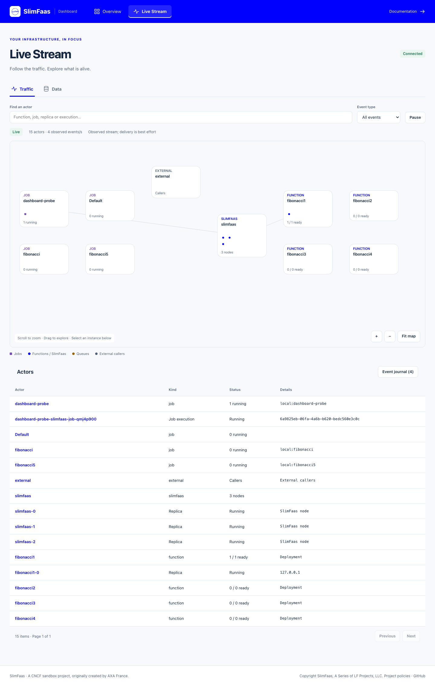

# SlimFaas User Interface

SlimFaas includes a web user interface that gives operators a live view of functions, jobs, queues, and network activity.

The user interface is available at the SlimFaas root address, for example:

```http
http://<slimfaas>/
```

The UI is served by the SlimFaas application itself and uses the same backend endpoints as the API. It is intended for operational visibility and manual wake-up actions, not as a replacement for Kubernetes configuration.

---

## Follow a request in the dashboard

Start with [Get Started](get-started.md), then keep this UI open while following the [Guided Tour](guided-tour.md). Each exercise names the request to send from cURL or Bruno and the resulting state or traffic to observe. The UI provides visibility, wake actions and a metadata-only data inventory. Use cURL or Bruno to invoke APIs or inspect stored contents.

## 1. What the Page Shows

The dashboard follows the same visual language as slimfaas.dev: primary blue, light surfaces and compact component-owned controls.

- **Overview** presents function, replica, job and node counters, compact searchable tables, and wake-up actions.
- **Live Stream → Traffic** opens the zoomable live canvas and its searchable actor list or event journal.
- **Live Stream → Data** lists set keys and file metadata, with expiry and file sizes.

The views have stable links: `/#/overview`, `/#/live/traffic` and `/#/live/data`. Select a function or job name in Overview to open its configuration and paginated instance details. Tables show 100 items per page; completed jobs stay available until their configured retention expires. Executions are attached by the complete configuration name, so configurations such as `fibonacci` and `fibonacci5` never share the same execution row.


---

## 2. Infrastructure Overview

Overview lists functions detected from deployments, statefulsets, daemonsets and WebSocket clients. Rows show visibility, ready/requested replicas and scale settings. Select a name to inspect configuration, resources, schedules, dependencies, retry settings and individual replicas in a side panel.

Replica and execution lists support search and pagination instead of expanding every instance into the main page. The side panel supports Escape to close and returns keyboard focus to its trigger.

---

## 3. Wake-Up Actions

The UI exposes two wake-up actions:

- **Wake Up** on one function calls `POST /wake-function/{functionName}`.
- **Wake Up All Functions** calls `POST /wake-functions`.

SlimFaas coalesces repeated wake-up calls while a wake-up is already in progress for the same function. The UI also applies a short local cooldown to avoid accidental repeated clicks.

---

## 4. Live Status Stream

The UI connects to:

```http
GET /status-functions-stream
```

This endpoint uses Server-Sent Events (SSE). It sends:

- **`state` events**: periodic full snapshots containing functions, queue lengths, jobs, SlimFaas replicas, SlimFaas nodes, front status, `LiveActivitySamplingRatio` and `MaxLiveEventsPerSecond`.
- **`activity` events**: single live network activity events.
- **`activity_batch` events**: grouped live network activity events during bursts.

The browser reconnects automatically if the stream disconnects.

---

## 5. Network Map



When `SlimFaas:EnableFront` is enabled, Traffic draws a canvas map of external callers, managed jobs, SlimFaas nodes, queues and functions. The overview groups replicas and executions by workload. Zooming reveals individual instances with no fixed instance-count cap. Groups reserve space for their instances; offscreen points are omitted from drawing.

Scroll or use the zoom buttons, drag to pan and use **Fit map** to return to the overview. Keyboard users can focus the canvas and use arrow keys, `+`, `-` and Home. The searchable actor table provides another way to select every instance. Selection focuses the map and filters the journal to the actor's connections. Clear selection to see all traffic.

The journal retains at most 5,000 received events. **Pause** freezes the current view; **Resume live** returns to current traffic without replaying the paused interval. Moving markers are independently limited to 200; the actor inventory is not sampled. Reduced-motion preferences disable moving markers.

Rates describe observed events, not guaranteed request throughput. Configured sampling and rate limits are identified in the UI; network interruptions and bounded server channels can also lose activity. The map aggregates repeated links and expands selected connections at detailed zoom.

When a SlimFaas-managed job calls a function, the incoming activity is matched against
the IP addresses of running jobs. The message then starts from the exact job instance:

- synchronous calls are displayed as `Job -> SlimFaas -> Function`
- asynchronous calls are displayed as `Job -> SlimFaas -> Queue -> Function`

If the running instance disappears from the current status snapshot while the event is
being displayed, the map falls back to the job configuration group. Calls that
cannot be matched to a running job remain attached to the external caller node.

In native local mode, all processes share the host IP. SlimFaas therefore routes local
entrypoint URLs declared in each Job's command or environment through a per-execution
loopback gateway. The gateway adds the Job execution identity, allowing the same
`Job -> SlimFaas -> Function` and `Job -> SlimFaas -> Queue -> Function` animations
without relying on a distinct process IP. Loopback addresses are not treated as
function replica identities, so requests sent from local tools such as `curl` or Bruno
remain attached to the external caller node.

The map is live-only for animations. Historical activity is not replayed into the animation stream when a new browser session starts.

SlimFaas nodes also synchronize recent local activity through the internal endpoint:

```http
GET /internal/activity-events?since=<unix-ms>
```

This endpoint is intended for peer SlimFaas nodes inside the namespace.

---

## 6. Jobs Overview

The jobs section uses the same SSE state payload as the function dashboard.

It shows:

- number of job configurations
- number of currently running jobs
- number of configured schedules
- image, visibility, dependencies, resources, schedules, and running job details when available

If no job configuration is loaded, the section displays an empty state.

The **Running** count includes only executions whose status is `Running`.
Pending and finished executions remain visible in the details table; `Succeeded`
and `Failed` entries are retained until their configured TTL expires. Retaining
finished entries does not occupy parallel job slots or keep their dependencies
awake. See [job concurrency and retention](jobs.md#7-concurrency-and-scaling).

---

## Data inventory


Open **Live Stream → Data**, choose **Sets** or **Files**, and search by key prefix. The table shows stable key ordering, remaining TTL, exact expiration time and, for files, the size in bytes. **Persistent** means no expiration; **Expires soon** marks the next 60 seconds. New or changed metadata is briefly highlighted. The summary shows all visible set/file counts, known file volume and upcoming expirations; it is independent of the prefix filter.

Only keys, expiration and file sizes are transmitted. The dashboard never fetches set values, file contents, hashes or filenames. Internal offload files and technical TTL keys are excluded. An unreadable file size appears as **Unknown** and is excluded from the volume total.

```http
GET /status-data-stream?kind=files&prefix=report&limit=100
Accept: text/event-stream
```

The endpoint emits `data_state` snapshots with `Kind`, `ServerTimeMs`, `Entries`, `NextCursor`, `TotalCount`, `Summary` and `RefreshIntervalMs`. Each entry contains `Id`, nullable `ExpiresAtMs` (Unix milliseconds), and nullable `SizeBytes`. Use `after=<NextCursor>` for the next page; `limit` defaults to 100 and accepts 1–500. The cursor is an exclusive key boundary, so deleting its key does not invalidate it. Return to the first page to see new keys before that boundary.

Snapshots use the node's locally applied Raft state and share one lazily refreshed metadata projection at `StatusStream.StateIntervalMilliseconds`. A freshly committed change may take an additional replication interval to reach a follower. Short-lived keys created and removed between snapshots may never appear. This inventory is not an audit log. The browser computes TTL countdowns using the server clock and labels disconnected inventory as stale.

By default, metadata follows `Data:DefaultVisibility` and the existing internal-request policy. To let dashboard visitors inspect metadata while keeping `/data` private, explicitly enable:

```bash
SlimFaas__ExposeDataMetadata=true
```

This option grants access only to the metadata stream. Value/document read, write and delete permissions still follow `/data` configuration. `SlimFaas:EnableFront=false` disables the metadata stream. Disallowed access or ports return 404; invalid queries return 400; the shared status/metadata SSE client limit returns 429. An open Data view uses two SSE slots (status and metadata); allow at least two per viewer when setting a client limit. Permanent metadata access failures stop automatic reconnection; transient failures use bounded exponential retries and offer a Retry action.

---

## 7. Main Backend Endpoints Used by the UI

| Endpoint | Method | Used for |
|---|---:|---|
| `/status-functions-stream` | `GET` | Main SSE stream for the live dashboard |
| `/status-data-stream` | `GET` | Paginated metadata-only SSE inventory |
| `/status-functions` | `GET` | Function status list API |
| `/status-function/{functionName}` | `GET` | Status for one function |
| `/wake-function/{functionName}` | `POST` | Wake one function |
| `/wake-functions` | `POST` | Wake all functions |
| `/internal/activity-events` | `GET` | Internal peer activity synchronization |

---

## 8. Configuration in `appsettings.json`

SlimFaas configuration is read from the `SlimFaas` section in `appsettings.json`.

The same values can be overridden with environment variables. For .NET configuration, use `__` to represent nested keys. For example:

```bash
SlimFaas__EnableFront=false
SlimFaas__StatusStream__StateIntervalMilliseconds=2000
```

### SlimFaas UI and Dashboard Settings

| appsettings.json key | Environment variable | Default value | Description |
|---|---|---:|---|
| `SlimFaas:ExposeDataMetadata` | `SlimFaas__ExposeDataMetadata` | `false` | Allow dashboard visitors to view keys, expiry and sizes independently of data value access. |
| `SlimFaas:EnableFront` | `SlimFaas__EnableFront` | `true` | Enables dashboard/network front features. When disabled, activity tracking and peer sync are disabled and the UI shows a disabled-front message. |
| `SlimFaas:StatusStream:StateIntervalMilliseconds` | `SlimFaas__StatusStream__StateIntervalMilliseconds` | `1000` | Interval between periodic SSE state snapshots. Must be greater than `0`. |
| `SlimFaas:StatusStream:QueueLengthsCacheMilliseconds` | `SlimFaas__StatusStream__QueueLengthsCacheMilliseconds` | `1000` | Cache duration for queue length reads used by state snapshots. `0` disables this cache. |
| `SlimFaas:StatusStream:JobsCacheMilliseconds` | `SlimFaas__StatusStream__JobsCacheMilliseconds` | `1000` | Cache duration for job status snapshots. `0` disables this cache. |
| `SlimFaas:StatusStream:PeerSyncIntervalMilliseconds` | `SlimFaas__StatusStream__PeerSyncIntervalMilliseconds` | `2000` | Interval between activity scrapes from peer SlimFaas nodes. Must be greater than `0`. |
| `SlimFaas:StatusStream:PeerSyncInitialDelayMilliseconds` | `SlimFaas__StatusStream__PeerSyncInitialDelayMilliseconds` | `5000` | Initial delay before the first peer activity scrape. |
| `SlimFaas:StatusStream:MaxSseClients` | `SlimFaas__StatusStream__MaxSseClients` | `0` | Maximum concurrent SSE clients per SlimFaas pod. `0` means unlimited. |
| `SlimFaas:StatusStream:SubscriberChannelCapacity` | `SlimFaas__StatusStream__SubscriberChannelCapacity` | `10000` | Bounded channel capacity per SSE subscriber for live activity events. Must be greater than `0`. |
| `SlimFaas:StatusStream:RecentActivityLimit` | `SlimFaas__StatusStream__RecentActivityLimit` | `1000` | Maximum recent activity events retained in memory for snapshots and peer sync. Must be greater than `0`. |
| `SlimFaas:StatusStream:KnownIdsLimit` | `SlimFaas__StatusStream__KnownIdsLimit` | `10000` | Maximum event IDs retained for peer de-duplication. Must be greater than `0`. |
| `SlimFaas:StatusStream:MaxLiveEventsPerSecond` | `SlimFaas__StatusStream__MaxLiveEventsPerSecond` | `0` | Maximum live events broadcast per second per SlimFaas pod. `0` disables rate limiting. |
| `SlimFaas:StatusStream:LiveEventSamplingRatio` | `SlimFaas__StatusStream__LiveEventSamplingRatio` | `1.0` | Ratio of live activity events broadcast to SSE clients. `1.0` sends all, `0` sends none. Stored events and peer sync are not sampled. |
| `SlimFaas:StatusStream:LiveActivityBatchSize` | `SlimFaas__StatusStream__LiveActivityBatchSize` | `100` | Maximum live activity events grouped in one `activity_batch` SSE frame. Must be greater than `0`. |

`StatusStream` is optional in `appsettings.json`. If the section is missing, SlimFaas uses the default values above.

## 9. Example Kubernetes Environment Overrides

```yaml
env:
  - name: SlimFaas__EnableFront
    value: "true"
  - name: SlimFaas__StatusStream__StateIntervalMilliseconds
    value: "1000"
  - name: SlimFaas__StatusStream__MaxSseClients
    value: "100"
  - name: SlimFaas__StatusStream__MaxLiveEventsPerSecond
    value: "500"
  - name: SlimFaas__StatusStream__LiveActivityBatchSize
    value: "100"
```

Use lower intervals for more reactive dashboards and higher intervals for lower backend load. In high-traffic clusters, prefer setting `MaxLiveEventsPerSecond`, `LiveEventSamplingRatio`, and `LiveActivityBatchSize` instead of disabling the front entirely.
