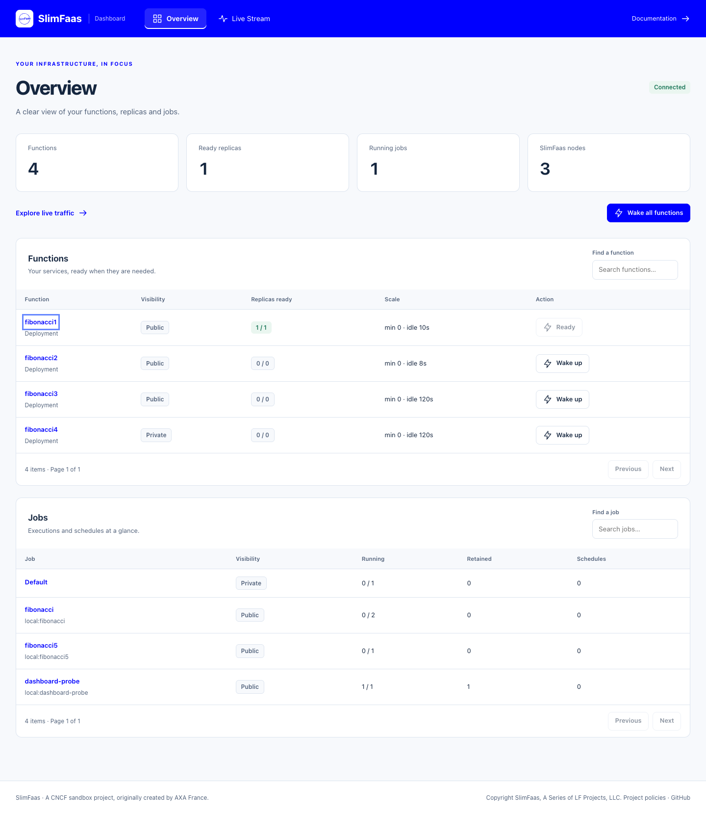
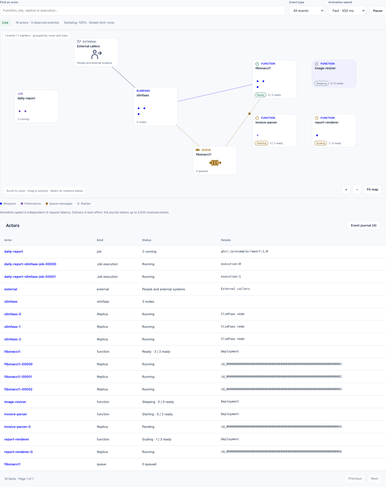
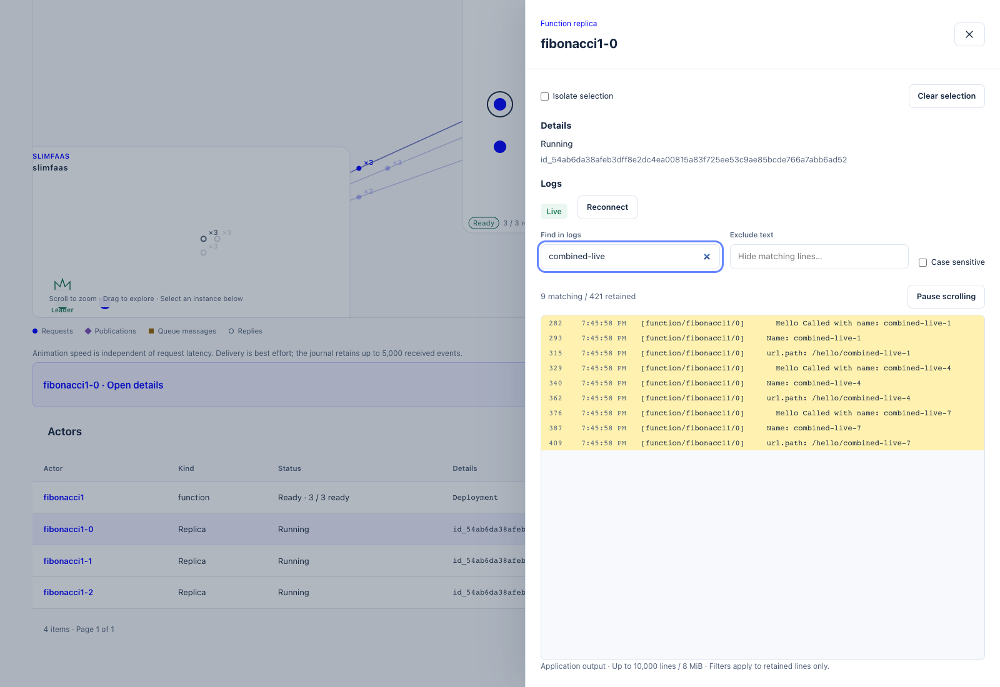
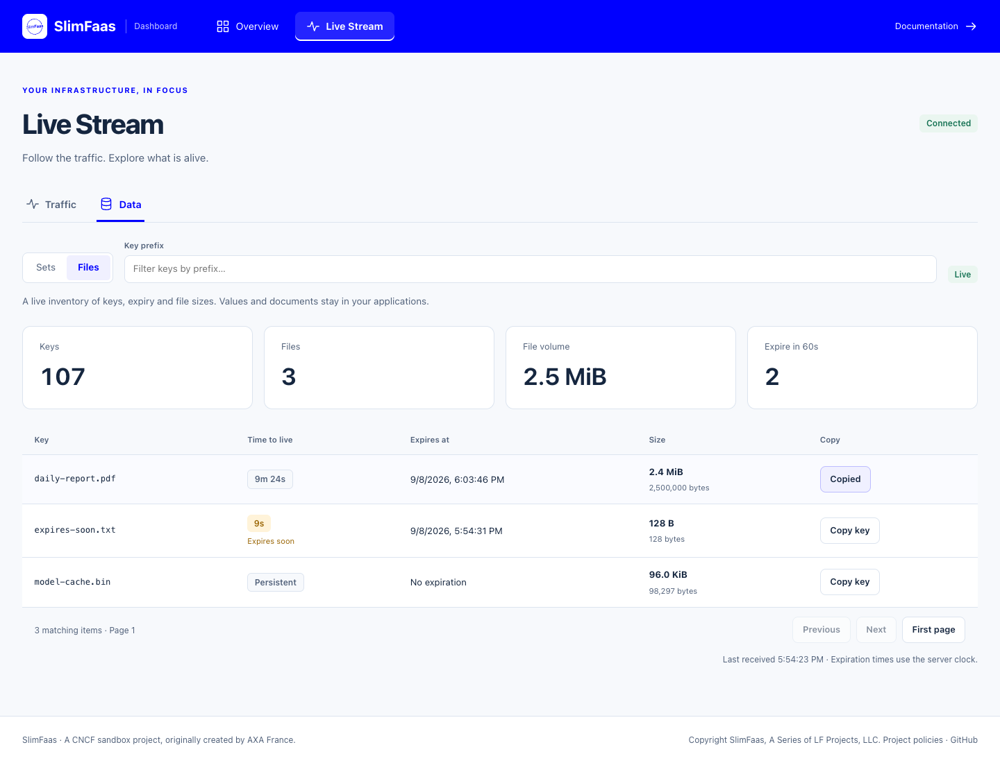
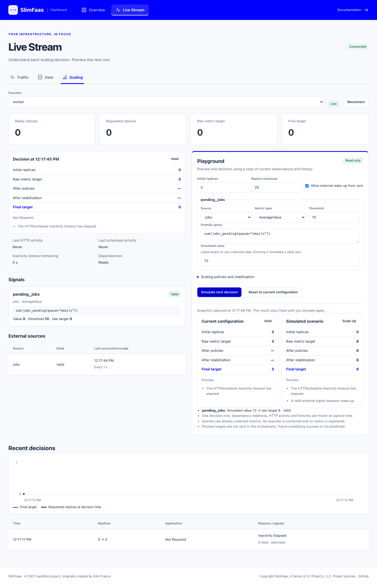

# SlimFaas User Interface

SlimFaas includes a web user interface that gives operators a live view of functions, jobs, queues, and network activity.

The user interface is available at the SlimFaas root address, for example:

```http
http://<slimfaas>/
```

The UI is served by the SlimFaas application itself and uses the same backend endpoints as the API. It is intended for operational visibility and manual wake-up actions, not as a replacement for Kubernetes configuration.

---

## Follow a request in the dashboard

Start with [Get Started](get-started.md), then keep this UI open while following the [Guided Tour](guided-tour.md). Each exercise names the request to send from cURL or Bruno and the resulting state or traffic to observe. The UI provides visibility, wake actions and a metadata-only data inventory. Use cURL or Bruno to invoke APIs or inspect stored contents.

## 1. What the Page Shows

The dashboard follows the same visual language as slimfaas.dev: primary blue, light surfaces and compact component-owned controls.

- **Overview** presents function, replica, job and node counters, compact searchable tables, and wake-up actions.
- **Live Stream → Traffic** opens the zoomable live canvas and its searchable actor list or event journal.
- **Live Stream → Data** lists set keys and file metadata, with expiry and file sizes.
- **Live Stream → Scaling** explains each function’s scaling decisions and offers a read-only playground.

The views have stable links: `/#/overview`, `/#/live/traffic`, `/#/live/data` and `/#/live/scaling`. Select a function or job name in Overview to open its configuration and paginated instance details. Tables show 100 items per page; completed jobs stay available until their configured retention expires. Executions are attached by the complete configuration name, so configurations such as `fibonacci` and `fibonacci5` never share the same execution row.



---

## 2. Infrastructure Overview

Overview lists functions detected from deployments, statefulsets, daemonsets and WebSocket clients. Rows show visibility, ready/requested replicas and scale settings. Select a name to inspect configuration, resources, schedules, dependencies, retry settings and individual replicas in a side panel.

Replica and execution lists support search and pagination instead of expanding every instance into the main page. The side panel supports Escape to close and returns keyboard focus to its trigger.

---

## 3. Wake-Up Actions

The UI exposes two wake-up actions:

- **Wake Up** on one function calls `POST /wake-function/{functionName}`.
- **Wake Up All Functions** calls `POST /wake-functions`.

SlimFaas coalesces repeated wake-up calls while a wake-up is already in progress for the same function. The UI also applies a short local cooldown to avoid accidental repeated clicks.

---

## 4. Live Status Stream

The UI connects to:

```http
GET /status-functions-stream
```

This endpoint uses Server-Sent Events (SSE). It sends:

- **`state` events**: periodic full snapshots containing functions, queue lengths, jobs, SlimFaas replicas, SlimFaas nodes, front status, `LiveActivitySamplingRatio` and `MaxLiveEventsPerSecond`.
- **`activity` events**: single live network activity events.
- **`activity_batch` events**: grouped live network activity events during bursts.

Replica and caller IP addresses are never sent in the stream's network address fields. Before serializing `state` (including `RecentActivity`), `activity` and `activity_batch`, the server replaces literal IPv4/IPv6 addresses with opaque `id_…` tokens using HMAC-SHA-256 and a private random process key. Equivalent IPv4/mapped-IPv6 forms share a token. An unkeyed hash or public salt is not used because private address ranges can be enumerated.

`Functions[].Pods[].Identity` contains the opaque **identifier** shown by the dashboard. The former `Ip` field is no longer emitted. `SourcePod` and `TargetPod` carry the matching token or an existing pod/job execution name. The dashboard searches names and identifiers and retains replica selection by name. Loopback caller identities are omitted to avoid attributing local tools to a function sharing the same address.

Tokens are consistent across subscribers and peer events served by one process; they change after a restart or when reconnecting to another node. Treat them as transient correlation identifiers, not persistent replica IDs. Raw addresses remain internal to routing and the access-controlled peer activity endpoint. No storage migration or client-side hashing is needed. Stream consumers must migrate from `Pods[].Ip` to `Pods[].Identity` and treat the value as opaque.

The browser reconnects automatically if the stream disconnects. Overview and Data use `?activity=false` on this endpoint to receive status snapshots without an activity subscription. The default remains a full Traffic stream. Both modes share the SSE client quota; metadata streams and status-only views do not activate peer activity scraping.

Activity IDs are opaque and unique across process restarts. Peer activity uses an application HTTP port, excluding the Raft port even when it is listed first (as in native local mode). Peers are read with up to four requests concurrently while Traffic has subscribers, using a 500 ms interval by default. A relative bootstrap window avoids replaying older history and accommodates different host clocks. Subsequent reads overlap by one millisecond and deduplicate by event ID. The internal endpoint retains its array response and additionally supports `windowMs` (bounded to 60 seconds), `X-Activity-Watermark` and `X-Activity-Instance` response headers. Older peers without these headers are primed without replaying their history.

---

## 5. Network Map



When `SlimFaas:EnableFront` is enabled, Traffic draws a canvas map of external callers, managed jobs, SlimFaas nodes, queues and functions. The overview groups replicas and executions by workload. Zooming reveals individual instances with no fixed instance-count cap. Groups reserve space for their instances; offscreen points are omitted from drawing.

Scroll or use the zoom buttons, drag to pan and use **Fit map** to return to the overview. Keyboard users can focus the canvas and use arrow keys, `+`, `-` and Home. The searchable actor table provides another way to select every instance. Selection focuses the map and highlights its connections while retaining other traffic. Enable **Isolate selection** to filter the map and journal to that actor. Active event-type and isolation filters are displayed above the map; **Clear filters** restores the global view.

The journal retains at most 5,000 received events. **Pause** freezes the current view; **Resume live** returns to current traffic without replaying the paused interval. Markers are grouped by route and event type and independently limited to 200; the actor inventory is not sampled. Each grouped marker shows its event count. The canvas reports any events omitted by the visual limit separately from the retained journal. Reduced-motion preferences replace movement with static activity highlights.

**Animation speed** offers **Fast (450 ms)**, **Normal (800 ms)** and **Slow (1,400 ms)** for a complete trip and remembers the choice in this browser. Fast is the default. This duration is a visual convention, not measured function latency. New arrivals use the browser's monotonic receipt clock, so an older server timestamp does not hide a live event. Returning from Pause, reconnecting or restoring a background tab does not replay stale animations.

Requests use blue circles, publications purple diamonds, queue messages amber squares and replies outlined circles. Queue groups show a FIFO symbol, directional arrows and their exact current length; an observed queue remains visible when empty. External callers use a person and incoming-arrow symbol, covering people and external systems.

Functions absent from this node’s snapshot but present in received events appear as **Observed traffic · inventory unknown**. Their observed replica identifiers remain selectable; the UI does not infer a ready/requested count from events.

Function groups include a power icon and a textual state: **Sleeping** (zero ready and requested), **Starting** (requested but none ready), **Scaling** (some ready, below requested capacity), **Ready** (requested capacity available), or **Error** when a failed/error pod state is explicitly reported and none are ready. Sleeping is an expected scale-to-zero state, not an error.

Rates describe observed events, not guaranteed request throughput. The actual configured sampling percentage and per-node rate limit are displayed in the UI; network interruptions and bounded server channels can also lose activity. The map aggregates repeated links. Whenever instances are visible at detailed zoom, trajectories retain their actual replica destination even without a selection. **Show replicas** frames a selected function; a brief arrival ring identifies the recipient. Traffic never pans the camera automatically.

When a SlimFaas-managed job calls a function or publishes an event, the incoming activity is matched against
the IP addresses of running jobs. The message then starts from the exact job instance:

- synchronous HTTP and WebSocket calls are displayed as `Job -> SlimFaas -> Function`
- publications fan out from SlimFaas to each ready subscribed replica, retaining the job caller
- asynchronous calls are displayed as `Job -> SlimFaas -> Queue -> Function`

If the running instance disappears from the current status snapshot while the event is
being displayed, the map falls back to the job configuration group. Calls that
cannot be matched to a running job remain attached to the external caller node.

In native local mode, all processes share the host IP. SlimFaas therefore routes local
entrypoint URLs declared in each Job's command or environment through a per-execution
loopback gateway. The gateway adds the Job execution identity, allowing the same
`Job -> SlimFaas -> Function` and `Job -> SlimFaas -> Queue -> Function` animations
without relying on a distinct process IP. Loopback addresses are not treated as
function replica identities, so requests sent from local tools such as `curl` or Bruno
remain attached to the external caller node.

The map is live-only for animations. Historical activity is not replayed into the animation stream when a new browser session starts.

SlimFaas nodes also synchronize recent local activity through the internal endpoint:

```http
GET /internal/activity-events?since=<unix-ms>
```

This endpoint is intended for peer SlimFaas nodes inside the namespace.

### Queue deliveries and the leader

A queued delivery produces correlated `dequeue` and `request_out` records. Both remain in the journal, but the canvas represents the attempt once, starting at **Queue → destination replica**. A retry has a new attempt identity and remains visible. This applies to HTTP and WebSocket deliveries without changing the WebSocket client protocol. A queue observed through peer activity also remains visible when its inventory is absent locally; its label is **Queue length unknown** until a snapshot supplies the count.

`SlimFaasNodes[].Role` is an optional `Leader`, `Follower` or `Unknown` field, separate from readiness. The map marks the current Raft leader in green with a crown and **Leader** label. The collapsed group names it too. During an election or when the known leader cannot be mapped to a managed node, the role is **Unknown**. Endpoint matching stays server-side and includes ports, including the three native demo nodes sharing loopback.

### Instance logs

Select a function replica, job execution or SlimFaas node on the map or in the actor list. Its drawer shows compact **Details** above **Logs**, which automatically loads retained output and follows new lines when log access is enabled. Use **Find in logs**, **Exclude text** and **Case sensitive** to filter the retained buffer. A non-empty **Find in logs** search highlights each occurrence of the searched text in yellow, including newly received matches. The surrounding text, line numbers and timestamps keep their usual background. Only matching lines are shown; clearing the search removes the highlight. Search text is literal, including punctuation and Unicode. Select a container when a Kubernetes pod has more than one. Scroll upward or use **Pause scrolling** to inspect output; **Follow latest** returns to the latest lines. Reception continues while scrolling is paused.

Selection opens the same right-hand drawer as Overview, with details and live output together for individual instances. The drawer is at most 760 px wide and fills the screen on mobile. The map continues to receive traffic behind the modal drawer; close it to interact with the map. Escape, the close button or a click on the backdrop closes the drawer and returns keyboard focus to its trigger. Closing keeps the selected actor and **Isolate selection** filter; use **Open details** to reopen it or **Clear selection** to return to global traffic.

Log source discovery starts when an instance drawer opens; only an authorized, available source starts a log stream. Disabled, denied or unavailable sources show a compact status instead of an empty viewer. Groups, queues and external actors show details only. Closing the drawer, changing the selected instance or losing that instance stops the subscription and pending reconnect attempts immediately. Reopening the drawer loads the current tail and follows new output. The log viewport uses the available drawer height and renders only visible rows plus a small overscan, including when the window is resized.

The viewer retains at most **10,000 lines and 8 MiB of UTF-8 text**, with **16 KiB per line**. Long lines and discarded history are indicated. Only the visible rows are rendered. Log output is displayed as text and terminal control sequences are removed. Filters do not search older output on disk or in the orchestrator.

Reading logs requires both `SlimFaas:EnableFront` and the dedicated **`SlimFaas:ExposeLogs`** option. `ExposeLogs` defaults to `false`. Setting it to `true` grants dashboard visitors access to application output, which may contain addresses or sensitive text written by the application; it does not automatically redact that content. Traffic identities remain protected independently. Tutorial deployments enable logs explicitly.

```json
{
  "SlimFaas": {
    "EnableFront": true,
    "ExposeLogs": true
  }
}
```

Logs are available for native managed processes, Kubernetes containers and Docker containers. External WebSocket clients and IDE processes attached with `debugUrl` show **Logs unavailable**: SlimFaas does not capture their stdout/stderr. Completed job logs remain available while the execution is retained by its orchestrator. Sources are tied to an instance generation; after a restart, use **Reconnect** to discover the current source. Closing the drawer or selecting another instance stops the previous subscription.

The public discovery request requires an instance name:

```http
GET /status-log-sources?kind=function&name=fibonacci1&replica=fibonacci1-0
GET /status-logs-stream?source=<Id returned by discovery>&tail=10000
```

`kind` is `function`, `job` or `slimfaas`; `name` is the function/configuration name, or `slimfaas` for nodes. For jobs, `replica` is the full execution name. Discovery returns `Status` and `Sources` containing `Id`, `Name` and `Container`. Source references are portable across SlimFaas nodes and are revalidated against managed resources; they are not authorization tokens. Browser requests cannot supply a filesystem path or upstream URL.

The SSE stream emits `log_state` (`Status`, `Session`, `DroppedLines`, `MaxLines`, `MaxBytes`) and `log_batch` (`Lines`, each with `Id`, `Text`, nullable `TimestampMs`, and `Truncated`). IDs order lines within the session; identical text can occur on multiple distinct lines. The initial tail is bounded to 1–10,000 lines and defaults to 10,000. Retention and byte limits can return fewer lines. Each batch contains at most 200 lines and 256 KiB of text.

Each node shares at most four source readers across viewers. Logs also reserve the global `StatusStream.MaxSseClients` quota, without starting Traffic peer synchronization. Slow viewers do not block application logging; buffers discard old lines when needed. The UI shows disabled/access-denied, disconnected, ended and removed-source states. Failed connections retry automatically at most three times, then require **Reconnect**.

Kubernetes requires namespace-scoped `get` on `pods/log`; function ownership validation also requires `get` on `replicasets`. The demo service account includes these permissions. No central log storage is introduced.



[Mobile log viewer](images/dashboard/instance-logs-mobile.png) · [Leader identification](images/dashboard/traffic-leader.png)

---

## 6. Jobs Overview

The jobs section uses the same SSE state payload as the function dashboard.

It shows:

- number of job configurations
- number of currently running jobs
- number of configured schedules
- image, visibility, dependencies, resources, schedules, and running job details when available

If no job configuration is loaded, the section displays an empty state.

The **Running** count includes only executions whose status is `Running`.
Pending and finished executions remain visible in the details table; `Succeeded`
and `Failed` entries are retained until their configured TTL expires. Retaining
finished entries does not occupy parallel job slots or keep their dependencies
awake. See [job concurrency and retention](jobs.md#7-concurrency-and-scaling).

---

## Data inventory



Open **Live Stream → Data**, choose **Sets** or **Files**, and search by key prefix. The table shows stable key ordering, remaining TTL, exact expiration time and, for files, the size in bytes. **Persistent** means no expiration; **Expires soon** marks the next 60 seconds. New or changed metadata is briefly highlighted. The summary shows all visible set/file counts, known file volume and upcoming expirations; it is independent of the prefix filter.

Only keys, expiration and file sizes are transmitted. The dashboard never fetches set values, file contents, hashes or filenames. Internal offload files and technical TTL keys are excluded. An unreadable file size appears as **Unknown** and is excluded from the volume total.

```http
GET /status-data-stream?kind=files&prefix=report&limit=100
Accept: text/event-stream
```

The endpoint emits `data_state` snapshots with `Kind`, `ServerTimeMs`, `Entries`, `NextCursor`, `TotalCount`, `Summary` and `RefreshIntervalMs`. Each entry contains `Id`, nullable `ExpiresAtMs` (Unix milliseconds), and nullable `SizeBytes`. Use `after=<NextCursor>` for the next page; `limit` defaults to 100 and accepts 1–500. The cursor is an exclusive key boundary, so deleting its key does not invalidate it. Return to the first page to see new keys before that boundary.

Snapshots use the node's locally applied Raft state and share one lazily refreshed metadata projection at `StatusStream.StateIntervalMilliseconds`. A freshly committed change may take an additional replication interval to reach a follower. Short-lived keys created and removed between snapshots may never appear. This inventory is not an audit log. The browser computes TTL countdowns using the server clock and labels disconnected inventory as stale.

By default, metadata follows `Data:DefaultVisibility` and the existing internal-request policy. To let dashboard visitors inspect metadata while keeping `/data` private, explicitly enable:

```bash
SlimFaas__ExposeDataMetadata=true
```

This option grants access only to the metadata stream. Value/document read, write and delete permissions still follow `/data` configuration. `SlimFaas:EnableFront=false` disables the dashboard access override; the metadata API then follows the existing `/data` visibility and internal-request policy. Disallowed access or ports return 404; invalid queries return 400; the shared status/metadata SSE client limit returns 429. An open Data view uses two SSE slots (status and metadata); allow at least two per viewer when setting a client limit. Permanent metadata access failures stop automatic reconnection; transient failures use bounded exponential retries and offer a Retry action.

---

## 7. Main Backend Endpoints Used by the UI

| Endpoint | Method | Used for |
|---|---:|---|
| `/status-functions-stream` | `GET` | Main SSE stream for the live dashboard |
| `/status-data-stream` | `GET` | Paginated metadata-only SSE inventory |
| `/status-functions` | `GET` | Function status list API |
| `/status-function/{functionName}` | `GET` | Status for one function |
| `/wake-function/{functionName}` | `POST` | Wake one function |
| `/wake-functions` | `POST` | Wake all functions |
| `/internal/activity-events` | `GET` | Internal peer activity synchronization |

---

## 8. Configuration in `appsettings.json`

SlimFaas configuration is read from the `SlimFaas` section in `appsettings.json`.

The same values can be overridden with environment variables. For .NET configuration, use `__` to represent nested keys. For example:

```bash
SlimFaas__EnableFront=false
SlimFaas__StatusStream__StateIntervalMilliseconds=2000
```

### SlimFaas UI and Dashboard Settings

| appsettings.json key | Environment variable | Default value | Description |
|---|---|---:|---|
| `SlimFaas:ExposeLogs` | `SlimFaas__ExposeLogs` | `false` | Allow dashboard visitors to stream managed instance output when the front is enabled. |
| `SlimFaas:ExposeDataMetadata` | `SlimFaas__ExposeDataMetadata` | `false` | Allow dashboard visitors to view keys, expiry and sizes independently of data value access. |
| `SlimFaas:EnableFront` | `SlimFaas__EnableFront` | `true` | Enables dashboard/network front features. When disabled, activity tracking and peer sync are disabled and the UI shows a disabled-front message. |
| `SlimFaas:StatusStream:StateIntervalMilliseconds` | `SlimFaas__StatusStream__StateIntervalMilliseconds` | `1000` | Interval between periodic SSE state snapshots. Must be greater than `0`. |
| `SlimFaas:StatusStream:QueueLengthsCacheMilliseconds` | `SlimFaas__StatusStream__QueueLengthsCacheMilliseconds` | `1000` | Cache duration for queue length reads used by state snapshots. `0` disables this cache. |
| `SlimFaas:StatusStream:JobsCacheMilliseconds` | `SlimFaas__StatusStream__JobsCacheMilliseconds` | `1000` | Cache duration for job status snapshots. `0` disables this cache. |
| `SlimFaas:StatusStream:PeerSyncIntervalMilliseconds` | `SlimFaas__StatusStream__PeerSyncIntervalMilliseconds` | `500` | Interval between activity scrapes from peer SlimFaas nodes. Must be greater than `0`. |
| `SlimFaas:StatusStream:PeerSyncInitialDelayMilliseconds` | `SlimFaas__StatusStream__PeerSyncInitialDelayMilliseconds` | `500` | Initial delay before the first peer activity scrape. |
| `SlimFaas:StatusStream:MaxSseClients` | `SlimFaas__StatusStream__MaxSseClients` | `0` | Maximum concurrent SSE clients per SlimFaas pod. `0` means unlimited. |
| `SlimFaas:StatusStream:SubscriberChannelCapacity` | `SlimFaas__StatusStream__SubscriberChannelCapacity` | `10000` | Bounded channel capacity per SSE subscriber for live activity events. Must be greater than `0`. |
| `SlimFaas:StatusStream:RecentActivityLimit` | `SlimFaas__StatusStream__RecentActivityLimit` | `1000` | Maximum recent activity events retained in memory for snapshots and peer sync. Must be greater than `0`. |
| `SlimFaas:StatusStream:KnownIdsLimit` | `SlimFaas__StatusStream__KnownIdsLimit` | `10000` | Maximum event IDs retained for peer de-duplication. Must be greater than `0`. |
| `SlimFaas:StatusStream:MaxLiveEventsPerSecond` | `SlimFaas__StatusStream__MaxLiveEventsPerSecond` | `0` | Maximum live events broadcast per second per SlimFaas pod. `0` disables rate limiting. |
| `SlimFaas:StatusStream:LiveEventSamplingRatio` | `SlimFaas__StatusStream__LiveEventSamplingRatio` | `1.0` | Ratio of live activity events broadcast to SSE clients. `1.0` sends all, `0` sends none. Stored events and peer sync are not sampled. |
| `SlimFaas:StatusStream:LiveActivityBatchSize` | `SlimFaas__StatusStream__LiveActivityBatchSize` | `100` | Maximum live activity events grouped in one `activity_batch` SSE frame. Must be greater than `0`. |

`StatusStream` is optional in `appsettings.json`. If the section is missing, SlimFaas uses the default values above.

## 9. Example Kubernetes Environment Overrides

```yaml
env:
  - name: SlimFaas__EnableFront
    value: "true"
  - name: SlimFaas__StatusStream__StateIntervalMilliseconds
    value: "1000"
  - name: SlimFaas__StatusStream__PeerSyncIntervalMilliseconds
    value: "500"
  - name: SlimFaas__StatusStream__MaxSseClients
    value: "100"
  - name: SlimFaas__StatusStream__MaxLiveEventsPerSecond
    value: "500"
  - name: SlimFaas__StatusStream__LiveActivityBatchSize
    value: "100"
```

Use lower intervals for more reactive dashboards and higher intervals for lower backend load. In high-traffic clusters, prefer setting `MaxLiveEventsPerSecond`, `LiveEventSamplingRatio`, and `LiveActivityBatchSize` instead of disabling the front entirely.


## Scaling diagnostics and playground

Open **Live Stream → Scaling**, select a function, or use **Inspect scaling and open playground** in its Overview details. A direct link can select a function: `/#/live/scaling?function=worker`.



The live view distinguishes ready replicas, the orchestrator’s requested count, the raw metric target, policy/stabilization results and the final decision. For `jobs_pending = 73` and threshold `10`, the raw target is eight; the default first scale-up permits four. An accepted request means the orchestrator accepted the target, not that four replicas are ready.

Each trigger shows its source, query, value, threshold and state. An absent or invalid observation displays `—`, never zero. `NotEvaluated` identifies triggers intentionally skipped by the real cycle, including local metrics at zero. During dependency waits, observed triggers can show their raw target while policy and stabilization steps remain unevaluated. Reasons explain inactivity, HTTP/schedule demand, dependency readiness, disabled external wake-up, invalid signals, policies, stabilization and reported infrastructure blocks. The inactivity countdown alone is not a promise to scale down: other gates can retain capacity.

The journal records changes in target, application status, trigger/source state and decision reasons. It retains at most 15 minutes and 300 events per function, within a shared 8 MiB diagnostic budget. Large frames and older events can be omitted; the UI marks truncation. History is in memory, and a new leader session restarts it. It is separate from the histories used by the autoscaler.

### Try a scenario

The playground starts from the current configuration. Change the initial replica count, maximum, `ScaleFromZero`, trigger thresholds/types, configured source selection, PromQL queries or Behavior JSON, then select **Simulate next decision**. An empty simulated-value input uses collected data; entering `0` substitutes a valid zero. The result identifies substituted observations.

The server compares the current configuration and scenario using the same captured metric points, source health, HTTP/schedule context, dependency readiness and decision histories. For a value of 73, changing the threshold from 10 to 20 changes the raw target from eight to four; existing policy budgets may still hold the final target. Results show their capture time and stay fixed until another simulation. **Reset to current configuration** reloads the form without applying anything.

A simulation does not call exporters, register metrics, alter real histories or supervision metrics, wake dependencies, save annotations or send replica requests. It evaluates one decision, without predicting future dependency readiness or orchestrator success. Only already collected metrics are available: a new query cannot enable new collection. Sources must already exist in the function configuration. Existing annotations and `/debug/promql/eval` keep their behavior.

Simulation requests are limited to 64 KiB, 32 trigger overrides, 2,048 characters per query and bounded expression complexity. Two simulations can run concurrently per leader, with a five-second execution budget. Captured metric data is limited to 8 MiB per simulation; exceeding the budget returns an explicit error. Behavior overrides accept at most 16 policies per direction, with periods/stabilization up to one day. No new dashboard dependency is required.

### Streams and cluster behavior

Scaling opens the status stream with `activity=false` plus `/status-scaling-stream?function=worker`. These consume two slots in the existing SSE budget and do not activate Traffic collection. Changing the function or leaving the view cancels its stream; temporary failures reconnect with bounded retries, while permanent access errors stop reconnecting.

Diagnostics and simulations come from the leader. A follower relays requests through its configured cluster membership, using bounded HTTP responses and shared short-lived frame caching. The browser never supplies a peer URL. A leader change resets the displayed journal; unavailable data is marked and the last received decision remains visible during reconnects.

Both new public endpoints require the front to be enabled and use the existing allowed-port filter. Peer endpoints additionally require a direct connection from a SlimFaas member IP; forwarded headers do not grant peer access. Upgrade all nodes before using the new view; older peers can temporarily report that diagnostics are unavailable. No annotation migration is needed. WebSocket-only workers absent from the orchestrator’s scaling inventory have no scaling decision to inspect.
