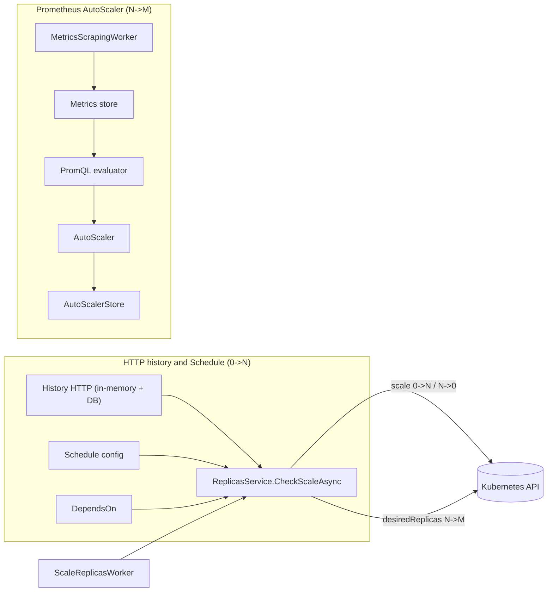

# SlimFaas Autoscaling Guide

> End-to-end autoscaling for SlimFaas functions:
> **HTTP activity & schedules for `0 → N` + Prometheus / PromQL AutoScaler for `N → M`**

---

## Table of contents

1. [Overview](#overview)
2. [Core concepts](#core-concepts)
3. [Autoscaling architecture](#autoscaling-architecture)
4. [Configuring `0 → N` scale (HTTP history + schedule)](#configuring-0--n-scale-http-history--schedule)
5. [Configuring `N → M` scale (Prometheus AutoScaler)](#configuring-n--m-scale-prometheus-autoscaler)
6. [PromQL support & current limitations](#promql-support--current-limitations)
7. [Metrics scraping internals](#metrics-scraping-internals)
8. [Debug HTTP endpoints](#debug-http-endpoints)
9. [Decision algorithm details](#decision-algorithm-details)
10. [Configuration examples](#configuration-examples)
11. [Best practices](#best-practices)
12. [Observability & debugging](#observability--debugging)
13. [FAQ](#faq)

---

## Overview

SlimFaas combines **two complementary autoscaling systems**:

1. **`0 → N` scaling (wake-up from zero)**
   Driven by:
    - HTTP call history (in-memory + database),
    - optional **schedule configuration** (wake-up times, scale-down timeouts),
    - **function dependencies** (`DependsOn`).

   👉 This system is the **only one allowed to bring a function from `0` to `> 0` replicas**.

2. **`N → M` scaling (Prometheus AutoScaler)**
   Driven by:
    - a Prometheus metrics scraping worker,
    - a small PromQL evaluator,
    - an `AutoScaler` that computes the desired number of replicas based on metrics.

   👉 This system is used **only when the function already has at least one pod** (`replicas > 0`).

When the Prometheus-based AutoScaler is enabled for a function (`SlimFaas/Scale` present), **scale-to-zero is allowed only if both systems agree**: the HTTP/schedule logic must decide that the function can go down to `ReplicasMin = 0`, *and* the metrics-based AutoScaler must also compute a desired replica count of `0`. If metrics still indicate that capacity is needed (`desired > 0`), SlimFaas keeps at least one replica running even if HTTP activity is idle.

Both systems are orchestrated by:

- `ReplicasService.CheckScaleAsync(namespace)`
- `ScaleReplicasWorker`, a background worker that calls `CheckScaleAsync` periodically on the master node.

---

## Core concepts

In SlimFaas, each function is represented by a Kubernetes `Deployment` and a set of **annotations** that drive autoscaling.

### Key properties (conceptual)

For each function (deployment):

- **Current replicas**
  The current number of pods, as seen by SlimFaas.

- **`ReplicasMin`**
  Minimal number of pods allowed after scale-down. This can be `0` if you want **scale-to-zero**, or a positive value if you want to avoid full cold starts.

- **`ReplicasAtStart`**
  Number of pods to start when waking up a function from `0` (or from below minimum) via the `0 → N` system.

- **`TimeoutSecondBeforeSetReplicasMin`**
  Inactivity duration (based on HTTP history and schedule) before SlimFaas scales down the function to `ReplicasMin`.

- **`DependsOn`**
  List of other functions that this function depends on. SlimFaas can ensure dependencies are ready before waking up a function.

- **`Schedule`**
  Time-based configuration for:
    - **wake-up times** (treated as synthetic HTTP activity),
    - **time-dependent scale-down timeouts**.

- **`Scale`**
  Metrics-based autoscaling configuration, powered by Prometheus & PromQL, used for `N → M` scaling.

### How this is exposed in Kubernetes

Many of these properties are configured via **annotations** on your function `Deployment`, for example:

```yaml
apiVersion: apps/v1
kind: Deployment
metadata:
  name: fibonacci
  namespace: default
  annotations:
    SlimFaas/ReplicasMin: "0"
    SlimFaas/ReplicasAtStart: "1"
    SlimFaas/TimeoutSecondBeforeSetReplicasMin: "300"
    SlimFaas/DependsOn: '["another-func-a","another-func-b"]'
    SlimFaas/Schedule: >
      {
        "TimeZoneID": "Europe/Paris",
        "Default": {
          "WakeUp": [ "08:00", "13:30" ],
          "ScaleDownTimeout": [
            { "Time": "08:00", "Value": 1800 },
            { "Time": "19:00", "Value": 300 }
          ]
        }
      }
    SlimFaas/Scale: >
      {
        "ReplicaMax": 10,
        "Triggers": [],
        "Behavior": {}
      }
spec:
  replicas: 1
  # ...
```

> Note: when the `SlimFaas/Scale` annotation is not present (or is invalid), the Prometheus-based AutoScaler is simply disabled for that function.

---

## Autoscaling architecture

### High-level diagram



- `ScaleReplicasWorker` periodically calls `CheckScaleAsync` if the node is the master.
- `ReplicasService.CheckScaleAsync`:
    1. Computes a **desired replica count** using the **HTTP/schedule based system** (`0 → N` / `N → 0`).
    2. If the function already has `replicas > 0` and a `SlimFaas/Scale` annotation, it invokes the **Prometheus AutoScaler** to adjust `N → M` and, when `ReplicasMin = 0`, to confirm whether scale-to-zero is actually allowed.

---

## Configuring `0 → N` scale (HTTP history + schedule)

The `0 → N` system is responsible for:

- **Scaling down** to `ReplicasMin` after inactivity,
- **Waking up** functions to `ReplicasAtStart` based on:
    - HTTP activity,
    - schedule,
    - dependencies.

### Inactivity timeout → scale down to `ReplicasMin`

SlimFaas measures the time since the last HTTP activity (or synthetic activity from schedule/dependencies).

Key annotations:

```yaml
metadata:
  annotations:
    SlimFaas/ReplicasMin: "0"                         # minimum replicas after scale-down (can be 0)
    SlimFaas/ReplicasAtStart: "1"                     # replicas after wake-up from zero
    SlimFaas/TimeoutSecondBeforeSetReplicasMin: "300" # seconds of inactivity before scale-down
```

Behavior (simplified):

- SlimFaas computes a last activity timestamp for each function:
    - from HTTP history,
    - plus schedule wake-up events,
    - plus the dependencies’ activity if relevant.
- If:

  ```text
  lastActivity + TimeoutSecondBeforeSetReplicasMin < now
  ```

  then SlimFaas **proposes** scaling the function down to **`ReplicasMin`**.

If `ReplicasMin` is `"0"`, this gives you **scale-to-zero** when the Prometheus AutoScaler is disabled.
If `ReplicasMin` is `"0"` **and** a `SlimFaas/Scale` configuration is present, SlimFaas will actually scale to zero **only if the metrics-based AutoScaler also agrees that `desiredReplicas` is `0`**. If the metrics say that some capacity is still needed (`desired > 0`), SlimFaas keeps at least one replica running (or more, according to the metrics).

### Wake-up `0 → N` (from zero or below minimum)

There are two main situations where SlimFaas wakes a function up:

1. **From `0` to `ReplicasAtStart`**:
    - The function currently has `replicas == 0`.
    - There is recent activity (HTTP or schedule) for this function.
    - All `DependsOn` functions are ready enough (as determined by SlimFaas).
    - ⇒ SlimFaas scales the function **to `ReplicasAtStart`**.

2. **From below min to `ReplicasAtStart`**:
    - The function currently has `replicas < ReplicasMin`.
    - Dependencies are ready.
    - ⇒ SlimFaas scales the function up to `ReplicasAtStart`.

This ensures:

- **Only the `0 → N` system can wake a function from 0**,
- The function will start with a known initial capacity before the Prometheus AutoScaler adjusts it.

### Time-based schedule (wake-up & scale-down timeout)

The `SlimFaas/Schedule` annotation lets you:

- Declare **wake-up times** (treated as “calls”),
- Configure **different scale-down timeouts by time of day**.

Annotation example:

```yaml
metadata:
  annotations:
    SlimFaas/Schedule: >
      {
        "TimeZoneID": "Europe/Paris",
        "Default": {
          "WakeUp": [
            "08:30"
          ],
          "ScaleDownTimeout": [
            { "Time": "08:30", "Value": 3600 },
            { "Time": "18:30", "Value": 300 }
          ]
        }
      }
```

- `TimeZoneID`: IANA time zone ID.
- `WakeUp`: list of `HH:mm` times when the function is considered active (even without HTTP calls).
- `ScaleDownTimeout`: list of time-based overrides for the inactivity timeout (`Value` is in seconds).

This allows you, for example:

- Large timeout in business hours (keep pods warm),
- Short timeout at night (aggressive scale-down).

---

## Configuring `N → M` scale (Prometheus AutoScaler)

The Prometheus-based AutoScaler is activated by adding a `SlimFaas/Scale` annotation on the function’s Deployment. It **only runs when the function has at least one pod**.

### `SlimFaas/Scale` annotation structure (JSON)

The annotation is a JSON `ScaleConfig`:

```yaml
metadata:
  annotations:
    SlimFaas/Scale: >
      {
        "ReplicaMax": 20,
        "Triggers": [
          {
            "MetricType": "AverageValue",
            "MetricName": "rps_per_pod",
            "Query": "sum(rate(http_server_requests_seconds_count{namespace=\"${namespace}\",job=\"${app}\"}[1m]))",
            "Threshold": 50
          }
        ],
        "Behavior": {
          "ScaleUp": {
            "StabilizationWindowSeconds": 0,
            "Policies": [
              { "Type": "Percent", "Value": 100, "PeriodSeconds": 15 },
              { "Type": "Pods",    "Value": 4,   "PeriodSeconds": 15 }
            ]
          },
          "ScaleDown": {
            "StabilizationWindowSeconds": 300,
            "Policies": [
              { "Type": "Percent", "Value": 50, "PeriodSeconds": 30 }
            ]
          }
        }
      }
```

Main fields:

- `ReplicaMax`
  Maximum number of pods SlimFaas may ever scale this function to. `null` means no hard cap.

- `Triggers`
  List of metrics-based scaling rules.

  Each trigger has:

    - `MetricType`: `"AverageValue"` or `"Value"`.
        - `"AverageValue"`: threshold is interpreted as **target per pod**.
        - `"Value"`: threshold is interpreted as **target for the total sum**.
    - `MetricName`: human-readable metric name (for doc / logs).
    - `Query`: PromQL query that **must return a scalar** (single numeric value).
    - `Threshold`: target value for the metric (per pod or total, depending on `MetricType`).

- `Behavior`
  Configuration of scale-up / scale-down behavior:
    - `ScaleUp`: policies and stabilization for increasing replicas.
    - `ScaleDown`: policies and stabilization for decreasing replicas.

### Scaling formula (HPA/KEDA-style)

For each trigger, the AutoScaler computes:

```text
desiredReplicasTrigger = ceil(currentReplicas * (currentMetric / Threshold))
```

Then:

- If **multiple triggers** are configured:
    - The AutoScaler takes the **maximum** of all `desiredReplicasTrigger`.

- The result is then constrained by:
    - `ReplicasMin` and `ReplicaMax`,
    - scale-up / scale-down policies,
    - stabilization windows.

If all triggers are invalid (NaN, Inf, negative, invalid PromQL, etc.), the AutoScaler **keeps the current replica count**, only clamping it between `ReplicasMin` and `ReplicaMax`.

#### Interaction with scale-to-zero

When `ReplicasMin` is `0` and a `SlimFaas/Scale` configuration is present:

- The HTTP/schedule system may **propose** going down to `ReplicasMin = 0` after inactivity.
- The metrics-based AutoScaler then decides whether this is actually allowed:
    - If it computes `desiredReplicas <= 0`, SlimFaas scales the function **to 0**.
    - If it computes `desiredReplicas > 0`, SlimFaas keeps **at least one replica** running (or more, according to `desiredReplicas`), even if HTTP activity is idle.

This provides an extra safety net against scaling to zero when metrics show that work may still be pending (for example due to queue length, high latency, etc.).

### Policies and stabilization

The `Behavior.ScaleUp.Policies` and `Behavior.ScaleDown.Policies` define how fast the scaler is allowed to change the number of pods:

```json
"Behavior": {
  "ScaleUp": {
    "StabilizationWindowSeconds": 0,
    "Policies": [
      { "Type": "Percent", "Value": 100, "PeriodSeconds": 15 },
      { "Type": "Pods",    "Value": 4,   "PeriodSeconds": 15 }
    ]
  },
  "ScaleDown": {
    "StabilizationWindowSeconds": 300,
    "Policies": [
      { "Type": "Percent", "Value": 50, "PeriodSeconds": 30 }
    ]
  }
}
```

Conceptually:

- For **scale-up**:
    - Each policy defines a **maximum allowed increase** (either percentage or absolute pod count).
    - SlimFaas picks the **most aggressive** policy (maximum allowed increase).

- For **scale-down**:
    - Each policy defines a **maximum allowed decrease**.
    - SlimFaas picks the **most conservative** policy (smallest allowed decrease).

- `StabilizationWindowSeconds`:
    - For scale-down, a non-zero window makes SlimFaas look at the **max desired replicas** in the recent window to avoid flapping.
    - For scale-up, you can also use a stabilization window, but the default is usually `0`.

---

## PromQL support & current limitations

SlimFaas embeds a **small PromQL evaluator** that is focused on autoscaling use cases.
It supports a **restricted but practical subset** of PromQL, and always evaluates the
query to a **single scalar** that can be used by the AutoScaler.

> If a query cannot be parsed, or ultimately evaluates to `NaN` / `Infinity`,
> the AutoScaler treats it as “no data” and keeps the current replica count
> (subject to `ReplicasMin` / `ReplicaMax`).

### Supported query patterns

#### 1. Instant and range selectors

- **Instant selector**

  ```promql
  http_server_requests_seconds_count{namespace="default", job="fibonacci"}
  ```

  The evaluator loads all time series that match the metric name and label filters,
  and keeps the latest value per series.

- **Range selector** (used with functions like `rate`, `max_over_time`, etc.)

  ```promql
  http_server_requests_seconds_count{namespace="default", job="fibonacci"}[1m]
  ```

  Supported duration units: `s`, `m`, `h` (e.g. `15s`, `1m`, `5m`, `1h`).

- **Label matchers**

    - Exact match: `label="value"`
    - Regex match: `label=~"value.*"`

  (Negative operators `!=` / `!~` are **not** supported.)

#### 2. Arithmetic on scalars

Once a query has been reduced to a scalar, you can combine expressions with basic
arithmetic:

```promql
max_over_time(slimfaas_function_queue_ready_items{function="fibonacci"}[30s]) / 100
```

Supported operators: `+`, `-`, `*`, `/` (no comparison or logical operators).

#### 3. `rate()` on counters

```promql
rate(http_server_requests_seconds_count{namespace="default", job="fibonacci"}[1m])
```

- Computes the **per-series rate** based on the first and last sample in the window.
- Resets (counter going backwards) are ignored.
- The evaluator returns the **sum of the rates of all matching series**.

This is typically combined with `sum()` (or used directly) as a global RPS estimator.

#### 4. Aggregations: `sum`, `min`, `max`, `avg`

All aggregations operate on scalars or on the per-bucket maps used for histograms.

Common patterns:

- **Global sum**

  ```promql
  sum(rate(http_server_requests_seconds_count{namespace="default", job="fibonacci"}[1m]))
  ```

- **Global min / max / avg** of a scalar expression:

  ```promql
  max(
    rate(http_server_requests_seconds_count{namespace="default", job="fibonacci"}[1m])
  )
  ```

- **Aggregations with `by (label)`**

  ```promql
  sum by (le) (
    rate(http_server_requests_seconds_seconds_bucket{namespace="default", job="fibonacci"}[1m])
  )
  ```

  This form is specifically supported for histogram use cases (see below).
  For non-histogram use cases, the `by (...)` support is limited and mostly
  intended as an internal building block for `histogram_quantile`.

> For autoscaling, you should assume that the final result is always a single scalar.
> Even when using `by (...)` aggregations, the evaluator eventually collapses the
> data to a scalar to feed the scaling formula.

#### 5. Histograms and `histogram_quantile()`

SlimFaas supports the standard Prometheus pattern for computing quantiles from histograms:

```promql
histogram_quantile(
  0.95,
  sum by (le) (
    rate(http_server_requests_seconds_bucket{namespace="default", job="fibonacci"}[1m])
  )
)
```

Supported semantics:

- The `_bucket` metric is treated as a **cumulative histogram**.
- `rate(...[win])` converts buckets to per-second rates.
- `sum by (le)` merges per-pod buckets into **global buckets per `le`**.
- `histogram_quantile(phi, …)` then applies Prometheus’ official algorithm
  to compute the `phi` quantile (e.g. `0.95` for p95).

The result is a **single scalar** representing the chosen quantile in seconds.

#### 6. `max_over_time()` on gauges

SlimFaas exposes several queue-related metrics as gauges, for example:

```promql
slimfaas_function_queue_ready_items{function="fibonacci"}
slimfaas_function_queue_in_flight_items{function="fibonacci"}
slimfaas_function_queue_retry_pending_items{function="fibonacci"}
```

You can use `max_over_time()` to look at the worst case in a recent window:

```promql
max_over_time(slimfaas_function_queue_ready_items{function="fibonacci"}[30s])
```

Semantics:

- For each matching series, the evaluator computes the **maximum value** in the window.
- The global result is the **maximum of all series maxima**.
- The output is a scalar, perfect for triggers such as “max queue length over 30s”.

This is particularly useful for queue-driven autoscaling.

### Practical examples for triggers

Here are a few ready-to-use patterns for `SlimFaas/Scale.Triggers[].Query`.

#### Example: total RPS per function

```jsonc
{
  "MetricType": "AverageValue",
  "MetricName": "rps_per_pod",
  "Query": "sum(rate(http_server_requests_seconds_count{namespace=\"${namespace}\",job=\"${app}\"}[1m]))",
  "Threshold": 20
}
```

Interpretation:

- The query returns the total RPS for the function.
- With `MetricType = "AverageValue"`, the AutoScaler treats `Threshold = 20`
  as “target 20 RPS **per pod**”.

#### Example: max queue length over 30 seconds

```jsonc
{
  "MetricType": "Value",
  "MetricName": "queue_max_30s",
  "Query": "max_over_time(slimfaas_function_queue_ready_items{function=\"${app}\"}[30s])",
  "Threshold": 200
}
```

Interpretation:

- If the maximum queue length over the last 30 seconds is 400 and the threshold is 200,
  the AutoScaler will aim for `desiredReplicas ≈ 2× currentReplicas` (subject to policies).

#### Example: p95 latency

```jsonc
{
  "MetricType": "AverageValue",
  "MetricName": "p95_latency",
  "Query": "histogram_quantile(0.95, sum by (le) ( rate(http_server_requests_seconds_bucket{namespace=\"${namespace}\",job=\"${app}\"}[1m]) ))",
  "Threshold": 0.500
}
```

Interpretation:

- The query computes the p95 latency in seconds.
- `Threshold = 0.500` means “keep p95 latency around 500ms per pod”.

### Current limitations & gotchas

The SlimFaas PromQL mini-evaluator is intentionally simple. Notable limitations:

1. **Scalar only**
    - All queries must reduce to a **single scalar**.
    - There's no support for returning full time series or vectors.
    - The scaler sums or aggregates all matching series internally.

2. **Limited function set**
    - Supported: `rate`, `sum`, `min`, `max`, `avg`, `histogram_quantile`, `max_over_time`,
      plus basic arithmetic `+ - * /`.
    - Not supported: `count`, `stddev`, `quantile_over_time`, `increase`, `irate`, `predict_linear`,
      `clamp_*`, `label_replace`, etc.

3. **No logical or comparison operators**
    - Operators such as `>`, `<`, `==`, `and`, `or`, `unless` are not supported.
    - Use these expressions only in dashboards, not in SlimFaas AutoScaler queries.

4. **Simple label matchers only**
    - Supported: `=` and `=~`.
    - Not supported: `!=`, `!~`.
    - Make sure your metric cardinality and label design fit this constraint.

5. **Range selector constraints**
    - Only simple durations with `s`, `m`, `h` are supported (e.g. `15s`, `1m`, `5m`).
    - Nested subqueries like `rate(sum(...)[5m:1m])` are **not** supported.

6. **Histogram assumptions**
    - Histogram support assumes standard Prometheus conventions:
        - cumulative `_bucket` metrics,
        - a `le` label with numeric bounds or `+Inf`.
    - The recommended pattern is exactly:
      `histogram_quantile(phi, sum by (le) ( rate(<metric>_bucket[win]) ))`.

7. **Evaluation time**
    - By default, the evaluator uses the **latest timestamp** found in the metrics store
      as the “now” for range selections.
    - You can override it in code (`Evaluate(query, nowUnixSeconds)`), but the SlimFaas
      AutoScaler uses the default.

8. **Error handling**
    - A parse error or unsupported construct results in a `FormatException`
      which is caught by the AutoScaler and logged as a warning.
    - Any resulting `NaN` / `Infinity` is treated as “no data” and the current replica
      count is preserved (within `ReplicasMin` / `ReplicaMax`).

In short: **keep queries simple and scalar-oriented**. If a query would be hard to express
without advanced PromQL features, it is probably better suited for dashboards than for
direct autoscaling decisions.

---

## Metrics scraping internals

SlimFaas does not talk directly to Prometheus. Instead, it has its own lightweight
scraping and storage pipeline that is optimized for autoscaling signals.

At a high level:

- Only the **metrics HTTP endpoint** is called on your pods.
- SlimFaas keeps in memory **only the metric keys that have been requested at least once**.
- A single SlimFaas node is responsible for scraping and persisting metrics.
- All nodes evaluate PromQL against a **shared, synchronized store** with a **30-minute retention window**.

---

### Scraping cycle (every 5 seconds)

Every 5 seconds, a background worker (`MetricsScrapingWorker`) runs on the
**designated scraping node** and performs the following steps:

1. Discover pods that:
    - are part of your SlimFaas workloads, and
    - expose Prometheus-compatible HTTP metrics via annotations.

2. For each pod that has Prometheus HTTP annotations (for example):

    - `prometheus.io/scrape: "true"`
    - `prometheus.io/scheme: "http"` (optional, defaults to HTTP)
    - `prometheus.io/port: "5000"` (optional)
    - `prometheus.io/path: "/metrics"` (optional)

   the worker builds the target URL:

   ```text
   <scheme>://<pod-ip>:<port><path>
   ```

3. It sends a **single HTTP GET** to the metrics endpoint of each such pod and
   parses the standard Prometheus exposition format:

   ```text
   <metric_name>{optional_labels} <value> [optional_timestamp]
   ```

4. For each parsed metric line, it decides whether to store the sample
   in the in-memory `IMetricsStore` (see next section).

Only this lightweight HTTP metrics scrape happens every 5 seconds; no other
“debug” or control endpoints are called on your functions during scraping.

---

### Requested metric keys only

To keep memory and I/O usage small, SlimFaas does **not** store every metric
it sees. Instead, it maintains a dynamic allow-list of **requested metric names**
via `IRequestedMetricsRegistry`.

A metric name becomes “requested” in two situations:

1. It appears in a `SlimFaas/Scale.Triggers[].Query` used by the AutoScaler.
2. It is referenced at least once in a call to the debug endpoint
   [`POST /debug/promql/eval`](#debug-http-endpoints).

During scraping:

- For each metric line, SlimFaas:
    - extracts the metric name (e.g. `http_server_requests_seconds_count`,
      `slimfaas_function_queue_ready_items`, etc.),
    - checks if this name is present in the requested set,
    - **only stores the sample if the metric name is requested**.

All other metrics are simply ignored.

#### Enabling new metrics via debug

If you run a debug query that uses a metric which was **not** previously requested,
for example:

```bash
curl -X POST "http://localhost:5000/debug/promql/eval"   -H "Content-Type: application/json"   -d '{
    "query": "max_over_time(some_new_metric{function=\"fibonacci\"}[30s])"
  }'
```

then:

- `IRequestedMetricsRegistry` will add `some_new_metric` to the requested set,
- from the next scraping cycles onward, the scraper will start storing
  samples for `some_new_metric` (provided the pods actually expose it).

This is not retroactive: data is only available from the moment the metric
becomes requested.

---

### Scraping node, master node, and database synchronization

In a SlimFaas cluster there are two important roles:

- The **master node**
  Responsible for orchestration and scaling decisions:
    - runs `ReplicasService.CheckScaleAsync`,
    - runs `ScaleReplicasWorker`,
    - applies scaling changes to Kubernetes.

- The **designated scraping node** (not the master)
  Responsible for metrics ingestion:
    - runs `MetricsScrapingWorker`,
    - calls the metrics endpoints on your pods every 5 seconds,
    - updates the in-memory `IMetricsStore`,
    - periodically serializes the metrics store to the SlimFaas database
      (for example under the key `metrics:store`).

All **other** SlimFaas nodes, including the master, do **not** scrape your pods.
Instead, they:

1. Periodically read the serialized metrics store from the SlimFaas database.
2. Hydrate their local `IMetricsStore` from this binary snapshot.
3. Evaluate PromQL queries locally against this hydrated store
   (for autoscaler triggers or debug requests).

This architecture:

- avoids hammering your functions with multiple scrapers,
- keeps network traffic and CPU overhead low,
- still allows every node to have a consistent view of recent metrics.

---

### Retention window (30 minutes)

The in-memory `IMetricsStore` is a time-bucketed structure, keyed by Unix timestamps
in seconds. On each scrape:

- new samples are added under the **current timestamp bucket**,
- older buckets that fall outside the retention window are removed.

By default, SlimFaas keeps **only 30 minutes of data** in the store.

Practical implications:

- PromQL range windows like `[15s]`, `[30s]`, `[1m]`, `[5m]`, `[15m]` work as expected.
- Longer windows (e.g. `[1h]`, `[6h]`) effectively see only the **most recent
  30 minutes** of samples and may produce misleading results.
- The autoscaler and debug endpoints always work on “recent” data, which keeps
  memory usage predictable and bounded.

When combined with the requested-metrics filter, this retention model gives you
a compact, autoscaling-oriented time series store: just enough history to compute
rates, quantiles and queue peaks, without trying to be a full Prometheus
replacement.

---

## Debug HTTP endpoints

SlimFaas exposes two **debug HTTP endpoints** to help you understand:

- Which metrics are actually stored in the in-memory metrics store,
- How your PromQL expressions are evaluated by the internal PromQL mini-evaluator.

> These endpoints are designed for **local development, QA, and troubleshooting**.
> In production, you should restrict access to them (authN/authZ, network policies, etc.)
> or expose them only to operators.

---

### `POST /debug/promql/eval`

Evaluate a PromQL expression **against the current in-memory metrics store** and see
the scalar value that the AutoScaler would use.

This endpoint also:

- Enables PromQL-driven scraping via `IMetricsScrapingGuard` (so the scraping worker
  will actively collect metrics referenced in queries),
- Registers the metric names found in the query via `IRequestedMetricsRegistry`
  (so the scraper can focus on relevant metrics).

#### Request

- Method: `POST`
- Path: `/debug/promql/eval`
- Body (JSON, `PromQlRequest`):

```jsonc
{
  "query": "max_over_time(slimfaas_function_queue_ready_items{function=\"fibonacci\"}[30s])",
  "nowUnixSeconds": 1732100000
}
```

Fields:

- `query` (required): the PromQL expression to evaluate.
- `nowUnixSeconds` (optional): Unix timestamp (seconds) to use as “now” for range selectors.
  If omitted, the evaluator uses the **latest timestamp available in the store**.

#### Successful response (200)

Body (JSON, `PromQlResponse`):

```json
{
  "value": 42.0
}
```

This is the final scalar value returned by the PromQL mini-evaluator.

#### Example: evaluate queue length over 30 seconds

```bash
curl -X POST "http://localhost:5000/debug/promql/eval"   -H "Content-Type: application/json"   -d '{
    "query": "max_over_time(slimfaas_function_queue_ready_items{function=\"fibonacci\"}[30s])"
  }'
```

Possible response:

```json
{
  "value": 128
}
```

#### Example: evaluate RPS

```bash
curl -X POST "http://localhost:5000/debug/promql/eval"   -H "Content-Type: application/json"   -d '{
    "query": "sum(rate(http_server_requests_seconds_count{namespace=\"default\",job=\"fibonacci\"}[1m]))"
  }'
```

Possible response:

```json
{
  "value": 17.352941176470587
}
```

You can compare this value with the trigger `Threshold` to understand
how the AutoScaler will compute `desiredReplicas`.

#### Error responses

The endpoint returns structured errors when something goes wrong.

**1. Missing or empty query**

```bash
curl -X POST "http://localhost:5000/debug/promql/eval"   -H "Content-Type: application/json"   -d '{"query": ""}'
```

Response (400):

```json
{
  "error": "query is required"
}
```

**2. Parse error / unsupported syntax**

```json
{
  "error": "Unexpected trailing characters in query"
}
```

**3. Result is NaN or Infinity**

For example, when there is no data or a division by zero:

```json
{
  "error": "PromQL result is NaN or Infinity (probably no data or division by zero)."
}
```

**4. Internal error**

Unexpected exceptions during evaluation are returned as RFC 7807 problem details:

```json
{
  "type": "about:blank",
  "title": "Evaluation error",
  "status": 500,
  "detail": "Some internal exception message..."
}
```

Use this endpoint to **dry-run** any PromQL expression before using it
in `SlimFaas/Scale.Triggers[].Query`.

---

### `GET /debug/store`

Inspect a **summary of the in-memory metrics store** and see which metric names are
currently being “requested” by the autoscaler and by your debug PromQL calls.

This endpoint does *not* dump all the raw samples. Instead, it returns a compact view
of what’s inside the store.

#### Request

- Method: `GET`
- Path: `/debug/store`
- Body: none

#### Response (200)

Body (JSON, `MetricsStoreDebugResponse`):

```json
{
  "requestedMetricNames": [
    "http_server_requests_seconds_count",
    "slimfaas_function_queue_ready_items"
  ],
  "timestampBuckets": 48,
  "seriesCount": 1262,
  "totalPoints": 1262
}
```

Fields:

- `requestedMetricNames`
  List of distinct metric names registered via `IRequestedMetricsRegistry`, typically from:
    - `SlimFaas/Scale.Triggers[].Query` (autoscaler triggers),
    - calls to `POST /debug/promql/eval`.

  If this list is empty, it usually means that no PromQL-based queries
  have been registered yet, and the scraper may not be focusing on any metric.

- `timestampBuckets`
  Number of distinct timestamps currently stored. This is roughly the size
  of the internal rolling window in “buckets”.

- `seriesCount`
  Number of time series (deployment × pod × metric key) in the store.

- `totalPoints`
  Total number of points `(timestamp, series)` currently stored.

#### Example: inspect the metrics store

```bash
curl "http://localhost:5000/debug/store"
```

Example response:

```json
{
  "requestedMetricNames": [
    "http_server_requests_seconds_count",
    "slimfaas_function_queue_ready_items"
  ],
  "timestampBuckets": 4,
  "seriesCount": 8,
  "totalPoints": 8
}
```

How to read this:

- Your PromQL queries currently reference two metric names
  (HTTP request counter and queue length gauge).
- The store holds data for 4 different timestamps.
- There are 8 logical series (e.g. 2 metrics × 4 pods).
- Each series has one point per timestamp, so `totalPoints = 8`.

If `timestampBuckets` stays at `0` or `1` for a long time, it usually means that:

- the scraping worker is not running,
- or it cannot reach your pods (annotations, network, etc.).

Using this endpoint together with `POST /debug/promql/eval` gives you a very quick way
to understand “what SlimFaas sees” when making autoscaling decisions.

---

## Decision algorithm details

High-level logic for each periodic tick of `CheckScaleAsync`:

```text
for each function:

  1. Read current replicas and configuration (annotations).

  2. Compute "last activity" timestamp using:
     - HTTP history,
     - schedule wake-up times,
     - dependency activity.

  3. HTTP/schedule-based 0→N / N→0 system:

     - If inactivity is longer than the current timeout:
         proposedReplicas = ReplicasMin

     - Else if (replicas == 0 or replicas < ReplicasMin) and dependencies are ready:
         proposedReplicas = ReplicasAtStart

     - Else:
         proposedReplicas = currentReplicas

  4. Prometheus-based N→M system:

     - If there is a valid SlimFaas/Scale annotation
       AND currentReplicas > 0:

         desiredFromMetrics = AutoScaler(proposedReplicas, metrics...)

         - If ReplicasMin == 0 AND proposedReplicas == 0:
             - If desiredFromMetrics <= 0:
                 desiredReplicas = 0   (both systems agree on scale-to-zero)
             - Else:
                 desiredReplicas = max(1, desiredFromMetrics) (metrics veto scale-to-zero)
           Else:
             desiredReplicas = desiredFromMetrics

       Else:
         desiredReplicas = proposedReplicas

  5. If desiredReplicas != currentReplicas:
       call Kubernetes Scale (Deployment replicas) for this function.
```

Key points:

- The **HTTP/schedule system always runs first**, and is the only one that can propose a transition from `0` to `> 0`.
- The **Prometheus AutoScaler only runs if `currentReplicas > 0`**.
- When `ReplicasMin = 0` and a `SlimFaas/Scale` configuration is present, **scale-to-zero requires both subsystems to agree**:
    - HTTP/schedule must declare the function idle enough to go down to 0,
    - metrics must also say that `desiredReplicas <= 0`.
      If metrics still require capacity (`desiredReplicas > 0`), SlimFaas keeps at least one replica alive (`max(1, desiredFromMetrics)`).
- The final decision is applied only if `desiredReplicas` differs from the current value.

---

## Configuration examples

### 1. Simple RPS-based autoscaling with scale-to-zero

This example:

- Scales based on **requests per second (RPS)**,
- Allows **scale-to-zero** after 5 minutes of inactivity,
- Starts with 1 pod when waking up.

```yaml
apiVersion: apps/v1
kind: Deployment
metadata:
  name: fibonacci
  namespace: default
  annotations:
    SlimFaas/ReplicasMin: "0"
    SlimFaas/ReplicasAtStart: "1"
    SlimFaas/TimeoutSecondBeforeSetReplicasMin: "300"
    SlimFaas/Scale: >
      {
        "ReplicaMax": 10,
        "Triggers": [
          {
            "MetricType": "AverageValue",
            "MetricName": "rps_per_pod",
            "Query": "sum(rate(http_server_requests_seconds_count{namespace=\"${namespace}\",job=\"${app}\"}[1m]))",
            "Threshold": 20
          }
        ]
      }
spec:
  replicas: 1
  # ...
```

Interpretation:

- Target: **20 RPS per pod**.
- Scale-up/down formula:

  ```text
  desiredReplicas = ceil(currentReplicas * (currentRps / 20))
  ```

- After 5 minutes with no activity (HTTP or schedule), the HTTP/schedule system **proposes** scaling the function down to 0.
  If no `SlimFaas/Scale` configuration is present, SlimFaas will scale to 0.
  If a `SlimFaas/Scale` configuration is present, SlimFaas will actually scale to 0 **only if metrics also allow `desiredReplicas <= 0`**; otherwise it will keep at least one replica (or more, according to the metrics).

### 2. Combined trigger: RPS per pod + queue length

This example:

- Uses two triggers:
    - RPS per pod,
    - Total queue length for this function.
- Uses per-pod and total constraints.

```yaml
apiVersion: apps/v1
kind: Deployment
metadata:
  name: my-queue-driven-func
  namespace: default
  annotations:
    SlimFaas/ReplicasMin: "1"
    SlimFaas/ReplicasAtStart: "2"
    SlimFaas/TimeoutSecondBeforeSetReplicasMin: "600"
    SlimFaas/Scale: >
      {
        "ReplicaMax": 50,
        "Triggers": [
          {
            "MetricType": "AverageValue",
            "MetricName": "rps_per_pod",
            "Query": "sum(rate(http_server_requests_seconds_count{namespace=\"${namespace}\",job=\"${app}\"}[1m]))",
            "Threshold": 30
          },
          {
            "MetricType": "Value",
            "MetricName": "queue_length",
            "Query": "sum(slimfaas_function_queue_ready_items{function=\"${app}\"})",
            "Threshold": 200
          }
        ],
        "Behavior": {
          "ScaleUp": {
            "StabilizationWindowSeconds": 0,
            "Policies": [
              { "Type": "Percent", "Value": 100, "PeriodSeconds": 15 },
              { "Type": "Pods",    "Value": 10,  "PeriodSeconds": 15 }
            ]
          },
          "ScaleDown": {
            "StabilizationWindowSeconds": 300,
            "Policies": [
              { "Type": "Percent", "Value": 50, "PeriodSeconds": 30 }
            ]
          }
        }
      }
spec:
  replicas: 2
  # ...
```

Behavior:

- For each trigger, the AutoScaler computes a desired replica count.
- The final `desiredReplicas` is the **maximum** of:
    - the desired from RPS trigger,
    - the desired from queue length trigger.

### 3. Business-hours warmup via Schedule

Keep pods warm during business hours, aggressive scale-down at night:

```yaml
apiVersion: apps/v1
kind: Deployment
metadata:
  name: business-func
  namespace: default
  annotations:
    SlimFaas/ReplicasMin: "1"
    SlimFaas/ReplicasAtStart: "2"
    SlimFaas/Schedule: >
      {
        "TimeZoneID": "Europe/Paris",
        "Default": {
          "WakeUp": [
            "08:30"
          ],
          "ScaleDownTimeout": [
            { "Time": "08:30", "Value": 3600 },
            { "Time": "18:30", "Value": 300 }
          ]
        }
      }
spec:
  # ...
```

- At 08:30 local time:
    - The function is “virtually called” and can be scaled up to `ReplicasAtStart`.
    - Inactivity timeout is 3600 seconds (1 hour).
- After 18:30:
    - Timeout is only 300 seconds (5 minutes), so pods can scale down quickly.

---

## Best practices

1. **Always set a meaningful `ReplicaMax`**
   Avoid unbounded scaling in case of incorrect thresholds or noisy metrics.

2. **Choose `ReplicasMin` carefully**
    - Use `0` only when you accept cold start latency.
    - Use `1` or more for critical, low-latency functions.

3. **Use reasonable PromQL windows**
    - Prefer metrics such as `rate(...[1m])` or `rate(...[5m])` rather than raw counters.
    - Avoid overly short windows that create noisy signals.

4. **Be conservative with scale-down**
    - Add a `ScaleDown` stabilization window.
    - Use smaller percent values (e.g., 50%) to avoid aggressive shrink.

5. **Never rely on Prometheus to wake from 0**
    - Prometheus metrics require pods to be running and scraped.
    - In SlimFaas, **only HTTP/schedule controls 0 → N**.
    - When `SlimFaas/Scale` is enabled and `ReplicasMin = 0`, metrics also act as a **safety net** for 0 → N → 0 by vetoing scale-to-zero if they still indicate that capacity is needed.

6. **Document each trigger**
    - Use `MetricName` for clear semantic names.
    - Keep the PromQL queries in team documentation or dashboards.

---

## Observability & debugging

To understand and debug autoscaling behavior:

1. **Logs from ReplicasService / ScaleReplicasWorker**
    - Debug logs show time left before scale-down.
    - Info logs show scaling decisions:

      ```text
      Scale up {Deployment} from {Current} to {Desired}
      Scale down {Deployment} from {Current} to {ReplicasMin}
      ```

2. **Logs from the AutoScaler / PromQL evaluator**
    - Warnings when:
        - PromQL queries fail,
        - Metric values are NaN or infinite,
        - Thresholds are invalid.

3. **Prometheus / Grafana dashboards**
    - Visualize:
        - The PromQL used in triggers.
        - The effective RPS, queue length, etc.
        - The number of replicas per function over time.

4. **Debug HTTP endpoints**
    - Use `/debug/promql/eval` to validate PromQL expressions against the current store.
    - Use `/debug/store` to check that metrics are being scraped and stored.

5. **Metrics for desired vs actual replicas**
    - Expose or log the desired replica count computed per tick for better visibility.

---

## FAQ

### Q1. Why does the AutoScaler never wake a function from 0?

By design:

- SlimFaas **only allows the HTTP/schedule system to wake functions from 0**.
- The Prometheus AutoScaler only adjusts **existing** capacity.
- When `SlimFaas/Scale` is enabled, metrics can **prevent** a function from going back to 0 (by vetoing scale-to-zero), but they can **never** create the first replica from 0.

This avoids relying on metrics that cannot exist while no pod is running.

---

### Q2. What happens if all triggers return invalid metrics?

If all triggers in `SlimFaas/Scale` produce invalid values (NaN, Inf, negative, PromQL error):

- The AutoScaler ignores them.
- The replica count is left unchanged, except for:
    - enforcing `ReplicasMin`,
    - enforcing `ReplicaMax`.

---

### Q3. How do I enable scale-to-zero?

Set:

```yaml
annotations:
  SlimFaas/ReplicasMin: "0"
  SlimFaas/TimeoutSecondBeforeSetReplicasMin: "300"
```

After 300 seconds of inactivity (considering HTTP history, schedule, and dependencies), the HTTP/schedule system will **propose** scaling the function down to 0.

- If there is **no** `SlimFaas/Scale` configuration for this function, SlimFaas will scale the function down to 0.
- If there **is** a `SlimFaas/Scale` configuration, SlimFaas will only scale to 0 if the metrics-based AutoScaler also computes `desiredReplicas <= 0`. Otherwise, it will keep at least one replica running until metrics also consider that 0 is safe.

---

### Q4. How do I temporarily disable the Prometheus AutoScaler for a function?

Simply remove the `SlimFaas/Scale` annotation from the Deployment (or set it to an empty config with no triggers):

```yaml
annotations:
  SlimFaas/Scale: >
    {
      "Triggers": []
    }
```

With no valid triggers, the `N → M` system will effectively be disabled; only `0 → N` / `N → 0` will remain active.

---

### Q5. Can I combine several triggers for one function?

Yes.

- Each trigger computes its own desired replica count.
- The AutoScaler chooses the **maximum** of all trigger outputs.
- This lets you, for example, scale based on:
    - both RPS and queue length,
    - or RPS and CPU usage, etc.
