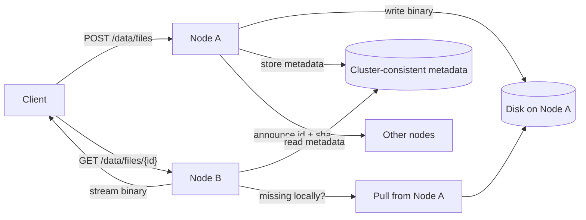

# Data temporary binary API

SlimFaas provides **temporary binary storage** through the **`/data/files`** endpoints.
This feature is designed for internal workflows (functions, jobs, agents, pipelines) that need to store and retrieve **binary artifacts** (PDF, ZIP, audio, PPTX, etc.) for a limited time.

This page explains:
- how to use the `/data/files` API,
- how it works internally (cluster behavior, safety limits),
- how to configure **Public vs Private** access and override it via **environment variables**.

---

## What is `/data/files` for?

Use `/data/files` when you need:

- a simple temporary store for binary artifacts
- a way to retrieve an artifact from any node in a SlimFaas cluster
- a solution that avoids shipping large binaries through the cluster’s consensus layer

**Core idea**
- The **binary content** is stored on **disk**.
- The **metadata** (checksum, size, content type, filename, TTL) is stored in a **cluster-consistent store** so every node knows “what exists”.

---

## API summary

Base path: `/data/files`

| Method | Path | Purpose |
|---|---|---|
| `POST` | `/data/files?id={id?}&ttl={ms?}` | Store a binary artifact (request body = raw bytes) |
| `GET` | `/data/files/{id}` | Download an artifact (auto-pull from another node if missing locally) |
| `DELETE` | `/data/files/{id}` | Remove metadata (the artifact becomes inaccessible through the API) |
| `GET` | `/data/files` | List known artifacts (metadata-based) |

---

## Store an artifact: `POST /data/files`

### Request contract

- Body: **raw bytes** (not multipart/form-data)
- **`Content-Length` is recommended** (for accurate concurrency accounting)
- Recommended headers:
    - `Content-Type` (defaults to `application/octet-stream`)
    - `Content-Disposition` (to provide a download filename)

Query parameters:

- `id` (optional): artifact identifier
    - If omitted, SlimFaas generates an id.
    - Use URL-safe ids (letters, numbers, `.`, `_`, `-`).
- `ttl` (optional): time-to-live in **milliseconds**
    - Example: `ttl=600000` (10 minutes)

### Content-Length behavior (when missing or unknown)

SlimFaas streams the request body to disk. For its transfer safety guard (see **256 MiB parallel limiter**), SlimFaas normally relies on `Content-Length` to “reserve” the right byte budget.

If `Content-Length` is **missing** or **unknown** (e.g., chunked transfer encoding), SlimFaas:

- **accepts the upload**
- logs a **warning**
- **assumes the transfer is 20 MiB** for the limiter accounting

> Recommendation
> Provide `Content-Length` whenever possible to get accurate concurrency behavior (especially behind proxies).

### Responses

- `200 OK` with the artifact id as plain text
- `400 Bad Request` if the id is invalid

### Examples (curl)

Store an artifact for 10 minutes and keep a filename:

```bash
curl -X POST "http://<slimfaas>/data/files?ttl=600000"   -H "Content-Type: application/pdf"   -H "Content-Disposition: attachment; filename=\"report.pdf\""   --data-binary @./report.pdf
```

Store an artifact with a chosen id:

```bash
curl -X POST "http://<slimfaas>/data/files?id=my-artifact-001&ttl=300000"   -H "Content-Type: application/octet-stream"   --data-binary @./payload.bin
```

---

## Download an artifact: `GET /data/files/{id}`

### What happens on a download

When you request an artifact:

1. SlimFaas reads the **cluster-consistent metadata** for `{id}` (checksum, size, content type, filename, TTL)
2. It checks whether the binary exists locally and matches the expected checksum
3. If missing, SlimFaas attempts to **pull** the binary from another cluster node that has it
4. The response streams the binary to the client

### Responses

- `200 OK` streamed response
    - `Content-Type` from metadata (fallback `application/octet-stream`)
    - a download filename if provided at upload time
- `400 Bad Request` if id is invalid
- `404 Not Found` if metadata is missing/expired, or if no node can provide the binary

### Example (curl)

```bash
curl -L "http://<slimfaas>/data/files/my-artifact-001" -o my-artifact-001.bin
```

---

## Delete an artifact: `DELETE /data/files/{id}`

This removes the **metadata** for the artifact.

- `204 No Content` on success
- `400 Bad Request` if id is invalid

> Important
> Removing metadata makes the artifact inaccessible through the API (downloads return 404), even if the binary still exists on disk. Disk cleanup depends on your configured cleanup/expiration strategy.

---

## List artifacts: `GET /data/files`

Returns the list of known artifact ids (metadata-based) and their expiration information (if any). Expired entries are not returned.

Example:

```bash
curl -s "http://<slimfaas>/data/files"
```

---

## Visibility & security (Public vs Private)

All `/data/files` routes are protected by a **data visibility** setting.

In `appsettings.json`:

```json
{
  "Data": {
    "DefaultVisibility": "Private"
  }
}
```

### Behavior

- **Public**: anyone who can reach SlimFaas can call `/data/files`
- **Private** (recommended): only **internal** requests are allowed
  External requests are typically answered with **404 Not Found** (intentionally “hidden”).

---

## Overriding visibility via environment variables

SlimFaas supports standard configuration overrides via environment variables.

To override:

- `Data:DefaultVisibility`

Use:

- `Data__DefaultVisibility`

### Example: set `/data/files` to Public

#### Docker / Docker Compose

```bash
export Data__DefaultVisibility=Public
```

#### Kubernetes Deployment (excerpt)

```yaml
env:
  - name: Data__DefaultVisibility
    value: "Public"
```

To keep it private (explicit):

```yaml
env:
  - name: Data__DefaultVisibility
    value: "Private"
```

> Notes
> - This setting affects all data routes that are guarded by the same visibility filter, including `/data/files`.
> - Use `Public` / `Private` for clarity.

---

## How it works internally (high-level)

### 1) Metadata is cluster-consistent; content is disk-backed

For `/data/files`:

- **metadata** is stored in a cluster-consistent store so every node has the same view of what exists and how to serve it
- **binary content** is stored on disk on the node that received the POST request

This avoids moving large binaries through the cluster’s consensus layer.

### 2) Cluster distribution model: announce + pull

SlimFaas does not block the POST by pushing the binary to all nodes.

Instead:

1. The node that stored the artifact announces “I have `{id}` with checksum `{sha}`”
2. Other nodes can **pull** the artifact in the background
3. If a client requests an artifact from a node that doesn’t have it locally, that node can **pull on demand**

This yields eventual distribution with minimal upload latency.

### Diagram (simplified)



---

## The 256 MiB parallel limiter (safety guard)

SlimFaas applies a safety guard that limits concurrent binary transfers to roughly:

- **256 MiB in parallel**

Meaning:

- each in-flight transfer reserves a “byte budget” equal to its size
- new transfers wait if starting them would exceed the budget
- a single artifact larger than 256 MiB can run only if it is **alone**

When `Content-Length` is missing/unknown, SlimFaas uses **20 MiB** as the reserved size for that transfer (and logs a warning).

**This is not a strict memory cap**; it’s a concurrency limiter.

---

## Storage & durability

`/data/files` is disk-backed:

- If storage is ephemeral, artifacts may disappear on pod restart.
- For durability, mount a persistent volume.
- Artifacts can be re-pulled from other nodes only while at least one node still has the content **and** metadata still exists.

---

## Troubleshooting

### Upload logs a warning about Content-Length
Your client/proxy sent the request without `Content-Length` (often chunked transfer).

SlimFaas will still accept the upload, but it will **assume 20 MiB** for concurrency accounting.
Fix: ensure uploads have a known length (e.g., `curl --data-binary @file`) and verify proxy settings if you want precise limiter behavior.

### 404 Not Found on download
- metadata expired or was deleted
- no node currently has the binary (restart, cleanup, ephemeral storage)
- temporary unavailability during cluster convergence

---

## Quick reference

- Store: `POST /data/files?id={id?}&ttl={ms?}`
- Download: `GET /data/files/{id}`
- Delete: `DELETE /data/files/{id}`
- List: `GET /data/files`
- Visibility config: `Data:DefaultVisibility = Public | Private`
- Env override: `Data__DefaultVisibility=Public`
