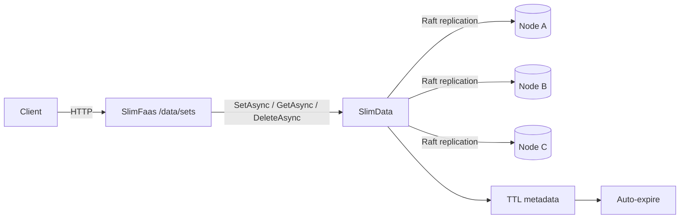

# Data Sets API

SlimFaas provides a **Redis-like, cluster-consistent key/value store** through the `/data/sets` endpoints.

Use it to store **small values** (cache entries, JSON state, flags, checkpoints) with a robust replication protocol (SlimData + Raft).

- **Max payload size:** 1 MiB per entry
- **TTL unit:** milliseconds (`ttl` query parameter)

> Not for large file storage. For large binaries (PDF, ZIP, audio, PPTX, ...), use **Data Files**: https://slimfaas.dev/data-files

---

## How it works (high-level)



---

## Endpoints

Base path: `/data/sets`

| Method | Path | Purpose |
|---|---|---|
| `POST` | `/data/sets?id={id?}&ttl={ttl_ms?}` | Create or overwrite a value |
| `GET` | `/data/sets/{id}` | Read a value |
| `GET` | `/data/sets` | List entries (IDs + expiration) |
| `DELETE` | `/data/sets/{id}` | Delete a value |

### IDs

- IDs are validated server-side (`IdValidator.IsSafeId`).
- If `id` is omitted (or empty), SlimFaas generates one (`Guid.NewGuid().ToString("N")`) and returns it.

### TTL (milliseconds)

- `ttl` is optional and expressed in **milliseconds**.
- When provided, the entry auto-expires after the TTL.

Examples:
- `ttl=60000` → 1 minute
- `ttl=600000` → 10 minutes

---

## Create / overwrite

`POST /data/sets?id={id?}&ttl={ttl_ms?}`

- Body is stored as raw bytes.
- Payload larger than 1 MiB returns **413 Payload Too Large**.

Examples:

Store JSON with a fixed id:
```bash
curl -X POST "http://<slimfaas>/data/sets?id=my-usecase/session-123/state" \
  -H "Content-Type: application/json" \
  --data-binary '{"step":"route","chosen":"kb_rag","confidence":0.92}'
```

Store a string:
```bash
curl -X POST "http://<slimfaas>/data/sets?id=my-usecase/session-123/flag" \
  -H "Content-Type: text/plain" \
  --data-binary "ready"
```

Let SlimFaas generate the id:
```bash
ID=$(curl -s -X POST "http://<slimfaas>/data/sets" --data-binary "hello")
echo "created id=$ID"
```

Store with TTL (10 minutes = 600000 ms):
```bash
curl -X POST "http://<slimfaas>/data/sets?id=my-usecase/session-123/state&ttl=600000" \
  --data-binary "temporary"
```

---

## Read

`GET /data/sets/{id}`

- Returns raw bytes as `application/octet-stream`.
- `404 Not Found` when missing or expired.

Examples:
```bash
curl -L "http://<slimfaas>/data/sets/my-usecase/session-123/state" -o value.bin
```

If you stored JSON:
```bash
curl -s "http://<slimfaas>/data/sets/my-usecase/session-123/state" | jq .
```

---

## List

`GET /data/sets`

Returns a JSON array:
```json
[
  { "id": "abc", "expireAtUtcTicks": -1 },
  { "id": "xyz", "expireAtUtcTicks": 638720123456789012 }
]
```

- `expireAtUtcTicks` is UTC DateTime ticks (100 ns units).
- `-1` means “no expiration”.

---

## Delete

`DELETE /data/sets/{id}`

- Returns **204 No Content**.

Example:
```bash
curl -X DELETE "http://<slimfaas>/data/sets/my-usecase/session-123/state"
```

---

## Visibility & security

`/data/sets` is protected by the same data visibility policy used by other data endpoints (`DataVisibilityEndpointFilter`).

`appsettings.json`:
```json
{
  "Data": {
    "DefaultVisibility": "Private"
  }
}
```

Env override:
- `Data:DefaultVisibility` → `Data__DefaultVisibility`
