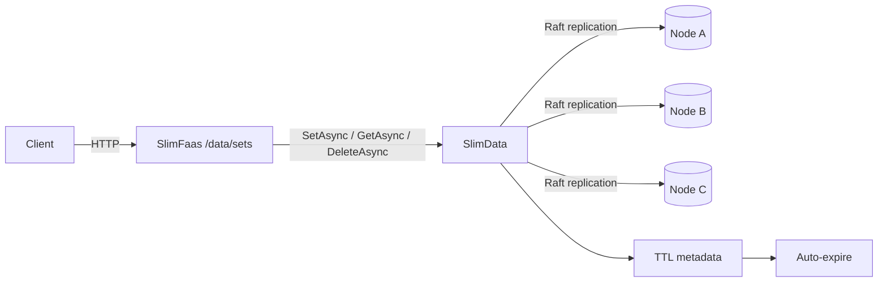

# Data Sets API

SlimFaas provides a **Redis-like, cluster-consistent key/value store** through the `/data/sets` endpoints.

Use it to store **small values** (cache entries, JSON state, flags, checkpoints) with a robust replication protocol (SlimData + Raft).

- **Max payload size:** 1 MiB per entry
- **TTL unit:** milliseconds (`ttl` query parameter)
- **Atomic counters:** Redis-like `INCR`, `INCRBY`, `INCRBYFLOAT`, `DECR`, `DECRBY`

> Not for large file storage. For large binaries (PDF, ZIP, audio, PPTX, ...), use **Data Files**: https://slimfaas.dev/data-files

---

## How it works (high-level)


```mermaid
flowchart LR
  C[Client] -->|HTTP| API[SlimFaas /data/sets]
  API -->|SetAsync / GetAsync / DeleteAsync| DB[SlimData]
  DB -->|Raft replication| N1[(Node A)]
  DB -->|Raft replication| N2[(Node B)]
  DB -->|Raft replication| N3[(Node C)]
  DB --> TTL[TTL metadata]
  TTL --> EXP[Auto-expire]
```

---

## Endpoints

Base path: `/data/sets`

| Method | Path | Purpose |
|---|---|---|
| `POST` | `/data/sets?id={id?}&ttl={ttl_ms?}` | Create or overwrite a value |
| `POST` | `/data/sets/{id}/incr` | Atomically increment an integer by 1 |
| `POST` | `/data/sets/{id}/incrby?by={long}` | Atomically increment an integer by `by` |
| `POST` | `/data/sets/{id}/incrbyfloat?by={decimal}` | Atomically increment a decimal value by `by` |
| `POST` | `/data/sets/{id}/decr` | Atomically decrement an integer by 1 |
| `POST` | `/data/sets/{id}/decrby?by={long}` | Atomically decrement an integer by `by` |
| `GET` | `/data/sets/{id}` | Read a value |
| `GET` | `/data/sets` | List entries (IDs + expiration) |
| `DELETE` | `/data/sets/{id}` | Delete a value |

### IDs

- IDs are validated server-side (`IdValidator.IsSafeId`).
- Valid IDs contain 1 to 200 characters: letters, digits, `.`, `_`, `-`.
- If `id` is omitted (or empty), SlimFaas generates one (`Guid.NewGuid().ToString("N")`) and returns it.

### TTL (milliseconds)

- `ttl` is optional and expressed in **milliseconds**.
- When provided, the entry auto-expires after the TTL.

Examples:
- `ttl=60000` → 1 minute
- `ttl=600000` → 10 minutes

---

## Create / overwrite

`POST /data/sets?id={id?}&ttl={ttl_ms?}`

- Body is stored as raw bytes.
- Payload larger than 1 MiB returns **413 Payload Too Large**.

Examples:

Store JSON with a fixed id:
```bash
curl -X POST "http://<slimfaas>/data/sets?id=my-usecase.session-123.state" \
  -H "Content-Type: application/json" \
  --data-binary '{"step":"route","chosen":"kb_rag","confidence":0.92}'
```

Store a string:
```bash
curl -X POST "http://<slimfaas>/data/sets?id=my-usecase.session-123.flag" \
  -H "Content-Type: text/plain" \
  --data-binary "ready"
```

Let SlimFaas generate the id:
```bash
ID=$(curl -s -X POST "http://<slimfaas>/data/sets" --data-binary "hello")
echo "created id=$ID"
```

Store with TTL (10 minutes = 600000 ms):
```bash
curl -X POST "http://<slimfaas>/data/sets?id=my-usecase.session-123.state&ttl=600000" \
  --data-binary "temporary"
```

---

## Atomic counters

Counter operations are executed directly inside the SlimData Raft command. This avoids client-side read/modify/write races: concurrent increments are serialized by the Raft log and each request receives the value produced by its own command.

Supported operations:

| Command | HTTP endpoint | Stored value type | Response |
|---|---|---|---|
| `INCR` | `POST /data/sets/{id}/incr` | UTF-8 integer | new integer value |
| `INCRBY` | `POST /data/sets/{id}/incrby?by={long}` | UTF-8 integer | new integer value |
| `INCRBYFLOAT` | `POST /data/sets/{id}/incrbyfloat?by={decimal}` | UTF-8 decimal | new decimal value |
| `DECR` | `POST /data/sets/{id}/decr` | UTF-8 integer | new integer value |
| `DECRBY` | `POST /data/sets/{id}/decrby?by={long}` | UTF-8 integer | new integer value |

Rules:

- Missing or expired keys start from `0`.
- Integer commands require the existing value to be a strict UTF-8 integer.
- `INCRBYFLOAT` requires the existing value to be a strict UTF-8 decimal number.
- Numeric mutations preserve the existing TTL.
- If a key has expired, the old value and TTL are ignored and removed before applying the mutation.
- Invalid numeric values or integer overflows return **409 Conflict** and do not mutate the stored value.
- Responses are `text/plain` and contain the new value.

Examples:

Increment a counter:
```bash
curl -X POST "http://<slimfaas>/data/sets/request-count/incr"
# 1
```

Increment by a custom amount:
```bash
curl -X POST "http://<slimfaas>/data/sets/request-count/incrby?by=10"
# 11
```

Decrement:
```bash
curl -X POST "http://<slimfaas>/data/sets/request-count/decr"
# 10
```

Increment a decimal value:
```bash
curl -X POST "http://<slimfaas>/data/sets/cost-total/incrbyfloat?by=1.25"
# 1.25
```

Read the stored counter value:
```bash
curl -s "http://<slimfaas>/data/sets/request-count"
# 10
```

---

## Read

`GET /data/sets/{id}`

- Returns raw bytes as `application/octet-stream`.
- `404 Not Found` when missing or expired.

Examples:
```bash
curl -L "http://<slimfaas>/data/sets/my-usecase.session-123.state" -o value.bin
```

If you stored JSON:
```bash
curl -s "http://<slimfaas>/data/sets/my-usecase.session-123.state" | jq .
```

---

## List

`GET /data/sets`

Returns a JSON array:
```json
[
  { "id": "abc", "expireAtUtcTicks": -1 },
  { "id": "xyz", "expireAtUtcTicks": 638720123456789012 }
]
```

- `expireAtUtcTicks` is UTC DateTime ticks (100 ns units).
- `-1` means “no expiration”.

---

## Delete

`DELETE /data/sets/{id}`

- Returns **204 No Content**.

Example:
```bash
curl -X DELETE "http://<slimfaas>/data/sets/my-usecase.session-123.state"
```

---

## Visibility & security

`/data/sets` is protected by the same data visibility policy used by other data endpoints (`DataVisibilityEndpointFilter`).

`appsettings.json`:
```json
{
  "Data": {
    "DefaultVisibility": "Private"
  }
}
```

Env override:
- `Data:DefaultVisibility` → `Data__DefaultVisibility`

---

## Availability and backpressure

Writes are grouped into bounded adaptive batches before being replicated as Raft entries. The API can return:

- **413 Payload Too Large** when one item exceeds the configured batch limit.
- **429 Too Many Requests** when the in-memory adaptive batch queue is full.
- **503 Service Unavailable** when no Raft quorum or valid leader lease is available within the bounded replication timeout.

`SET` keeps its existing retry behavior. Numeric mutations are not retried automatically because they are not idempotent.

SlimData creates streaming state snapshots every 5,000 applied entries by default. The interval can be changed without altering the API:

```bash
SlimData__SnapshotIntervalEntries=5000
```

Raft membership changes are serialized and bounded by configurable timeouts. The announcement timeout must be greater than the membership change timeout:

```bash
SlimData__Membership__ChangeTimeoutSeconds=60
SlimData__Membership__AnnouncementTimeoutSeconds=70
SlimData__Membership__RemovalMissingCycles=3
```

Followers normally join by announcing themselves to the current leader. As a fallback, the leader also reconciles the Raft membership with the orchestrator topology. Missing members are added first; a member is removed only after it has been absent for `RemovalMissingCycles` consecutive reconciliation cycles. No removal is attempted when the orchestrator snapshot does not contain the local leader.

SlimData configures DotNext with `warmupRounds=10000` by default so a new follower can search far enough back in an active leader's WAL before requiring a snapshot. It can be overridden directly:

```bash
SlimData__WarmupRounds=20000
```

For backward compatibility, a `warmupRounds` value inside `SlimData__Configuration` takes precedence over this dedicated setting.

## Raft command protocol

SlimData writes and accepts only the `SLDC/1` Raft command envelope. Legacy payloads, including key/value command ID `2` and queue command ID `14`, are skipped without mutating the state; they are never converted or rewritten. Every node exposes its protocol and assembly version on the internal SlimData port:

Before a mutation is appended to Raft, every SlimData command is serialized into a bounded immutable payload. Its declared length and `SLDC/1` envelope are validated, then the same byte block is written to the leader WAL and replicated to followers.

```text
GET /SlimData/protocol
X-SlimData-Command-Protocol: SLDC/1
X-SlimData-Assembly-Version: <version>
```

A node with a missing or incompatible protocol, or whose assembly version (including the Git commit SHA) differs from the other nodes, is rejected during membership changes. All replicas must therefore run the exact same image build. A follower also returns `503` from `/ready` and refuses SlimData operations while its leader is incompatible.

Upgrading from a WAL created before `SLDC/1` requires a clean cluster restart:

1. Deploy one immutable image digest to all replicas.
2. Scale the StatefulSet to zero.
3. Delete the `slimfaas-volume-*` PVCs containing the `wal`, `db`, and `config` directories. Backup PVCs can be retained.
4. Start `slimfaas-0`, then the followers one at a time.
5. Verify the startup protocol/version log and ensure `slimdata_raft_skipped_command_total` remains zero.

The readiness endpoint returns `503` while the local snapshot is being restored, the node has no active Raft consensus, or the leader protocol is incompatible. The liveness endpoint remains available so Kubernetes or OpenShift can keep the process alive while the cluster recovers.
