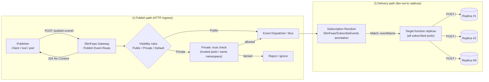

# Events in SlimFaas

SlimFaas supports a basic “publish/subscribe” model for broadcasting events to all replicas of a function.
This can be used to trigger internal actions or notify your functions of certain events.

---

## 1. Subscribe to Events

To allow a function to **receive** events, add the annotation `SlimFaas/SubscribeEvents` to the function's deployment:

```yaml
metadata:
  annotations:
    SlimFaas/SubscribeEvents: "Public:my-event1,Private:my-event2,my-event3"
```

- **Public events** can be sent from any source.
- **Private event**s can only be sent by trusted pods or within the same namespace.
- If you omit `Public:` or `Private:`, it defaults to `SlimFaas/DefaultVisibility`.

---

## 2. Publishing an Event
   Use the following HTTP route to publish an event:

- **Endpoint**: `POST http://<slimfaas>/publish-event/<eventName>/<path>`

- **Body** (any JSON payload):
```json
{
  "data": "my-event-data"
}
```
- **Response**: `204 (No Content)`

---

## 3. Example
```bash
curl -X POST -H "Content-Type: application/json" \
     -d '{"data":"hello"}' \
     http://localhost:30021/publish-event/my-event-name/hello

```
All function replicas that have subscribed to `my-event-name` will receive a POST request at their /hello URL (e.g., `http://<pod_ip>:<pod_port>/hello`), and can handle it as needed.



